

  <strong>UNIVERSIDAD PERUANA DE CIENCIAS APLICADAS</strong>

  

  Ingeniería de Software  
  1ASI0728 Arquitecturas De Software Emergentes  
  2026-10  
  Profesor: <strong>Christian Luis De Los Rios Fernandez
</strong>   
  Report  
  CoWare – Producto: CoBox

 

<strong>Team Members:</strong>

<table align="center">
  <thead>
    <tr>
      <th>Member</th>
      <th>Código</th>
    </tr>
  </thead>
  <tbody>
    <tr>
      <td>Ramiro Alexander Guzmán Chávez</td>
      <td>U202217062</td>
    </tr>
    <tr>
      <td>Diego Ivan Cabrera Buitron</td>
      <td>U20211B293</td>
    </tr>
    <tr>
      <td>Joaquín Pedraza Maldonado</td>
      <td>U202218514</td>
    </tr>
    <tr>
      <td>Jhon Alexander Galvez Chambi</td>
      <td>U202323270</td>
    </tr>
  </tbody>
</table>

  

  <strong>Abril, 2026</strong>  
  <strong>URL del proyecto:</strong> 
  <a href="https://github.com/11770-Cobox-ArquitecturaEmergentes">
    https://github.com/11770-Cobox-ArquitecturaEmergentes
  </a>

---

## Registro de Versiones del Informe

| Versión | Fecha       | Autor                          | Descripción                                                                 |
|---------|-------------|--------------------------------|-----------------------------------------------------------------------------|
| AV1 | 09/04/2026  | Jhon Alexander Galvez Chambi | Elaboración inicial del Capítulo I: Introducción, incluyendo Startup Profile, Solution Profile y Segmentos objetivo. |
| AV1 | 10/04/2026  | Jhon Alexander Galvez Chambi | Desarrollo inicial del Capítulo II: Requirements Elicitation & Analysis, desde Competidores hasta User Personas. |
| AV1 | 12/04/2026  | Diego Iván Cabrera Buitrón | Desarrollo de las secciones 2.3.2. User Task Matrix, 2.3.3. Empathy Mapping y 2.3.4. As-is Scenario Mapping. |
| AV1 | 13/04/2026  | Diego Iván Cabrera Buitrón | Desarrollo de la sección 2.4. Ubiquitous Language y revisión de consistencia del Capítulo II. |
| AV1 | 15/04/2026  | Ramiro Alexander Guzmán Chávez | Desarrollo del Capítulo III: Requirements Specification, iniciando con 3.1. To-Be Scenario Mapping y 3.2. User Stories. |
| AV1 | 17/04/2026  | Ramiro Alexander Guzmán Chávez | Desarrollo de las secciones 3.3. Impact Mapping y 3.4. Product Backlog, con revisión del Capítulo III. |
| AV1 | 18/04/2026  | Joaquín Pedraza Maldonado | Desarrollo de la sección 4.1. Strategic-Level Attribute-Driven Design y sus subsecciones principales. |
| AV1 | 20/04/2026  | Joaquín Pedraza Maldonado | Desarrollo de la sección 4.2.1. EventStorming como parte del Strategic-Level Domain-Driven Design. |
| AV1 | 21/04/2026  | Diego Iván Cabrera Buitrón | Desarrollo de las secciones 4.2.2. Candidate Context Discovery y 4.2.3. Domain Message Flows Modeling. |
| AV1 | 23/04/2026  | Ramiro Alexander Guzmán Chávez | Colaboración en la sección 4.2.4. Bounded Context Canvases y revisión de alineamiento con el Capítulo III. |
| AV1 | 24/04/2026  | Jhon Alexander Galvez Chambi | Colaboración en la sección 4.3. Software Architecture y sus diagramas de arquitectura de software. |
| AV1 | 26/04/2026  | Joaquín Pedraza Maldonado | Revisión final del Capítulo IV, actualización del Project Report Collaboration Insights y validación general del informe AV1. |

## Project Report Collaboration Insights

| URL del repositorio del reporte |
| :-----------------------------------: |
| [https://github.com/11770-Cobox-ArquitecturaEmergentes/Documentacion](https://github.com/11770-Cobox-ArquitecturaEmergentes/Documentacion) |

**AV1:**

Para la elaboración de la entrega AV1 de este informe, el equipo se organizó mediante reuniones de coordinación a través de un canal de Discord. En estas reuniones se definió la distribución de actividades, se asignaron responsables por capítulo y se establecieron fechas de revisión periódica para asegurar el avance progresivo de cada integrante.

| Integrante | Usuario GitHub | Detalle de avance |
|------------|----------------|-------------------|
| Diego Iván Cabrera Buitrón | `omele7` | Desarrollo del Capítulo II (secciones 2.3.2. User Task Matrix hasta 2.4. Ubiquitous Language) y del Capítulo IV (secciones 4.2.2. Candidate Context Discovery y 4.2.3. Domain Message Flows Modeling). |
| Joaquín Pedraza Maldonado | `JoaquinPedraza1` | Desarrollo del Capítulo IV (secciones 4.1. Strategic-Level Attribute-Driven Design y 4.2.1. EventStorming). |
| Ramiro Alexander Guzmán Chávez | `RamiroGuzmanCh` | Desarrollo del Capítulo III y colaboración en el Capítulo IV (sección 4.2.4. Bounded Context Canvases). |
| Jhon Alexander Galvez Chambi | `Chaomeum` | Desarrollo de los Capítulos I y II (hasta la sección 2.3.1. User Personas) y colaboración en el Capítulo IV (sección 4.3. Software Architecture). |

**Report Repository Insights:** 

En esta sección se presentan los analíticos de colaboración y los commits realizados en GitHub por los miembros del equipo dentro del repositorio del informe durante la fase AV1. Esta evidencia permite visualizar la participación de los integrantes y la evolución del trabajo colaborativo a lo largo del desarrollo del reporte.

- Report Contributors:

- Report Network:

## Contenido
#### Tabla de contenidos

- [Carátula](#carátula)
- [Registro de Versiones del Informe](#registro-de-versiones-del-informe)
- [Project Report Collaboration Insights](#project-report-collaboration-insights)
- [Contenido](#contenido)
- [Student Outcome](#student-outcome)

- [Capítulo I: Introducción](#capítulo-i-introducción)
  - [1.1. Startup Profile](#11-startup-profile)
    - [1.1.1. Descripción de la Startup](#111-descripción-de-la-startup)
    - [1.1.2. Perfiles de integrantes del equipo](#112-perfiles-de-integrantes-del-equipo)
  - [1.2. Solution Profile](#12-solution-profile)
    - [1.2.1. Antecedentes y problemática](#121-antecedentes-y-problemática)
    - [1.2.2. Lean UX Process](#122-lean-ux-process)
      - [1.2.2.1. Lean UX Problem Statements](#1221-lean-ux-problem-statements)
      - [1.2.2.2. Lean UX Assumptions](#1222-lean-ux-assumptions)
      - [1.2.2.3. Lean UX Hypothesis Statements](#1223-lean-ux-hypothesis-statements)
      - [1.2.2.4. Lean UX Canvas](#1224-lean-ux-canvas)
  - [1.3. Segmentos objetivo](#13-segmentos-objetivo)

- [Capítulo II: Requirements Elicitation & Analysis](#capítulo-ii-requirements-elicitation--analysis)
  - [2.1. Competidores](#21-competidores)
    - [2.1.1. Análisis competitivo](#211-análisis-competitivo)
    - [2.1.2. Estrategias y tácticas frente a competidores](#212-estrategias-y-tácticas-frente-a-competidores)
  - [2.2. Entrevistas](#22-entrevistas)
    - [2.2.1. Diseño de entrevistas](#221-diseño-de-entrevistas)
    - [2.2.2. Registro de entrevistas](#222-registro-de-entrevistas)
    - [2.2.3. Análisis de entrevistas](#223-análisis-de-entrevistas)
  - [2.3. Needfinding](#23-needfinding)
    - [2.3.1. User Personas](#231-user-personas)
    - [2.3.2. User Task Matrix](#232-user-task-matrix)
    - [2.3.3. Empathy Mapping](#233-empathy-mapping)
    - [2.3.4. As-is Scenario Mapping](#234-as-is-scenario-mapping)
  - [2.4. Ubiquitous Language](#24-ubiquitous-language)

- [Capítulo III: Requirements Specification](#capítulo-iii-requirements-specification)
  - [3.1. To-Be Scenario Mapping](#31-to-be-scenario-mapping)
  - [3.2. User Stories](#32-user-stories)
  - [3.3. Impact Mapping](#33-impact-mapping)
  - [3.4. Product Backlog](#34-product-backlog)

- [Capítulo IV: Strategic-Level Software Design](#capítulo-iv-strategic-level-software-design)
  - [4.1. Strategic-Level Attribute-Driven Design](#41-strategic-level-attribute-driven-design)
    - [4.1.1. Design Purpose](#411-design-purpose)
    - [4.1.2. Attribute-Driven Design Inputs](#412-attribute-driven-design-inputs)
      - [4.1.2.1. Primary Functionality (Primary User Stories)](#4121-primary-functionality-primary-user-stories)
      - [4.1.2.2. Quality Attribute Scenarios](#4122-quality-attribute-scenarios)
      - [4.1.2.3. Constraints](#4123-constraints)
    - [4.1.3. Architectural Drivers Backlog](#413-architectural-drivers-backlog)
    - [4.1.4. Architectural Design Decisions](#414-architectural-design-decisions)
    - [4.1.5. Quality Attribute Scenario Refinements](#415-quality-attribute-scenario-refinements)
  - [4.2. Strategic-Level Domain-Driven Design](#42-strategic-level-domain-driven-design)
    - [4.2.1. EventStorming](#421-eventstorming)
    - [4.2.2. Candidate Context Discovery](#422-candidate-context-discovery)
    - [4.2.3. Domain Message Flows Modeling](#423-domain-message-flows-modeling)
    - [4.2.4. Bounded Context Canvases](#424-bounded-context-canvases)
    - [4.2.5. Context Mapping](#425-context-mapping)
  - [4.3. Software Architecture](#43-software-architecture)
    - [4.3.1. Software Architecture System Landscape Diagram](#431-software-architecture-system-landscape-diagram)
    - [4.3.2. Software Architecture Context Level Diagrams](#432-software-architecture-context-level-diagrams)
    - [4.3.3. Software Architecture Container Level Diagrams](#433-software-architecture-container-level-diagrams)
    - [4.3.4. Software Architecture Deployment Diagrams](#434-software-architecture-deployment-diagrams)

## Student Outcome

### ABET – EAC - Student Outcome 3

**Criterio:** Capacidad de comunicarse efectivamente con un rango de audiencias.

En el siguiente cuadro se describen las acciones realizadas y enunciados de conclusiones por parte del equipo, que permiten sustentar el haber alcanzado el logro del ABET – EAC - Student Outcome 3.

| Criterio específico | Acciones realizadas | Conclusiones |
|----------------------|---------------------|--------------|
| Comunica oralmente sus ideas y/o resultados con objetividad a público de diferentes especialidades y niveles jerárquicos, en el marco del desarrollo de un proyecto en ingeniería. | **AV1**   Jhon Alexander Galvez Chambi: participé en la coordinación inicial del informe y comuniqué al equipo los avances relacionados con el Capítulo I: Introducción, así como con el desarrollo inicial del Capítulo II hasta la sección 2.3.1. User Personas. Además, colaboré en la explicación de los elementos trabajados en la sección 4.3. Software Architecture.   Diego Iván Cabrera Buitrón: comuniqué los avances del Capítulo II desde la sección 2.3.2. User Task Matrix hasta 2.4. Ubiquitous Language, explicando cómo estos artefactos permitían comprender las necesidades de los usuarios y establecer un lenguaje común para el dominio del proyecto. También sustenté mis aportes al Capítulo IV en las secciones 4.2.2. Candidate Context Discovery y 4.2.3. Domain Message Flows Modeling.   Ramiro Alexander Guzmán Chávez: expuse al equipo los avances del Capítulo III: Requirements Specification, incluyendo To-Be Scenario Mapping, User Stories, Impact Mapping y Product Backlog. Asimismo, comuniqué la relación entre estos artefactos y la sección 4.2.4. Bounded Context Canvases del Capítulo IV.   Joaquín Pedraza Maldonado: comuniqué los avances del Capítulo IV, principalmente en la sección 4.1. Strategic-Level Attribute-Driven Design y en 4.2.1. EventStorming, explicando las decisiones arquitectónicas, los drivers y la relación entre los eventos del dominio y el diseño estratégico del sistema.   Como equipo, realizamos reuniones de coordinación mediante Discord para presentar avances, resolver dudas, revisar la distribución de capítulos y asegurar que los aportes individuales mantuvieran coherencia con la estructura general del informe. | **AV1**   Durante esta entrega, el equipo comunicó oralmente sus avances de manera organizada y objetiva, usando reuniones de coordinación para explicar decisiones, justificar contenidos y alinear criterios entre los capítulos del informe. La participación de cada integrante permitió compartir resultados desde distintas áreas del proyecto, como investigación, requerimientos, análisis de dominio y arquitectura de software. Como resultado, se logró una comunicación efectiva orientada a mantener coherencia entre la problemática, los requerimientos, el diseño estratégico y la arquitectura propuesta para CoBox Smart Vision. |
| Comunica en forma escrita ideas y/o resultados con objetividad a público de diferentes especialidades y niveles jerárquicos, en el marco del desarrollo de un proyecto en ingeniería. | **AV1**   Jhon Alexander Galvez Chambi: redacté el Capítulo I: Introducción, incluyendo Startup Profile, Solution Profile y Segmentos objetivo. También desarrollé el contenido inicial del Capítulo II hasta la sección 2.3.1. User Personas y colaboré en la sección 4.3. Software Architecture, aportando a la documentación de los diagramas y decisiones arquitectónicas.   Diego Iván Cabrera Buitrón: redacté las secciones 2.3.2. User Task Matrix, 2.3.3. Empathy Mapping, 2.3.4. As-is Scenario Mapping y 2.4. Ubiquitous Language. Además, desarrollé las secciones 4.2.2. Candidate Context Discovery y 4.2.3. Domain Message Flows Modeling, alineando el análisis de dominio con el diseño estratégico del sistema.   Ramiro Alexander Guzmán Chávez: redacté el Capítulo III: Requirements Specification, incluyendo 3.1. To-Be Scenario Mapping, 3.2. User Stories, 3.3. Impact Mapping y 3.4. Product Backlog. También colaboré en la sección 4.2.4. Bounded Context Canvases, relacionando los requerimientos con los contextos delimitados del dominio.   Joaquín Pedraza Maldonado: redacté la sección 4.1. Strategic-Level Attribute-Driven Design y sus subsecciones principales, así como la sección 4.2.1. EventStorming. Además, participé en la revisión final del Capítulo IV, la actualización del Project Report Collaboration Insights y la validación general del informe AV1.   El equipo documentó el avance en el Registro de Versiones del Informe, la Tabla de Contenidos y el Project Report Collaboration Insights, evidenciando de forma escrita la organización, los responsables y la evolución del trabajo desarrollado entre el 09/04/2026 y el 26/04/2026. | **AV1**   El informe evidencia una comunicación escrita estructurada y objetiva, ya que cada sección fue redactada siguiendo una secuencia lógica desde la introducción del problema hasta la especificación de requerimientos y el diseño arquitectónico. La tabla de contenidos, el registro de versiones y la tabla de colaboración permiten identificar con claridad los aportes de cada integrante y su relación con los capítulos desarrollados. En conjunto, la documentación permite que audiencias con distintos niveles de especialización comprendan el contexto del proyecto, las necesidades identificadas, los requerimientos definidos y las decisiones de diseño propuestas. |

## Capítulo I: Introducción

### 1.1. Startup Profile

#### 1.1.1. Descripción de la Startup

CoWare es una startup tecnológica orientada a la transformación digital del sector logístico de transporte de carga, enfocada en mejorar la eficiencia operativa, la trazabilidad de los servicios y la confiabilidad de la información generada durante la ejecución de operaciones.

La iniciativa surge a partir de la identificación de una problemática recurrente en pequeñas y medianas empresas del sector: la dependencia de procesos manuales y herramientas no integradas como hojas de cálculo, registros físicos y aplicaciones de mensajería, lo cual genera fragmentación de la información, errores en el registro de datos y limitaciones para supervisar y auditar las operaciones de manera efectiva.

Misión: Desarrollar soluciones tecnológicas que permitan mejorar la eficiencia y trazabilidad de las operaciones logísticas del transporte de carga mediante la digitalización y automatización progresiva de sus procesos.

Visión: Consolidarse como una startup referente en soluciones digitales para el sector logístico, impulsando la modernización de la gestión del transporte de carga a través del uso de tecnologías innovadoras.

#### 1.1.2. Perfiles de integrantes del equipo

**Diego Cabrera -Ingeniería de Software**

Estudio Ing. Software. Me considero que soy una persona creativa, entusiasta en aprender cosas nuevas. Me gusta ayudar a los demás y aprender de manera constante   

**Joaquin Pedraza Maldonado – Ingeniería de Software – U202218514**  

Estudio Ing. Software. Me considero que soy una persona perseverante, entusiasta en aprender cosas nuevas. Me gusta ayudar a los demás y sé trabajar en equipo. Cuento con conocimientos en lenguajes de Programación como C++, Python,CSS, JavaScript.

**Ramiro Alexander Guzman Chavez – Ingeniería de Software – U202217062**  

Mi perfil se basa en ser una persona responsable, disciplinada en todo aspecto y comprometida con las actividades que me puedan tocar.
Considero que tengo una experiencia altamente capacitada para este tipo de tareas. Suelo desarrollarme de manera positiva en los trabajos grupales y tengo conocimientos en bases de datos, lo cual puede aportar de manera importante al equipo.
Además, cuento con conocimientos en lenguajes de programación como Java y JavaScript, lo que me permite desarrollar soluciones tanto del lado del backend como del frontend, contribuyendo a proyectos de desarrollo de software de manera integral.

**Jhon Alexander Galvez Chambi - Ingeniería de Software - U202323270**  

Soy una persona responsable y comprometida con la consecución de los mejores resultados en trabajo en equipo. Poseo experiencia en diversos lenguajes de programación, incluyendo Python, JavaScript y C++, así como en varios de los frameworks asociados a estos lenguajes. Además, tengo conocimientos en tecnologías emergentes como Cloud Computing e Internet de las Cosas (IoT), y estoy dispuesto a aportar mi experiencia en estas áreas para contribuir al éxito de los proyectos en los que participo.

### 1.2. Solution Profile

CoWare desarrolla CoBox como una plataforma digital para centralizar la gestión de servicios logísticos de transporte de carga; sin embargo, la evolución hacia **CoBox Smart Vision** responde a una brecha más crítica que la simple digitalización: la falta de confiabilidad de los datos operativos capturados desde campo. En las PyMES de transporte, registros como kilometraje, consumo de combustible, entregas e incidencias suelen depender de ingreso manual, fotografías aisladas, comprobantes físicos o mensajes no estructurados, lo que limita su uso para auditoría, resolución de disputas y toma de decisiones operativas.

**CoBox Smart Vision** se plantea como una capa accesible de auditoría operativa basada en evidencia visual verificable. Su propuesta de valor consiste en convertir evidencias capturadas durante la ruta —como odómetros, comprobantes de combustible, documentos de entrega e incidencias— en datos operativos trazables, asociados al servicio correspondiente y validados mediante captura guiada, validación local básica de calidad de imagen, geolocalización, sincronización posterior y procesamiento inteligente. El MVP no busca resolver toda la gestión logística ni reemplazar un TMS, ERP o sistema de telemetría por hardware; su alcance inicial se concentra en validar evidencias críticas donde el error manual, la falta de trazabilidad o la manipulación de datos generan mayor fricción operativa.

La solución está dirigida inicialmente a pequeñas y medianas empresas de transporte de carga que operan con procesos manuales o semi-digitales y necesitan mejorar el control de sus servicios sin asumir la complejidad de plataformas enterprise. Para este segmento, el valor principal no está en registrar más datos, sino en contar con información confiable para reducir discrepancias entre gestores y conductores, disminuir reprocesos administrativos, sustentar reclamos y auditar operaciones con evidencia objetiva. Por ello, el enfoque del MVP prioriza una experiencia móvil simple, captura offline, validación local básica de calidad de imagen —por ejemplo, detección de desenfoque, baja iluminación o evidencia incompleta— y procesamiento cloud posterior para la extracción avanzada de datos cuando exista conectividad.

#### 1.2.1 Antecedentes y problemática

El transporte de carga por carretera constituye una actividad crítica para la continuidad de las operaciones comerciales, ya que conecta proveedores, centros de distribución, clientes y puntos de entrega. En el contexto peruano, el Ministerio de Transportes y Comunicaciones mantiene estadísticas específicas sobre el parque vehicular autorizado para transporte de carga general nacional, incluyendo información por ámbito, clase de vehículo, antigüedad, departamento y principales marcas. Esto evidencia que se trata de un sector formalmente medido y relevante para la gestión operativa del país (Ministerio de Transportes y Comunicaciones [MTC], 2025).

Sin embargo, en pequeñas y medianas empresas de transporte de carga persiste una alta dependencia de procesos manuales y herramientas no integradas, como hojas de cálculo, registros físicos, fotografías aisladas y aplicaciones de mensajería. Esta forma de operación genera fragmentación de información, duplicidad de registros, errores humanos y capacidad limitada para auditar los datos reportados desde campo. Esta situación se vuelve más crítica en un entorno empresarial donde la informalidad de las MYPE en Perú alcanzó el 84.8% en 2022, lo que refleja barreras estructurales para adoptar soluciones tecnológicas complejas, costosas o difíciles de operar (Ministerio de la Producción [PRODUCE], 2024).

El problema de fondo no se limita a la falta de digitalización. Aunque una solución como CoBox permite centralizar parte de la operación logística, todavía existe dependencia del ingreso manual de datos críticos como kilometraje, consumo de combustible, entregas e incidencias. Cuando estos datos se registran manualmente o se respaldan con evidencias no validadas, la empresa mantiene una brecha de confiabilidad: la información existe, pero no necesariamente puede considerarse verificable, auditable o libre de manipulación.

En entrevistas preliminares, se identificaron patrones recurrentes que refuerzan esta problemática: diferencias de kilometraje sin justificación, comprobantes de combustible que no corresponden con la ruta o fecha del servicio, pérdida de clientes por falta de trazabilidad formal y conflictos entre gestores y conductores por ausencia de evidencia objetiva. Estos hallazgos se desarrollan con mayor detalle en la sección 2.2.3; en esta sección se incorporan como evidencia preliminar para delimitar el problema central del Capítulo I: la falta de validación automática de la información operativa capturada durante la ejecución del servicio.

La oportunidad de solución se encuentra en incorporar mecanismos de validación inteligente que reduzcan la carga manual y eleven la confiabilidad de los registros sin exigir infraestructura costosa. Como referencia macro, Fortune Business Insights reporta que el mercado global de logística digital fue valorado en USD 37.64 mil millones en 2025 y proyecta que alcanzará USD 155.29 mil millones en 2034, impulsado por la adopción de tecnologías para visibilidad, automatización y eficiencia operativa (Fortune Business Insights, 2026). No obstante, esta referencia debe interpretarse como una tendencia global de digitalización logística, no como prueba directa de disposición de pago en PyMES peruanas. Para CoBox Smart Vision, la validación del mercado dependerá principalmente de la evidencia levantada en entrevistas, pilotos controlados y métricas de reducción de discrepancias operativas.

Para estructurar la problemática, se aplica la técnica de las 5W + 2H. El análisis no solo busca describir el contexto, sino delimitar el segmento inicial, el dolor prioritario, el comportamiento actual y las métricas que permitirán validar si CoBox Smart Vision resuelve un problema económicamente relevante.

| Elemento | Análisis refinado |
|----------|-------------------|
| **Who** | El segmento inicial está compuesto por pequeñas y medianas empresas de transporte de carga que gestionan flotas con procesos manuales o semi-digitales. El cliente económico es el dueño, gerente general o jefe de operaciones, quien asume pérdidas, reclamos y decisiones de inversión. Los usuarios directos son gestores logísticos y conductores: los primeros necesitan información confiable para supervisar y auditar, mientras que los segundos registran evidencias en campo bajo presión operativa, fatiga y conectividad variable. |
| **What** | El problema crítico es la falta de información operativa verificable. Datos como kilometraje, consumo de combustible, entregas, incidencias y documentos de ruta existen, pero se registran de forma manual o semi-digital, por lo que pueden contener errores, duplicidades, omisiones o manipulación. El resultado es una brecha entre “tener datos” y “tener datos confiables para decidir, auditar o resolver disputas”. |
| **Where** | El problema ocurre en dos espacios conectados: en campo, durante rutas, entregas, recargas de combustible, paradas no planificadas y zonas con baja conectividad; y en oficina, cuando los gestores consolidan información, revisan discrepancias, responden reclamos o preparan reportes para clientes y gerencia. |
| **When** | Se presenta en los momentos de mayor criticidad operativa: inicio de servicio, captura de odómetro, recarga de combustible, entrega, registro de incidencia, cierre de ruta y revisión posterior. En esos puntos, un dato incorrecto o una evidencia no verificable puede generar conflictos internos, reprocesos, reclamos de clientes o decisiones basadas en información incompleta. |
| **Why** | Porque las herramientas actuales permiten registrar y comunicar información, pero no validan automáticamente si lo reportado desde campo es consistente con el contexto del servicio. Una fotografía enviada por mensajería, una hoja de cálculo o un registro físico pueden respaldar parcialmente una operación, pero no garantizan por sí mismos trazabilidad, integridad, georreferenciación ni auditabilidad. |
| **How** | El proceso actual se sostiene mediante cuadernos, hojas de cálculo, fotografías enviadas por WhatsApp, comprobantes físicos, llamadas y revisiones manuales. La validación ocurre de forma reactiva: el gestor revisa cuando aparece una discrepancia, un reclamo o una sospecha. Esto traslada el control al final del proceso, cuando corregir o demostrar lo ocurrido ya es más costoso. |
| **How Much** | El impacto económico se manifiesta en cuatro frentes: tiempo administrativo invertido en revisar discrepancias, riesgo de pagos o reembolsos incorrectos por kilometraje y combustible, pérdida de confianza del cliente cuando no existe evidencia verificable, y reprocesos internos para reconstruir lo ocurrido después del servicio. Las entrevistas preliminares del proyecto evidencian diferencias de kilometraje, variaciones no explicadas de combustible y pérdida de trazabilidad formal ante clientes. Como referencia internacional sobre el costo de fallas de control en cadenas logísticas, CargoNet reportó 3,625 incidentes de robo de carga en Estados Unidos y Canadá durante 2024, 27% más que en 2023, con un valor promedio por robo de USD 202,364 (CargoNet, 2025). Aunque esta referencia no valida por sí sola el dolor específico de las PyMES peruanas, refuerza que la falta de control y trazabilidad logística puede tener consecuencias económicas significativas. Para el MVP, el impacto se validará mediante reducción del tiempo de revisión por servicio, disminución de registros observados, reducción de discrepancias entre gestor y conductor, y número de incidencias resueltas con evidencia verificable. |

##### Objetivos de la solución

- Reducir la dependencia del ingreso manual de datos operativos críticos durante el registro de kilometraje, combustible, entregas e incidencias.
- Incrementar la confiabilidad de la información utilizada para supervisión, auditoría y toma de decisiones operativas.
- Automatizar la validación de evidencias capturadas en campo, priorizando odómetros, comprobantes de combustible y documentos de entrega.
- Mejorar la trazabilidad de los servicios logísticos mediante registros verificables, georreferenciados y asociados al contexto de operación.
- Disminuir conflictos operativos derivados de datos incompletos, contradictorios o no sustentados con evidencia objetiva.
- Reducir el tiempo administrativo dedicado a revisar servicios con discrepancias durante el piloto del MVP.
- Validar si las PyMES de transporte perciben la auditoría basada en evidencia visual como una mejora suficientemente valiosa para sostener un modelo SaaS modular.

##### Restricciones del proyecto

- La solución debe operar en entornos con conectividad limitada, permitiendo captura offline y sincronización posterior.
- La experiencia móvil debe ser simple, considerando usuarios con distintos niveles de alfabetización digital.
- La validación automática debe contemplar condiciones reales de campo, como fotografías borrosas, baja iluminación, reflejos, ángulos incorrectos o evidencias incompletas.
- El MVP aplicará validación local básica de calidad de imagen en el dispositivo móvil, mientras que la extracción avanzada de datos mediante IA de visión o procesamiento documental podrá ejecutarse en servicios cloud especializados cuando exista conectividad.
- La arquitectura debe integrarse con la infraestructura cloud existente y mantener una estrategia viable para un equipo académico de alcance limitado.
- El procesamiento de evidencias debe proteger la privacidad y seguridad de la información operativa, evitando exposición de credenciales, imágenes o datos sensibles.
- El modelo de solución debe priorizar bajo costo de adopción para PyMES, usando dispositivos móviles existentes siempre que sea posible.

En respuesta a esta problemática, se plantea la evolución hacia **CoBox Smart Vision**, una solución que incorpora captura móvil guiada, validación local básica de calidad de imagen, sincronización offline y procesamiento inteligente de evidencias críticas. La propuesta no busca únicamente digitalizar registros, sino transformar evidencias visuales en datos operativos verificables, reduciendo errores humanos, fortaleciendo la trazabilidad y generando información confiable para auditoría, resolución de disputas y toma de decisiones.

#### 1.2.2. Lean UX Process

##### 1.2.2.1 Lean UX Problem Statements

El Lean UX Problem Statement de CoBox Smart Vision se construye a partir de la brecha identificada en la operación de PyMES de transporte de carga: la información crítica del servicio existe, pero no siempre puede considerarse confiable, verificable o auditable. Por ello, esta sección organiza el problema desde el dominio, los segmentos, los dolores, la brecha actual, la visión estratégica y el segmento inicial de validación.

**Problem Statement consolidado**

Las PyMES de transporte de carga que operan con registros manuales o semi-digitales necesitan reducir discrepancias en kilometraje, combustible, entregas e incidencias, porque los datos capturados desde campo no siempre son verificables, auditables ni consistentes con el contexto real del servicio.

Este problema genera reprocesos administrativos, conflictos entre gestores y conductores, dificultad para sustentar reclamos y pérdida de confianza en la información usada para tomar decisiones operativas. CoBox Smart Vision buscará resolver esta brecha mediante captura guiada de evidencias visuales, validación local básica, trazabilidad contextual, operación offline, sincronización posterior y procesamiento inteligente cuando exista conectividad, priorizando inicialmente los flujos de odómetro, comprobantes de combustible, documentos de entrega e incidencias.

**Business Problem**

Las empresas del segmento objetivo no enfrentan únicamente un problema de digitalización, sino una pérdida de confiabilidad operativa. Aunque pueden registrar datos mediante hojas de cálculo, fotografías, mensajes o sistemas básicos, estos registros no siempre permiten demostrar que el kilometraje, el consumo de combustible, la entrega o la incidencia reportada corresponden realmente al servicio ejecutado.

Esta falta de evidencia verificable genera costos indirectos: tiempo administrativo para revisar discrepancias, dificultad para resolver reclamos, riesgo de pagos o reembolsos incorrectos, pérdida de confianza entre gestores y conductores, y menor capacidad para auditar la operación con información objetiva.

**Business Outcomes**

CoBox Smart Vision buscará validar su impacto en el negocio mediante los siguientes resultados esperados:

- Reducir el tiempo administrativo dedicado a revisar servicios con discrepancias.
- Disminuir la cantidad de registros observados por falta de evidencia verificable.
- Reducir conflictos entre gestores y conductores asociados a kilometraje, combustible, entregas o incidencias.
- Aumentar la proporción de servicios auditables con evidencia visual asociada, georreferenciada y trazable.
- Validar si el segmento percibe la auditoría basada en evidencia visual como una mejora suficientemente valiosa para sostener un modelo SaaS modular.

**Domain**

El dominio del problema se ubica en la gestión operativa del transporte de carga, específicamente en el registro, validación y uso de información generada durante la ejecución de servicios logísticos. El punto crítico no es únicamente capturar datos, sino asegurar que la información proveniente de campo sea verificable, consistente y útil para supervisión, auditoría, resolución de disputas y toma de decisiones.

Dentro de este dominio, CoBox Smart Vision se enfoca en los momentos donde la confiabilidad del dato tiene mayor impacto operativo: inicio de servicio, captura de odómetro, recarga de combustible, entrega, registro de incidencia y cierre de ruta.

**Customer Segments**

El segmento inicial está compuesto por pequeñas y medianas empresas de transporte de carga que operan con procesos manuales o semi-digitales. Dentro de este segmento se identifican tres actores relevantes:

- **Cliente económico:** dueño, gerente general o jefe de operaciones, responsable de asumir costos por errores, reclamos, reprocesos, pérdidas operativas o decisiones de inversión.
- **Usuario gestor:** coordinador o responsable de operaciones logísticas, encargado de supervisar servicios, revisar evidencias, detectar discrepancias y generar reportes confiables.
- **Usuario operativo:** conductor de carga, responsable de ejecutar el servicio y registrar evidencias desde campo bajo presión de tiempo, fatiga, conectividad variable y condiciones ambientales no controladas.

**User Outcomes / Benefits**

Los beneficios esperados para cada usuario clave son los siguientes:

| Usuario | Resultado esperado |
|---------|--------------------|
| Cliente económico | Contar con una operación más auditable, con menor exposición a reprocesos, reclamos no sustentados y pérdidas derivadas de información no verificable. |
| Gestor logístico | Revisar servicios con evidencia objetiva, reducir tiempo de validación manual y resolver discrepancias con mayor rapidez. |
| Conductor | Registrar evidencias de forma simple, incluso en condiciones de baja conectividad, y contar con respaldo objetivo frente a reclamos o cuestionamientos posteriores. |

**Pain Points**

Los principales dolores identificados son:

- Dependencia del ingreso manual de datos críticos como kilometraje, combustible, entregas e incidencias, lo que genera errores, omisiones y necesidad de revisión posterior.
- Uso de evidencias aisladas, como fotografías enviadas por mensajería, sin validación automática ni relación estructurada con el servicio logístico.
- Dificultad para auditar información operativa cuando existen discrepancias entre lo reportado por el conductor y lo revisado por el gestor.
- Conflictos entre gestores y conductores por falta de evidencia objetiva.
- Pérdida de tiempo administrativo al reconstruir lo ocurrido después del servicio, especialmente cuando la información está dispersa entre hojas de cálculo, mensajes, comprobantes físicos y llamadas.
- Limitaciones de conectividad, baja alfabetización digital, baja iluminación, fotografías borrosas o incompletas y presión operativa durante el registro en campo.

**Gap**

Las soluciones actuales permiten registrar, centralizar o comunicar información, pero no garantizan que los datos capturados desde campo sean verificables antes de ser usados en reportes, auditorías o decisiones operativas. La brecha principal se encuentra entre “tener datos registrados” y “tener datos confiables, validados y trazables”.

El status quo persiste porque herramientas como hojas de cálculo, mensajería, fotografías sueltas o registros físicos son accesibles y conocidas para el segmento; sin embargo, fallan cuando la empresa necesita demostrar integridad, contexto, georreferenciación, consistencia y trazabilidad de la información. CoBox Smart Vision se diferencia porque no busca reemplazar todo el sistema logístico, sino agregar una capa de auditoría visual sobre los puntos críticos donde el dato manual pierde confiabilidad.

**Vision / Strategy**

La visión de CoBox Smart Vision es evolucionar CoBox desde una plataforma de gestión logística hacia una capa accesible de auditoría operativa basada en trazabilidad del servicio. La estrategia inicial consiste en validar primero los casos de mayor dolor operativo: odómetro, comprobantes de combustible, documentos de entrega e incidencias.

Para ello, el MVP priorizará captura móvil guiada, operación offline, sincronización posterior, geolocalización de evidencias, validación local básica de calidad de imagen y procesamiento inteligente de datos cuando exista conectividad. En condiciones reales de campo, la solución deberá contemplar casos de borde como fotografías borrosas, baja iluminación, reflejos, ángulos incorrectos, documentos incompletos o fallas temporales de conexión.

**Initial Segment**

El segmento inicial priorizado son PyMES de transporte de carga que realizan servicios recurrentes de distribución urbana o rutas interprovinciales, operan con flotas pequeñas o medianas, registran kilometraje, combustible y entregas mediante procesos manuales o semi-digitales, y no cuentan con telemetría especializada ni plataformas enterprise.

Este segmento permite validar la propuesta con ciclos cortos, pilotos controlados y métricas operativas claras, porque concentra tres condiciones críticas para el MVP: dolor frecuente, comprador identificable y dependencia actual de evidencias no estructuradas. La validación inicial no buscará cubrir todo el mercado logístico, sino demostrar que la auditoría visual de evidencias críticas reduce discrepancias y genera valor suficiente para sostener una adopción progresiva.

##### 1.2.2.2 Lean UX Assumptions

###### Business Assumptions

1. Creemos que nuestros clientes necesitan una forma confiable de validar la información operativa capturada durante los servicios de transporte de carga, especialmente en registros de kilometraje, combustible, entregas e incidencias.

2. Estas necesidades se resuelven mediante una solución que no solo centralice información, sino que convierta evidencias visuales capturadas en campo en datos verificables, asociados al servicio logístico correspondiente.

3. Nuestros clientes iniciales serán pequeñas y medianas empresas de transporte de carga que operan con procesos manuales o semi-digitales y que necesitan mejorar la trazabilidad sin asumir el costo o complejidad de soluciones enterprise o hardware especializado.

4. El valor más importante para el cliente es contar con información operativa confiable, verificable y auditable para supervisar servicios, resolver discrepancias, reducir reprocesos y tomar decisiones basadas en evidencia.

5. El cliente puede obtener beneficios adicionales como reducción del tiempo administrativo, menor dependencia de registros manuales, disminución de conflictos entre gestores y conductores, mejora en la respuesta ante reclamos y mayor control sobre el desempeño de la operación.

6. Vamos a adquirir clientes mediante pilotos controlados con PyMES de transporte, demostraciones enfocadas en casos de uso críticos —odómetro, combustible, entregas e incidencias—, contacto directo con empresas del sector y una landing page orientada a captar solicitudes de demostración.

7. Generaremos ingresos a través de un modelo SaaS modular, con suscripciones mensuales basadas en número de vehículos, usuarios activos y funcionalidades avanzadas de validación, trazabilidad y reportes.

8. Nuestra competencia principal serán los procesos manuales, hojas de cálculo, fotografías enviadas por mensajería, sistemas ERP/TMS tradicionales y plataformas de gestión de flota que centralizan información, pero no se enfocan en validar automáticamente evidencias operativas capturadas en campo.

9. Nos diferenciaremos porque CoBox Smart Vision no se posiciona como un TMS genérico ni como una solución de telemetría basada en hardware, sino como una capa accesible de auditoría operativa para PyMES, basada en evidencia visual verificable, operación móvil simple y bajo costo de adopción.

10. Nuestro mayor riesgo de negocio es que las empresas perciban la validación automática como una mejora secundaria y no como un problema suficientemente frecuente, costoso o urgente para pagar por la solución.

11. Resolveremos este riesgo mediante pilotos con servicios reales, medición de impacto operativo, demostraciones con datos comparables antes/después y priorización de casos donde la falta de evidencia ya genera conflictos, reprocesos, reclamos o pérdida de confianza en la operación.

12. ¿Qué otras suposiciones tenemos que, si resultan falsas, harán que nuestro negocio/proyecto fracase?

    * Que las PyMES de transporte están dispuestas a cambiar procesos manuales conocidos por un flujo basado en captura de evidencia visual.
    * Que los conductores adoptarán la aplicación si el registro visual es más rápido, claro y útil que el ingreso manual.
    * Que los gestores confiarán en datos validados automáticamente y los usarán para tomar decisiones operativas.
    * Que el MVP puede demostrar valor medible sin requerir hardware especializado ni una implementación enterprise compleja.
    * Que la validación automática puede funcionar en condiciones reales de campo, considerando baja iluminación, fotografías borrosas, reflejos, conectividad limitada o evidencias incompletas.
    * Que la reducción de discrepancias, reprocesos y tiempo administrativo será suficientemente visible para sostener un modelo SaaS modular.
    * Que los casos de uso priorizados —odómetro, combustible, documentos de entrega e incidencias— ocurren con suficiente frecuencia como para justificar el uso recurrente de la solución.

13. Suposiciones más riesgosas para validar primero:

    * **Riesgo alto - Dolor pagable:** que el cliente económico perciba la falta de evidencia verificable como un problema suficientemente importante para pagar una suscripción.
    * **Riesgo alto - Adopción del conductor:** que el conductor adopte la captura guiada sin sentir que incrementa su carga operativa durante la ruta.
    * **Riesgo alto - Calidad de validación:** que la validación automática funcione en condiciones reales de campo, incluyendo baja iluminación, fotografías borrosas, reflejos, ángulos incorrectos, conectividad limitada o evidencias incompletas.
    * **Riesgo medio - Confianza del gestor:** que el gestor confíe en los estados de validación generados por el sistema y los use para revisar servicios, resolver discrepancias o sustentar reclamos.
    * **Riesgo medio - Sostenibilidad del modelo:** que la mejora operativa sea lo bastante recurrente y medible como para sostener un cobro mensual por vehículo, usuario o módulo funcional.

###### User Assumptions

1. ¿Quién será nuestro usuario?

   * El cliente económico será el dueño, gerente general o jefe de operaciones de una PyME de transporte de carga, responsable de controlar costos, resolver reclamos y decidir sobre la adopción de nuevas herramientas.
   * El usuario gestor será el coordinador o responsable de operaciones logísticas, quien necesita supervisar servicios, revisar evidencias, identificar discrepancias y generar reportes confiables.
   * El usuario operativo será el conductor de carga, quien registra información y evidencias durante la ejecución del servicio desde un dispositivo móvil.

2. ¿Dónde encaja nuestro producto en su vida?

   * Para el gestor, CoBox Smart Vision encaja en la rutina diaria de supervisión, revisión de servicios, atención de reclamos y control operativo.
   * Para el conductor, encaja durante la ejecución del servicio, especialmente en momentos críticos como inicio de ruta, captura de odómetro, recarga de combustible, entrega, incidencia, parada no planificada y cierre de servicio.
   * Para el cliente económico, encaja en la necesidad de contar con evidencia objetiva para auditar operaciones, controlar costos y tomar decisiones de mejora sobre la flota.

3. ¿Qué problemas resuelve nuestro producto?

   * Reduce la dependencia del ingreso manual de datos operativos críticos.
   * Permite asociar evidencias visuales a servicios específicos, evitando fotografías aisladas o registros difíciles de auditar.
   * Mejora la confiabilidad de la información usada por gestores para supervisar, auditar y resolver discrepancias.
   * Brinda respaldo objetivo al conductor frente a reclamos, descuentos injustificados o conflictos derivados de datos no verificables.
   * Permite continuidad operativa en escenarios de conectividad limitada mediante captura offline y sincronización posterior.
   * Reduce el tiempo dedicado a reconstruir lo ocurrido después del servicio cuando existen inconsistencias entre kilometraje, combustible, entregas o incidencias reportadas.

4. ¿Cómo y cuándo es usado nuestro producto?

   * El conductor utiliza la aplicación móvil durante la ruta para capturar evidencias, registrar incidencias y consultar el estado de sincronización o validación de sus registros.
   * El gestor utiliza la aplicación web para consultar servicios, revisar evidencias, validar observaciones, responder reclamos y analizar información operativa.
   * El cliente económico utiliza los reportes y evidencias consolidadas para revisar el desempeño operativo, identificar patrones de discrepancia y decidir mejoras en procesos o control interno.
   * El sistema se usa durante la operación en campo y también después del servicio, cuando se consolidan registros, se revisan discrepancias o se generan reportes.

5. ¿Qué características son importantes?

   * Captura guiada de evidencia visual.
   * Validación automática de odómetro, comprobantes, documentos de entrega e incidencias.
   * Funcionamiento offline con sincronización posterior.
   * Mensajes claros ante evidencias borrosas, incompletas, con baja iluminación o problemas de lectura.
   * Estados visibles de guardado, sincronización, validación u observación.
   * Reportes basados en datos verificados.
   * Interfaz móvil simple, rápida y con mínima carga cognitiva para el conductor.
   * Trazabilidad contextual de la evidencia, incluyendo relación con servicio, momento de captura, ubicación y estado de validación.
   * Mecanismo de contingencia cuando una evidencia no pueda validarse automáticamente, permitiendo recaptura o registro observado.

6. ¿Cómo luce y se comporta nuestro producto?

   * Para el conductor, el producto se comporta como una aplicación móvil de flujo guiado, con acciones simples, confirmaciones visibles y tolerancia a conectividad limitada.
   * Para el gestor, se comporta como una plataforma web de supervisión y auditoría, donde cada servicio puede revisarse con evidencias, estados de validación, incidencias y trazabilidad.
   * Para el cliente económico, se comporta como una herramienta de control operativo que resume discrepancias, evidencias verificadas y servicios observados para apoyar decisiones de gestión.
   * En condiciones de campo, el producto debe priorizar rapidez, claridad y resiliencia: si la evidencia no puede validarse, debe explicar el motivo y permitir recaptura o registro de contingencia.

##### 1.2.2.3 Lean UX Hypothesis Statements

1. Creemos que al reemplazar parte del ingreso manual de datos por captura guiada de evidencia visual, los conductores de PyMES de transporte reducirán el tiempo requerido para registrar información operativa durante el servicio, especialmente en eventos de odómetro, combustible, entrega e incidencias.

Sabremos que esto será correcto cuando, durante un piloto de 4 semanas, el tiempo promedio de registro por evento disminuya al menos 25% frente al proceso manual actual, y al menos el 80% de los conductores participantes complete el flujo de captura sin asistencia del gestor. Esta hipótesis será medida mediante comparación de tiempos antes/después, registros de uso de la aplicación y observación de sesiones piloto.

2. Creemos que al asociar evidencias visuales a servicios logísticos específicos, los gestores aumentarán la confianza en la información operativa registrada desde campo, porque podrán revisar datos vinculados a evidencia, ubicación, momento de captura y estado de validación.

Sabremos que esto será correcto cuando, durante un piloto de 4 semanas, al menos el 70% de los servicios registrados cuente con evidencia asociada y estado de validación, y los gestores califiquen dichos registros como confiables para revisión operativa en al menos 4 de 5 puntos en una encuesta posterior al piloto. Esta hipótesis será medida mediante registros del sistema, revisión de servicios observados y encuesta a gestores.

3. Creemos que al incorporar validación automática de evidencias mediante inteligencia artificial y reglas de consistencia contextual, se reducirán errores humanos y se identificarán inconsistencias en datos críticos como kilometraje, combustible, entregas e incidencias.

Sabremos que esto será correcto cuando, durante un piloto de 4 semanas, la cantidad de registros observados o disputados disminuya al menos 20% frente al proceso manual actual, y el sistema identifique automáticamente evidencias con problemas de lectura, baja calidad o inconsistencia contextual antes de que el gestor realice la revisión final. Esta hipótesis será medida mediante comparación de registros observados antes/después, logs de validación y revisión manual de una muestra de evidencias.

4. Creemos que al permitir captura offline y sincronización posterior, los conductores podrán registrar evidencias en rutas con conectividad limitada sin interrumpir la operación ni perder trazabilidad del servicio asociado.

Sabremos que esto será correcto cuando, durante un piloto de 4 semanas, al menos el 90% de las evidencias capturadas sin conexión se almacene localmente, se sincronice correctamente al recuperar conectividad y conserve relación con el servicio, usuario, momento de captura y ubicación disponible. Esta hipótesis será medida mediante logs de almacenamiento local, eventos de sincronización, revisión de errores y trazabilidad de evidencias sincronizadas.

5. Creemos que al informar problemas de calidad de imagen antes de cerrar el registro, se reducirá la cantidad de evidencias inválidas o no utilizables por desenfoque, baja iluminación, reflejos, encuadre incorrecto o información incompleta.

Sabremos que esto será correcto cuando, durante un piloto de 4 semanas, la proporción de evidencias rechazadas en revisión posterior disminuya al menos 30% frente al proceso actual, y al menos el 70% de las evidencias observadas por baja calidad sea recapturada exitosamente por el conductor antes de finalizar el registro. Esta hipótesis será medida mediante logs de validación de calidad, tasa de recaptura, revisión manual de evidencias y comparación con evidencias rechazadas en el proceso previo.

6. Creemos que al demostrar mayor trazabilidad sin requerir hardware especializado, las PyMES de transporte percibirán CoBox Smart Vision como una solución viable y accesible para mejorar su control operativo.

Sabremos que esto será correcto cuando, al finalizar un piloto de 4 semanas, al menos 2 de cada 3 clientes económicos participantes indiquen disposición a continuar con un piloto extendido o suscripción inicial bajo un modelo SaaS modular, sustentando su decisión en reducción de discrepancias, menor tiempo de revisión o mayor capacidad de auditoría. Esta hipótesis será medida mediante entrevistas de cierre, encuesta de disposición de pago, análisis de métricas del piloto y validación de interés en un plan mensual por vehículo, usuario o módulo funcional.

##### 1.2.2.4. Lean UX Canvas

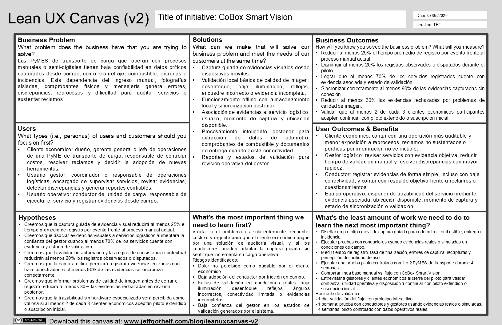

### 1.3. Segmentos Objetivo

CoWare identifica dos segmentos principales dentro del dominio del transporte de carga. Ambos participan en la misma operación logística, pero cumplen roles distintos frente al problema identificado: la falta de información operativa verificable, trazable y auditable. El primer segmento concentra la decisión de adopción, la supervisión del servicio y la necesidad de control operativo; el segundo concentra la generación de evidencias en campo, sin la cual la solución no podría producir datos confiables.

La selección de estos segmentos se sustenta en el contexto del transporte terrestre de carga en Perú, donde el Ministerio de Transportes y Comunicaciones mantiene estadísticas específicas sobre el parque vehicular autorizado de transporte de carga general nacional (Ministerio de Transportes y Comunicaciones [MTC], 2025). Asimismo, el enfoque en pequeñas y medianas empresas responde a la realidad de adopción tecnológica del país: PRODUCE reporta que la informalidad de las MYPE alcanzó el 84.8% en 2022, con una tasa de 91.3% en microempresas y 48.3% en pequeñas empresas, lo que evidencia la necesidad de soluciones accesibles, simples y de baja fricción operativa (Ministerio de la Producción [PRODUCE], 2024).

#### Segmento inicial priorizado para el MVP

Para la primera validación de CoBox Smart Vision, el segmento inicial priorizado estará compuesto por pequeñas y medianas empresas de transporte de carga que realizan servicios recurrentes de distribución urbana o rutas interprovinciales, operan con flotas pequeñas o medianas y gestionan evidencias operativas mediante procesos manuales o semi-digitales.

Este segmento se prioriza porque concentra cuatro condiciones relevantes para el MVP: necesidad frecuente de registrar kilometraje, combustible, entregas e incidencias; uso de fotografías, comprobantes físicos, hojas de cálculo o mensajería como respaldo operativo; ausencia de telemetría especializada o plataformas enterprise; y necesidad de sustentar servicios ante clientes, gerencia o responsables de operación. Por ello, permite validar la propuesta con pilotos controlados, métricas operativas claras y bajo costo de adopción.

#### Segmento Primario: Cliente económico y gestión de operaciones logísticas

Este segmento está conformado por dueños, gerentes generales, jefes de operaciones, coordinadores y responsables de operaciones en pequeñas y medianas empresas de transporte de carga. Estas personas administran flotas, supervisan servicios logísticos, responden ante clientes y toman decisiones sobre herramientas que puedan mejorar el control operativo.

- **Perfil organizacional**: PyMES de transporte de carga con estructuras operativas tradicionales, procesos manuales o semi-digitales, uso frecuente de hojas de cálculo, registros físicos, llamadas, fotografías aisladas y aplicaciones de mensajería para coordinar y validar operaciones.

- **Características del segmento**:
  - Empresas con flotas pequeñas o medianas.
  - Operaciones recurrentes de distribución urbana, rutas interprovinciales o servicios para clientes empresariales.
  - Registro operativo basado en hojas de cálculo, comprobantes físicos, fotografías, llamadas o mensajería.
  - Capacidad limitada para asumir soluciones enterprise, hardware especializado o implementaciones complejas.
  - Necesidad de herramientas que puedan adoptarse progresivamente sin interrumpir la operación diaria.

- **Necesidades clave**:
  - Contar con información confiable, verificable y asociada a cada servicio logístico.
  - Reducir discrepancias en registros de kilometraje, combustible, entregas e incidencias.
  - Auditar operaciones con evidencia objetiva y no solo con declaraciones, fotografías aisladas o registros manuales.
  - Generar reportes útiles para clientes, gerencia y control interno.
  - Sustentar reclamos o discrepancias con trazabilidad del servicio, evidencia visual y contexto de captura.

- **Problemas relevantes**:
  - Inconsistencias en kilometraje y consumo de combustible.
  - Dificultad para validar comprobantes, entregas o incidencias reportadas desde campo.
  - Conflictos internos por discrepancias entre lo reportado por el conductor y lo revisado por el gestor.
  - Reprocesos administrativos al consolidar información dispersa.
  - Pérdida de confianza en los datos utilizados para tomar decisiones operativas.
  - Falta de evidencia estructurada para responder reclamos de clientes o auditorías internas.

- **Motivaciones principales**:
  - Reducir errores, reprocesos y conflictos operativos.
  - Mejorar la trazabilidad de servicios sin incorporar hardware especializado.
  - Contar con evidencia verificable para auditoría, reclamos y toma de decisiones.
  - Adoptar una solución accesible y escalable según número de vehículos, usuarios o módulos funcionales.
  - Validar una mejora operativa sin asumir la complejidad de una plataforma logística enterprise.

- **Relación con la solución**:
  Este segmento se beneficia directamente de CoBox Smart Vision al obtener una capa de auditoría operativa basada en registros visuales trazables. La solución permite que los gestores revisen registros asociados a servicios específicos, con estados de validación, trazabilidad, geolocalización y soporte documental para resolver discrepancias o sustentar decisiones operativas.

#### Segmento Secundario: Usuario operativo - Conductores de unidades de carga

Este segmento está compuesto por conductores y operadores de campo encargados de ejecutar los servicios de transporte, registrar eventos operativos y capturar evidencias durante la ruta. Aunque no suelen ser los compradores de la solución, son usuarios críticos para su adopción, ya que la calidad de los datos depende de su interacción con la aplicación móvil.

- **Perfil demográfico y operativo**:
  - Conductores con experiencia en transporte urbano, interprovincial o de carga especializada.
  - Usuarios con niveles diversos de alfabetización digital.
  - Operación en jornadas extensas, condiciones de fatiga, presión de tiempo y conectividad variable.
  - Uso frecuente de herramientas simples como llamadas, WhatsApp, mapas móviles o fotografías enviadas por mensajería.

- **Responsabilidades operativas**:
  - Registrar inicio y cierre de servicio.
  - Capturar kilometraje, combustible, entregas, incidencias y paradas no planificadas.
  - Proporcionar evidencia de actividades realizadas en campo.
  - Mantener comunicación con el equipo de operaciones.
  - Sincronizar información cuando exista conectividad disponible.

- **Problemas relevantes**:
  - Carga operativa asociada al ingreso manual de datos.
  - Errores involuntarios por cansancio, presión operativa o registros posteriores al servicio.
  - Conflictos derivados de falta de evidencia objetiva.
  - Dificultad para utilizar aplicaciones complejas durante la operación.
  - Riesgo de que registros válidos no sean aceptados por falta de trazabilidad o contexto.
  - Pérdida de tiempo cuando debe reenviar fotografías, explicar incidencias o corregir información incompleta después del servicio.

- **Necesidades funcionales**:
  - Interacción móvil simple, rápida y guiada.
  - Funcionamiento offline en zonas con baja conectividad.
  - Confirmación visible de guardado, sincronización y validación.
  - Mensajes claros cuando una evidencia sea borrosa, incompleta, tenga baja iluminación o no pueda validarse.
  - Acceso a historial de evidencias como respaldo de su trabajo.
  - Opción de recaptura o registro observado cuando una evidencia no cumpla condiciones mínimas de calidad.

- **Motivaciones principales**:
  - Reducir el tiempo y esfuerzo necesario para registrar información.
  - Evitar conflictos con supervisores por discrepancias de datos.
  - Contar con respaldo objetivo frente a reclamos, descuentos injustificados o cuestionamientos posteriores.
  - Usar una herramienta que no interrumpa la ruta ni incremente la carga operativa.

- **Relación con la solución**:
  CoBox Smart Vision reemplaza parte del ingreso manual por captura guiada de evidencia visual desde dispositivos móviles. Para este segmento, el valor principal está en registrar información de forma rápida, incluso sin conexión, recibir alertas claras cuando una evidencia no sea válida y contar con información asociada al servicio que respalde su trabajo ante gestores o clientes.

---

## Capítulo II: Requirements Elicitation & Analysis

### 2.1. Competidores

Para analizar el entorno competitivo de CoBox Smart Vision, se identificaron tres soluciones digitales vinculadas a la gestión de flotas, trazabilidad logística, telemática, optimización de rutas y control operativo. Estas alternativas permiten contrastar cómo el mercado aborda problemas relacionados con visibilidad, eficiencia, evidencia de operación y control de servicios logísticos.

El análisis considera competidores directos e indirectos. Samsara y Powerfleet representan soluciones con fuerte orientación a telemática, conectividad de activos, monitoreo e integración de datos de flota, usualmente asociadas a empresas con mayor capacidad de inversión tecnológica. Driv.in representa una alternativa SaaS más cercana al contexto latinoamericano, enfocada en optimización logística, última milla, ruteo y control de entregas.

A diferencia de estas soluciones, CoBox Smart Vision se posiciona inicialmente como una capa accesible de auditoría operativa basada en evidencia visual verificable. Su foco no es reemplazar un TMS, ERP o sistema de telemetría por hardware, sino validar evidencias críticas capturadas en campo —como odómetros, comprobantes de combustible, documentos de entrega e incidencias— para reducir errores manuales, discrepancias operativas y reprocesos administrativos en PyMES de transporte de carga.

**Competidor 1: Samsara**  
Web: https://www.samsara.com/mx  

Samsara es una plataforma orientada a operaciones conectadas, telemática, seguridad vial, monitoreo de activos y análisis de datos operativos. Su propuesta se apoya en dispositivos, sensores, cámaras y software para ofrecer visibilidad sobre flotas y operaciones. Su fortaleza principal se encuentra en la integración de hardware, datos en tiempo real y herramientas de seguridad; sin embargo, su enfoque puede implicar mayor complejidad y costo de adopción para PyMES que no cuentan con infraestructura tecnológica avanzada.

**Competidor 2: Powerfleet**  
Web: https://www.fleetcomplete.com/es/  

Powerfleet representa una solución de gestión de flotas y activos conectados, enfocada en telemática, integración de datos, monitoreo operativo y administración de activos móviles. Su valor diferencial se encuentra en la consolidación de información proveniente de vehículos, sensores, dispositivos y plataformas externas. No obstante, este enfoque está más orientado a organizaciones que requieren integración profunda de datos y gestión de flotas con mayor nivel de madurez tecnológica.

**Competidor 3: Driv.in**  
Web: https://driv.in/  

Driv.in es una solución SaaS especializada en gestión de transporte, optimización de rutas, última milla, seguimiento de entregas y experiencia del cliente final en operaciones logísticas. Su fortaleza se encuentra en la planificación y control de distribución, especialmente en contextos de operación urbana y regional. Sin embargo, su foco principal se orienta a la optimización logística y control de entrega, no necesariamente a la validación automática de evidencias visuales críticas para auditoría operativa en PyMES de transporte de carga.

A partir de este contraste, se identifica una oportunidad de diferenciación para CoBox Smart Vision: ofrecer una solución de menor fricción de adopción, basada en dispositivos móviles existentes, captura guiada, operación offline, validación local básica de calidad de imagen y procesamiento inteligente de evidencias cuando exista conectividad. Esta orientación permite atender a empresas que necesitan mejorar la confiabilidad de sus registros sin asumir la complejidad de soluciones enterprise o infraestructura especializada.

#### 2.1.1. Análisis competitivo

<table style="width:100%; border-collapse: collapse; font-family: sans-serif; font-size: 14px; border: 1px solid #000;">
    <thead>
        <tr style="background-color: #f2f2f2;">
            <th colspan="6" style="border: 1px solid #000; padding: 10px; text-align: left; font-size: 18px;">Competitive Analysis Landscape</th>
        </tr>
        <tr>
            <td style="border: 1px solid #000; padding: 10px; font-weight: bold; width: 15%;">¿Por qué llevar a cabo este análisis?</td>
            <td colspan="5" style="border: 1px solid #000; padding: 10px; vertical-align: top;">
                El análisis competitivo permite identificar cómo las soluciones actuales abordan la gestión de flotas, la trazabilidad logística, el monitoreo operativo y el control de entregas. A partir de esta comparación, CoBox Smart Vision puede reconocer oportunidades de diferenciación enfocadas en la validación de evidencias visuales, la reducción de errores manuales, la operación offline y la accesibilidad para PyMES de transporte de carga.
                  
            </td>
        </tr>
        <tr style="text-align: center; font-weight: bold; background-color: #fafafa;">
            <td colspan="2" style="border: 1px solid #000; padding: 10px; width: 30%;">Nombre y Logo</td>
            <td style="border: 1px solid #000; padding: 10px; width: 17.5%;">
                CoBox SV 
                

                    
                

            </td>
            <td style="border: 1px solid #000; padding: 10px; width: 17.5%;">
                Samsara 
                

                    
                

            </td>
            <td style="border: 1px solid #000; padding: 10px; width: 17.5%;">
                Powerfleet 
                

                    
                

            </td>
            <td style="border: 1px solid #000; padding: 10px; width: 17.5%;">
                Driv.in 
                

                    
                

            </td>
        </tr>
    </thead>
    <tbody>
        <tr>
            <td rowspan="2" style="border: 1px solid #000; padding: 10px; font-weight: bold; text-align: center; writing-mode: vertical-lr; transform: rotate(180deg);">Perfil</td>
            <td style="border: 1px solid #000; padding: 10px;">Overview</td>
            <td style="border: 1px solid #000;">Capa de auditoría logística basada en evidencia visual verificable para validar datos operativos críticos capturados en campo.</td>
            <td style="border: 1px solid #000;">Plataforma de operaciones conectadas orientada a telemática, seguridad de flotas, monitoreo de activos y análisis operativo.</td>
            <td style="border: 1px solid #000;">Solución de gestión de flotas y activos conectados enfocada en telemática, integración de datos y visibilidad operativa.</td>
            <td style="border: 1px solid #000;">TMS SaaS orientado a planificación logística, optimización de rutas, última milla, seguimiento de entregas y experiencia del cliente final.</td>
        </tr>
        <tr>
            <td style="border: 1px solid #000; padding: 10px;">Ventaja competitiva ¿Qué valor ofrece a los clientes?</td>
            <td style="border: 1px solid #000;">Permite validar evidencias críticas sin requerir hardware especializado, usando captura móvil guiada, trazabilidad contextual y procesamiento inteligente.</td>
            <td style="border: 1px solid #000;">Ofrece visibilidad operativa avanzada mediante sensores, cámaras, telemática y analítica para mejorar seguridad y eficiencia.</td>
            <td style="border: 1px solid #000;">Centraliza datos de activos y flotas, facilitando integración con sistemas empresariales y monitoreo de operaciones distribuidas.</td>
            <td style="border: 1px solid #000;">Optimiza rutas, entregas y seguimiento logístico, mejorando la planificación y la experiencia del cliente final.</td>
        </tr>
        <tr>
            <td rowspan="2" style="border: 1px solid #000; padding: 10px; font-weight: bold; text-align: center; writing-mode: vertical-lr; transform: rotate(180deg); background-color: #f9f9f9;">Perfil de Marketing</td>
            <td style="border: 1px solid #000; padding: 10px; background-color: #f9f9f9;">Mercado objetivo</td>
            <td style="border: 1px solid #000; background-color: #f9f9f9;">PyMES de transporte de carga con procesos manuales o semi-digitales, baja adopción de telemetría especializada y necesidad de evidencia verificable.</td>
            <td style="border: 1px solid #000; background-color: #f9f9f9;">Empresas medianas y grandes con flotas que requieren telemática, seguridad vial, monitoreo de activos y control operativo avanzado.</td>
            <td style="border: 1px solid #000; background-color: #f9f9f9;">Organizaciones con flotas, activos móviles o necesidades de integración de datos operativos a nivel empresarial.</td>
            <td style="border: 1px solid #000; background-color: #f9f9f9;">Empresas de retail, consumo masivo, operadores logísticos y organizaciones con operaciones de distribución urbana o última milla.</td>
        </tr>
        <tr>
            <td style="border: 1px solid #000; padding: 10px; background-color: #f9f9f9;">Estrategias de marketing</td>
            <td style="border: 1px solid #000; background-color: #f9f9f9;">Posicionamiento basado en confiabilidad operativa, reducción de discrepancias, facilidad de adopción y uso de dispositivos móviles existentes.</td>
            <td style="border: 1px solid #000; background-color: #f9f9f9;">Comunicación centrada en seguridad, eficiencia operacional, reducción de riesgos y control integral de flotas conectadas.</td>
            <td style="border: 1px solid #000; background-color: #f9f9f9;">Enfoque en integración de datos, visibilidad de activos, administración centralizada y escalabilidad empresarial.</td>
            <td style="border: 1px solid #000; background-color: #f9f9f9;">Enfoque en optimización de distribución, eficiencia de rutas, seguimiento de entregas y mejora de experiencia del cliente final.</td>
        </tr>
        <tr>
            <td rowspan="3" style="border: 1px solid #000; padding: 10px; font-weight: bold; text-align: center; writing-mode: vertical-lr; transform: rotate(180deg);">Perfil de Producto</td>
            <td style="border: 1px solid #000; padding: 10px;">Productos & Servicios</td>
            <td style="border: 1px solid #000;">Aplicación móvil de captura guiada, validación básica local de calidad de imagen, sincronización offline, backend de trazabilidad y procesamiento inteligente de evidencias.</td>
            <td style="border: 1px solid #000;">Software de gestión de flotas, dispositivos telemáticos, cámaras, sensores, monitoreo de activos, seguridad y reportes operativos.</td>
            <td style="border: 1px solid #000;">Plataforma de gestión de flotas, telemática, monitoreo de activos, integración de datos y herramientas de control operativo.</td>
            <td style="border: 1px solid #000;">Planificación de rutas, seguimiento de entregas, app para conductores, proof of delivery, notificaciones y analítica logística.</td>
        </tr>
        <tr>
            <td style="border: 1px solid #000; padding: 10px;">Precios & Costos</td>
            <td style="border: 1px solid #000;">Modelo SaaS modular orientado a bajo costo de adopción, sin inversión inicial en hardware especializado.</td>
            <td style="border: 1px solid #000;">Costo potencialmente alto por combinación de software, dispositivos, cámaras, sensores e implementación.</td>
            <td style="border: 1px solid #000;">Costo medio o alto según volumen de activos, funcionalidades contratadas e integraciones requeridas.</td>
            <td style="border: 1px solid #000;">Modelo SaaS escalable, generalmente asociado al volumen operativo, usuarios, vehículos o servicios gestionados.</td>
        </tr>
        <tr>
            <td style="border: 1px solid #000; padding: 10px;">Canales de distribución (Web y/o Móvil)</td>
            <td style="border: 1px solid #000;">Web + aplicación móvil, priorizando uso de dispositivos móviles existentes por parte de conductores y gestores.</td>
            <td style="border: 1px solid #000;">Web + aplicación móvil + hardware IoT, cámaras y sensores instalados en vehículos o activos.</td>
            <td style="border: 1px solid #000;">Web + aplicación móvil + dispositivos telemáticos + integraciones con plataformas empresariales.</td>
            <td style="border: 1px solid #000;">Web + aplicación móvil + integraciones con canales de notificación y sistemas logísticos.</td>
        </tr>
        <tr>
            <td rowspan="5" style="border: 1px solid #000; padding: 10px; font-weight: bold; text-align: center; writing-mode: vertical-lr; transform: rotate(180deg); background-color: #fdfdfd;">Análisis SWOT</td>
            <td style="border: 1px solid #000; padding: 10px; font-size: 11px; background-color: #fdfdfd;" colspan="5">
                Realice esto para su startup y sus competidores. Sus fortalezas deberían apoyar sus oportunidades y contribuir a lo que ustedes definen como su posible ventaja competitiva.
            </td>
        </tr>
        <tr>
            <td style="border: 1px solid #000; padding: 10px;">Fortalezas</td>
            <td style="border: 1px solid #000;">Baja fricción de adopción, enfoque en PyMES, captura móvil guiada, operación offline y validación de evidencias críticas sin hardware especializado.</td>
            <td style="border: 1px solid #000;">Marca consolidada, ecosistema de hardware y software, monitoreo en tiempo real y capacidades avanzadas de telemática.</td>
            <td style="border: 1px solid #000;">Experiencia en integración de datos de flotas, monitoreo de activos y soporte para operaciones empresariales complejas.</td>
            <td style="border: 1px solid #000;">Especialización en ruteo, distribución, última milla y seguimiento de entregas en mercados latinoamericanos.</td>
        </tr>
        <tr>
            <td style="border: 1px solid #000; padding: 10px;">Debilidades</td>
            <td style="border: 1px solid #000;">Dependencia de la calidad de la cámara, condiciones de captura, conectividad posterior y correcta adopción por parte de conductores.</td>
            <td style="border: 1px solid #000;">Mayor complejidad de implementación y posible dependencia de dispositivos o infraestructura especializada.</td>
            <td style="border: 1px solid #000;">Puede resultar complejo para empresas pequeñas con procesos manuales, baja madurez digital o recursos limitados.</td>
            <td style="border: 1px solid #000;">Su foco principal está en optimización logística y entregas, no necesariamente en auditoría visual de evidencias críticas como odómetro o combustible.</td>
        </tr>
        <tr>
            <td style="border: 1px solid #000; padding: 10px;">Oportunidades</td>
            <td style="border: 1px solid #000;">Atender PyMES que requieren trazabilidad y evidencia verificable, pero no pueden asumir telemetría especializada ni plataformas enterprise.</td>
            <td style="border: 1px solid #000;">Expandir capacidades de análisis predictivo, seguridad vial y automatización operativa en flotas conectadas.</td>
            <td style="border: 1px solid #000;">Fortalecer su rol como plataforma de datos para flotas, seguros, mantenimiento y gestión de activos.</td>
            <td style="border: 1px solid #000;">Ampliar su cobertura en mercados con alta demanda de digitalización logística, última milla y visibilidad de entregas.</td>
        </tr>
        <tr>
            <td style="border: 1px solid #000; padding: 10px;">Amenazas</td>
            <td style="border: 1px solid #000;">Competidores consolidados podrían incorporar módulos de validación visual o proof of delivery más avanzados dentro de sus plataformas existentes.</td>
            <td style="border: 1px solid #000;">Soluciones más livianas y móviles podrían captar segmentos PyME que no requieren telemática completa.</td>
            <td style="border: 1px solid #000;">Nuevas plataformas SaaS de menor costo podrían ofrecer integración básica de flotas con menor complejidad de adopción.</td>
            <td style="border: 1px solid #000;">Actores globales o regionales podrían integrar auditoría visual, validación documental y seguimiento logístico en una sola solución.</td>
        </tr>
    </tbody>
</table>

El análisis evidencia que los competidores revisados cuentan con fortalezas relevantes en telemática, monitoreo de flotas, optimización de rutas, control de entregas e integración de datos. Sin embargo, también permite identificar un espacio competitivo para CoBox Smart Vision: la validación de evidencias operativas críticas en PyMES de transporte de carga que aún dependen de registros manuales, fotografías aisladas, comprobantes físicos o mensajería.

Por ello, la ventaja inicial de CoBox Smart Vision no debe formularse como superioridad general frente a plataformas consolidadas, sino como especialización en un problema más acotado: convertir evidencia visual capturada en campo en información verificable, trazable y útil para auditoría operativa. Esta diferenciación será la base para definir las estrategias y tácticas frente a competidores en la siguiente subsección.

#### 2.1.2. Estrategias y tácticas frente a competidores

A partir del análisis competitivo, CoBox Smart Vision define sus estrategias frente a competidores desde una posición de especialización. La solución no busca competir directamente en amplitud funcional con plataformas consolidadas de telemática, gestión de flotas o planificación logística, sino enfocarse en una brecha específica identificada en el segmento objetivo: la falta de información operativa verificable, trazable y auditable durante la ejecución de servicios de transporte de carga.

Mientras soluciones como Samsara y Powerfleet se orientan principalmente a telemática, monitoreo de activos, sensores, cámaras o integración de datos empresariales, y Driv.in se enfoca en planificación logística, ruteo y control de entregas, CoBox Smart Vision se posiciona como una capa accesible de auditoría operativa basada en evidencia visual. Su ventaja preliminar se concentra en validar evidencias críticas capturadas desde campo —como odómetros, comprobantes de combustible, documentos de entrega e incidencias— sin exigir infraestructura especializada ni reemplazar los sistemas existentes de la empresa.

**Estrategia de posicionamiento**

CoBox Smart Vision se posiciona como una solución especializada en mejorar la confiabilidad de los datos operativos capturados en campo. Su propuesta se centra en reducir la dependencia del ingreso manual mediante captura móvil guiada, validación local básica de calidad de imagen, trazabilidad contextual, operación offline y procesamiento inteligente de evidencias cuando exista conectividad.

Este posicionamiento permite diferenciar la solución frente a competidores más amplios. En lugar de ofrecer una plataforma integral de gestión de flotas o un TMS completo, CoBox Smart Vision se enfoca en resolver una brecha concreta: transformar evidencias visuales dispersas en información verificable para auditoría, resolución de discrepancias y toma de decisiones operativas.

La estrategia resulta especialmente relevante para pequeñas y medianas empresas de transporte de carga que actualmente operan con hojas de cálculo, comprobantes físicos, fotografías enviadas por mensajería o registros manuales, y que no cuentan con recursos suficientes para adoptar soluciones enterprise, telemetría avanzada o hardware especializado.

**Estrategias frente a competidores**

1. _Estrategia de diferenciación por especialización_

   CoBox Smart Vision no compite con Samsara, Powerfleet o Driv.in desde la amplitud de funcionalidades, sino desde la profundidad en un problema específico: la validación de evidencias operativas críticas. Esta estrategia permite concentrar el MVP en casos donde el error manual, la falta de trazabilidad o la manipulación de datos generan mayor fricción para gestores y conductores.

   La especialización se expresa en flujos como captura de odómetro, validación de comprobantes de combustible, registro de documentos de entrega e incidencias. Estos casos permiten demostrar valor operativo sin desarrollar una plataforma logística completa desde la primera versión.

2. _Estrategia de entrada por segmento desatendido_

   CoBox Smart Vision prioriza inicialmente a PyMES de transporte de carga que operan con procesos manuales o semi-digitales. Este segmento suele quedar parcialmente desatendido por soluciones enterprise debido a barreras de costo, complejidad de implementación, necesidad de hardware o dependencia de integraciones avanzadas.

   Frente a competidores con mayor orientación a empresas medianas o grandes, la solución propone una adopción gradual, más accesible y centrada en dolores operativos frecuentes: discrepancias de kilometraje, comprobantes difíciles de verificar, evidencias aisladas, reclamos no sustentados y reprocesos administrativos.

3. _Estrategia de reducción de fricción de adopción_

   A diferencia de soluciones basadas en instalación de sensores, cámaras o dispositivos telemáticos, CoBox Smart Vision prioriza el uso de dispositivos móviles existentes. Esto reduce la inversión inicial y permite validar la propuesta mediante pilotos controlados antes de escalar la solución.

   La reducción de fricción también se refleja en la experiencia del conductor. El flujo debe minimizar el ingreso manual, guiar la captura de evidencia, funcionar en escenarios de conectividad limitada y mostrar mensajes claros cuando una imagen esté borrosa, incompleta, mal iluminada o no pueda ser validada correctamente.

4. _Estrategia de complementariedad frente a sistemas existentes_

   CoBox Smart Vision no se plantea como reemplazo inmediato de soluciones de gestión logística, ERP, TMS o sistemas de flota. Su estrategia es actuar como una capa complementaria de auditoría visual que mejora la confiabilidad de los datos antes de que estos sean utilizados por gestores, clientes o responsables de operación.

   Esta aproximación reduce la resistencia de adopción, ya que permite integrarse progresivamente al flujo actual de la empresa y enfocarse primero en los puntos de mayor dolor operativo.

5. _Estrategia defensiva frente a competidores consolidados_

   Una amenaza relevante es que plataformas consolidadas incorporen módulos de validación visual, proof of delivery avanzado o procesamiento documental dentro de sus propios ecosistemas. Para responder a esta amenaza, CoBox Smart Vision debe construir ventaja desde la cercanía con el segmento PyME, la simplicidad de uso, la rapidez de implementación y la adaptación a condiciones reales de campo en el contexto local.

   La defensa competitiva no debe basarse únicamente en la tecnología de IA, sino en la combinación de bajo costo de adopción, comprensión del proceso operativo, flujos simples para conductores y métricas claras de reducción de discrepancias.

**Tácticas frente a competidores**

1. _Priorizar casos de uso críticos y medibles_

   El MVP debe concentrarse en eventos donde la validación de evidencia visual tenga impacto directo: odómetro inicial y final, comprobantes de combustible, documentos de entrega e incidencias. Esta táctica permite demostrar valor tangible sin competir en todos los módulos de una plataforma logística completa.

2. _Ejecutar pilotos con PyMES de transporte_

   Se deben realizar pruebas piloto con gestores y conductores reales para validar si la captura guiada reduce errores, disminuye reprocesos y mejora la confianza en la información operativa. Estos pilotos permitirán comparar el proceso actual frente al uso de CoBox Smart Vision mediante métricas antes/después.

3. _Diseñar una experiencia móvil de baja carga cognitiva_

   La aplicación móvil debe priorizar flujos simples, instrucciones claras, confirmaciones visibles de guardado y sincronización, y alertas comprensibles ante evidencias borrosas, incompletas, con baja iluminación o problemas de lectura. Esta táctica responde directamente a la necesidad de adopción por parte de conductores que trabajan bajo presión de tiempo, fatiga y conectividad variable.

4. _Usar operación offline como diferenciador práctico_

   La solución debe permitir que el conductor capture evidencias sin conexión y que estas se sincronicen posteriormente conservando relación con el servicio, usuario, momento de captura y ubicación disponible. Esta táctica diferencia a CoBox Smart Vision en contextos donde las rutas pueden presentar conectividad limitada.

5. _Comunicar valor en términos de auditoría, no solo digitalización_

   El mensaje competitivo debe evitar enfocarse únicamente en “digitalizar registros”. La propuesta debe comunicar que el valor está en contar con evidencia verificable para resolver discrepancias, sustentar reclamos, reducir reprocesos y mejorar la confiabilidad de los datos operativos.

6. _Medir indicadores de impacto operativo_

   Para sustentar la propuesta frente a alternativas existentes, se deben medir indicadores como tiempo promedio de registro, porcentaje de evidencias rechazadas, cantidad de registros observados, número de discrepancias resueltas con evidencia y percepción de confianza del gestor sobre la información registrada.

7. _Mantener bajo costo de adopción_

   La táctica comercial inicial debe evitar dependencias fuertes de hardware especializado o implementaciones complejas. El modelo debe apoyarse en dispositivos móviles existentes, pilotos controlados y una propuesta SaaS modular que permita escalar por vehículos, usuarios o funcionalidades.

8. _Diferenciarse frente a cada competidor_

   - Frente a Samsara, CoBox Smart Vision debe diferenciarse por menor dependencia de hardware y mayor accesibilidad para PyMES.
   - Frente a Powerfleet, debe diferenciarse por simplicidad de implementación y foco en evidencia visual operativa, no en integración compleja de activos.
   - Frente a Driv.in, debe diferenciarse por auditoría de datos críticos capturados en campo, no por optimización de rutas o última milla.

En conjunto, estas estrategias y tácticas permiten que CoBox Smart Vision compita desde un enfoque acotado, defendible y alineado con el alcance del MVP. La ventaja inicial no consiste en superar funcionalmente a plataformas consolidadas, sino en resolver mejor una brecha específica para el segmento objetivo: convertir evidencias visuales capturadas durante la operación logística en información confiable, trazable y útil para auditoría.

### 2.2. Entrevistas

#### 2.2.1 Diseño de entrevistas

El diseño de entrevistas tiene como objetivo validar las hipótesis planteadas en el proceso Lean UX, particularmente aquellas relacionadas con la adopción de soluciones basadas en inteligencia artificial, la reducción del ingreso manual de datos y la confiabilidad de la información operativa.

Se han definido dos segmentos objetivo para la recolección de información: gestores de operaciones logísticas y conductores de unidades de carga.

---

**Bloque general: Preguntas demográficas y de contexto**

Estas preguntas se aplican al inicio de cada entrevista, independientemente del segmento al que pertenezca el entrevistado. Su propósito es recolectar información base para la construcción de User Persona y para contextualizar los hallazgos obtenidos durante el análisis de entrevistas.

1. ¿Cuál es su edad, distrito de residencia o zona principal de trabajo, y ocupación actual?
2. ¿Cuánto tiempo de experiencia tiene en transporte, logística, distribución o actividades relacionadas?
3. ¿Qué dispositivos utiliza con mayor frecuencia en su trabajo diario: celular, computadora, tablet u otros?
4. ¿Qué canales digitales utiliza más para coordinar o reportar información: WhatsApp, llamadas, correo, hojas de cálculo, aplicaciones móviles, sistemas web u otros?
5. ¿Qué tan cómodo se siente utilizando herramientas digitales o aplicaciones móviles en su trabajo?

---

**Segmento 1: Gestión de operaciones logísticas**

**Objetivo del segmento:**  
Comprender cómo los responsables de operación registran, supervisan, validan y utilizan la información logística; qué problemas enfrentan con los datos reportados desde campo; qué herramientas utilizan actualmente; y qué factores influirían en la adopción de una solución basada en evidencia visual verificable.

1. ¿Cuál es su rol dentro de la empresa y qué responsabilidades tiene en la gestión de flota, conductores, servicios o decisiones operativas?
2. ¿Cuántos vehículos administra o supervisa, y qué tipo de operaciones realiza la empresa: distribución urbana, rutas interprovinciales, última milla u otro tipo de servicio?
3. ¿Cómo registran actualmente datos como kilometraje, consumo de combustible, entregas, incidencias o cierre de servicio?
4. ¿Qué herramientas utilizan para gestionar o supervisar la operación: papel, Excel, WhatsApp, llamadas, GPS, sistemas de flota, TMS u otras?
5. ¿Qué evidencias suelen recibir desde campo para validar un servicio, por ejemplo fotos, comprobantes, guías, ubicación, mensajes o documentos físicos?
6. ¿Qué problemas o inconsistencias ha identificado con mayor frecuencia en la información reportada por los conductores?
7. ¿Puede mencionar un caso reciente donde una diferencia de kilometraje, combustible, entrega, comprobante o incidencia haya generado revisión, reclamo o conflicto?
8. ¿Cómo validan actualmente si la información enviada desde campo es correcta, completa y corresponde al servicio realizado?
9. ¿Qué impacto generan estos errores o discrepancias en tiempo administrativo, costos, reclamos, relación con clientes o relación con conductores?
10. ¿Ha utilizado o evaluado soluciones como GPS, telemetría, gestión de flotas, TMS, ruteo o control de entregas? ¿Qué facilitó o impidió su adopción?
11. ¿Qué valor tendría para usted que una evidencia visual, como una foto del odómetro, comprobante o guía, quede asociada al servicio, fecha, conductor y ubicación?
12. ¿Qué factores serían decisivos para adoptar una solución de este tipo: costo, facilidad de uso, precisión, rapidez, funcionamiento sin conexión, integración, soporte o seguridad?

---

**Segmento 2: Conductores / operadores de ruta**

**Objetivo del segmento:**  
Comprender cómo los conductores registran información durante la ruta, qué dificultades enfrentan en campo, qué tan viable resulta la captura de evidencia visual, qué barreras existen para la adopción móvil y qué condiciones reales deben considerarse para diseñar una experiencia simple, offline y de baja carga operativa.

1. ¿Cuánto tiempo lleva trabajando como conductor u operador de transporte de carga, y qué tipo de rutas realiza con mayor frecuencia?
2. ¿Qué responsabilidades tiene además de conducir, por ejemplo registrar kilometraje, reportar entregas, guardar comprobantes o informar incidencias?
3. ¿Cómo registra actualmente el inicio y fin de cada servicio, el kilometraje, el combustible y las entregas realizadas?
4. ¿Qué herramientas utiliza para reportar información durante la ruta: papel, WhatsApp, llamadas, fotos, GPS, aplicaciones móviles u otras?
5. ¿En qué momento suele completar estos registros: durante la ruta, al llegar al destino, al finalizar el día o después del servicio?
6. ¿Cuánto tiempo aproximado le toma completar los registros relacionados con un servicio?
7. ¿Qué dificultades ha tenido al registrar información durante o después de un viaje?
8. ¿Ha tenido problemas por errores en kilometraje, combustible, comprobantes, entregas o incidencias reportadas? ¿Podría contar un caso?
9. ¿Qué condiciones hacen más difícil registrar o enviar información correctamente: falta de señal, poca luz, cansancio, apuro, tráfico, lluvia, presión del cliente u otras?
10. Cuando debe reportar un dato o evidencia, ¿qué le resulta más rápido o confiable: escribirlo, tomar una foto, enviar un mensaje, llamar al gestor o usar una aplicación? ¿Por qué?
11. ¿Qué tan útil sería que una aplicación le avise si una foto del odómetro, comprobante o documento salió borrosa, oscura, incompleta o difícil de leer antes de enviarla?
12. ¿Qué características debería tener una aplicación para que sea fácil de usar durante sus rutas y no se convierta en una carga adicional? 

#### 2.2.2. Registro de entrevistas

**Enlace a las entrevistas en Microsoft Stream:** https://upcedupe-my.sharepoint.com/:v:/g/personal/u202323270_upc_edu_pe/IQDzsbxvw7NXRI0oXSHTg3aYAX9OIPDS18ivmeaY0yGlTlU?e=K1jGSa

**Segmento 1: Gestión de operaciones logísticas**

**Entrevista #1**

**Datos generales**

| Detalle       | Información                                      |
|---------------|--------------------------------------------------|
| Entrevistado  | Ricardo Valdivia Quispe                          |
| Imagen | 

 |
| Rol           | Coordinador de Operaciones                       |
| Empresa       | Transportes Valdivia SAC                         |
| Edad          | 38 años                                          |
| Origen        | Reside en Los Olivos, Lima Norte                 |
| Experiencia   | 12 años en transporte y logística                |
| Flota         | 14 unidades — rutas Lima–Junín–Pasco             |

---

**Resumen de la entrevista**

Ricardo Valdivia Quispe es coordinador de operaciones en Transportes Valdivia SAC. Supervisa 14 unidades dedicadas principalmente a rutas interprovinciales hacia Junín y Pasco, además de reparto local en Lima. Su trabajo consiste en planificar rutas, asignar conductores, recibir incidencias, coordinar respuestas operativas y preparar reportes de kilometraje y combustible para revisión del dueño.

La empresa registra la operación mediante hojas de ruta físicas, boletas de combustible, guías de remisión, WhatsApp y Excel. Los conductores anotan kilometraje, entregas y combustible de forma manual, mientras que Ricardo consolida la información al retorno de cada servicio. Las incidencias no siguen un formato estándar y suelen reportarse por WhatsApp o de manera verbal.

Los principales problemas identificados son diferencias de kilometraje, bajo rendimiento de combustible y comprobantes que no coinciden con la ruta o fecha del servicio. Ricardo menciona que la validación actual se realiza manualmente, comparando rutas con Google Maps, revisando boletas y llamando al conductor cuando detecta inconsistencias.

Estas discrepancias generan entre dos y tres horas semanales de revisión adicional, conflictos con conductores y menor confianza en los reportes operativos. La empresa ya evaluó GPS y sistemas de gestión de flota, pero no los adoptó por costo mensual, complejidad y baja percepción de retorno.

Ricardo considera valioso contar con evidencia visual asociada al servicio, conductor, fecha y ubicación, especialmente para reducir discusiones y sustentar reportes ante el dueño. Para adoptar una solución, prioriza confiabilidad en operación real, facilidad de uso para conductores, precio accesible y acompañamiento inicial.

---

**Entrevista #2**

**Datos generales**

| Detalle       | Información                                          |
|---------------|------------------------------------------------------|
| Entrevistada  | Miriam Ccori Huanca                                  |
| Imagen | 

 |
| Rol           | Jefa de Operaciones                                  |
| Empresa       | Grupo Ccori Logística EIRL                           |
| Edad          | 44 años                                              |
| Origen        | San Juan de Lurigancho, Lima                         |
| Experiencia   | 18 años en transporte, logística y operaciones       |
| Flota         | 22 unidades — distribución retail Lima Metropolitana |

---

**Resumen de la entrevista**

Miriam Ccori Huanca es jefa de operaciones en Grupo Ccori Logística EIRL, empresa familiar de transporte y distribución. Supervisa 22 unidades activas, principalmente orientadas a distribución retail en Lima Metropolitana y algunas rutas cortas hacia Ica. Su rol incluye gestión de turnos, control de flota, coordinación con clientes, seguimiento de indicadores y reporte mensual al directorio.

La empresa cuenta con GPS y TMS activos; sin embargo, el proceso operativo sigue dependiendo de papel, WhatsApp y transcripción manual. Los conductores registran información durante la ruta en documentos físicos y luego el equipo administrativo la ingresa al sistema. Las guías de remisión y boletas de combustible se manejan físicamente, mientras que las incidencias se reportan por WhatsApp sin un protocolo estándar.

Los principales problemas identificados son variaciones no explicadas en consumo de combustible, inconsistencias entre reportes de conductor y ayudante, reclamos de clientes por faltantes de entrega y falta de evidencia digital con hora, coordenadas y fotografía. Miriam menciona que incluso perdieron un contrato retail porque no pudieron entregar evidencia digital trazable para auditoría interna del cliente.

La validación actual se realiza de forma manual y reactiva, cruzando datos del GPS, reportes del conductor y documentación física solo cuando aparece un reclamo o una alerta. Esta situación genera entre tres y cuatro horas diarias de transcripción y conciliación de datos, además de afectar la credibilidad de los reportes operativos frente al directorio.

Miriam considera que una solución de evidencia visual asociada al servicio, conductor, fecha y ubicación tendría alto valor para responder reclamos, sustentar indicadores y recuperar oportunidades comerciales perdidas por falta de trazabilidad. Para adoptar una herramienta de este tipo, prioriza integración o baja fricción con los sistemas actuales, soporte postventa real, adopción por parte de conductores y resultados medibles durante los primeros dos meses.
---

**Entrevista #3**

**Datos generales**

| Detalle       | Información                                           |
|---------------|-------------------------------------------------------|
| Entrevistado  | Jorge Mamani Apaza                                    |
| Imagen | 

 |
| Rol           | Gerente General y fundador                            |
| Empresa       | Trans Mamani Cargo SAC                                |
| Edad          | 52 años                                               |
| Origen        | Puno, reside en Villa El Salvador                     |
| Experiencia   | Más de 20 años en transporte de carga                 |
| Flota         | 8 unidades propias + 6 en alquiler — rutas Lima–sur   |

---

**Resumen de la entrevista**

Jorge Mamani Apaza es gerente general y fundador de Trans Mamani Cargo SAC. Además de dirigir la empresa, participa directamente en la operación: asigna rutas, contrata conductores, revisa camiones, coordina clientes y, en ocasiones, maneja cuando falta personal. Su empresa opera con 8 camiones propios y hasta 6 alquilados en temporadas de mayor demanda, principalmente en rutas hacia el sur del país.

La gestión actual se realiza mediante cuaderno, llamadas, WhatsApp y hojas de ruta físicas. Los conductores registran kilometraje, combustible, entregas e incidencias manualmente, y entregan boletas o guías al finalizar el servicio. La supervisión depende en gran medida de la confianza personal y de la experiencia de Jorge con las rutas, ya que no utiliza GPS, TMS ni sistemas digitales de flota.

Los principales problemas identificados son kilómetros que no coinciden con la ruta esperada, consumo de combustible difícil de justificar, sospechas de manipulación de odómetro en unidades alquiladas y boletas de grifos que no corresponden a la ruta. También menciona haber perdido un cliente en Arequipa porque no pudo entregar reportes digitales con información suficiente para auditoría interna.

La validación actual se basa en conocimiento empírico: Jorge compara los datos reportados con lo que sabe de las rutas, llama a conductores o consulta informalmente con personas en destino. Este método le permite detectar algunas inconsistencias, pero no es escalable ni verificable. Las discrepancias generan pérdida de dinero difícil de explicar, conflictos con conductores y limitaciones para presentarse ante clientes más grandes.

Jorge considera valioso contar con evidencia visual asociada al servicio, fecha, conductor y ubicación, porque le permitiría recuperar control sobre kilometraje y combustible, presentarse con mayor formalidad ante clientes y crecer sin depender exclusivamente de llamadas o confianza personal. Para adoptar una solución, prioriza simplicidad real, precio accesible, soporte disponible y una prueba piloto en una unidad real durante aproximadamente un mes.

---

**Segmento 2: Conductores / operadores de ruta**

**Entrevista #1**

**Datos generales**

| Detalle       | Información                                         |
|---------------|-----------------------------------------------------|
| Entrevistado  | Edilberto Poma Condori                              |
| Imagen | 

 |
| Rol           | Conductor de larga distancia                        |
| Ruta          | Lima–Arequipa–Juliaca                               |
| Edad          | 46 años                                             |
| Origen        | Juliaca, reside en Villa María del Triunfo          |
| Experiencia   | 19 años — licencia AIII-C, récord limpio en SUTRAN  |

---

**Resumen de la entrevista**

Edilberto Poma Condori es conductor de tracto camión con 19 años de experiencia en rutas de larga distancia, principalmente en la carretera sur entre Lima, Arequipa, Juliaca y Puno. Su trabajo implica viajes de varios días, con periodos cortos de descanso en Lima antes de volver a salir a ruta.

Actualmente registra el kilometraje, combustible, entregas e incidencias mediante hojas de ruta, cuadernillo personal, boletas físicas, guías firmadas, WhatsApp y llamadas. El cierre completo del servicio suele realizarse al regresar a Lima, lo que puede generar pérdida de detalles porque algunos eventos se reconstruyen de memoria después de varios días.

Las principales dificultades que identifica son la falta de señal en tramos largos, baja iluminación durante cargas nocturnas, frío en zonas de sierra, boletas ilegibles de provincia y eventos no planificados como desvíos o bloqueos de vía. También menciona haber tenido descuentos por diferencias de kilometraje que no pudo sustentar con evidencia objetiva.

Edilberto considera que tomar fotos del odómetro, comprobantes o documentos es más rápido y confiable que escribir datos manualmente, porque reduce errores y sirve como respaldo frente a cuestionamientos posteriores. También valora que una aplicación avise inmediatamente si una foto salió borrosa, oscura o incompleta, ya que permitiría corregir el registro antes de alejarse del lugar.

Para que una aplicación sea usable durante sus rutas, prioriza funcionamiento sin internet, botones grandes, pocos pasos, confirmación clara de guardado y autocompletado de datos conocidos como conductor o placa. Su expectativa principal es que la herramienta no aumente la carga operativa y funcione en condiciones reales de carretera.

---

**Entrevista #2**

**Datos generales**

| Detalle       | Información                                          |
|---------------|------------------------------------------------------|
| Entrevistada  | Yadira Ríos Solano                                   |
| Imagen | 

 |
| Rol           | Conductora de reparto urbano                         |
| Ruta          | Lima Metropolitana — reparto multípunto              |
| Edad          | 34 años                                              |
| Origen        | Piura, reside en San Martín de Porres                |
| Experiencia   | 5 años — licencia AIII-B, opera con ayudante         |

---

**Resumen de la entrevista**

Yadira Ríos Solano es conductora de reparto urbano con cinco años de experiencia. Realiza entregas en distintos distritos de Lima Metropolitana y puede atender entre 14 y 15 clientes por jornada. Además de conducir, registra entregas, coordina con su ayudante, recopila firmas, guarda guías y reporta incidencias al coordinador.

Actualmente utiliza WhatsApp, cuadernillo, guías físicas y una tableta proporcionada por la empresa. Sin embargo, señala que la tableta es lenta y suele preferir su celular personal para reportar novedades, tomar fotos y coordinar entregas. También menciona que comenzó a tomar fotografías de cada entrega por iniciativa propia para respaldarse ante reclamos de clientes.

Las principales dificultades que identifica son la cantidad de registros por jornada, el tráfico, el apuro entre entregas, el deterioro de documentos físicos por garúa, errores de registro entre conductor y ayudante, restricciones de uso de celular en algunos almacenes y problemas de batería durante jornadas largas. Estas condiciones pueden hacer que se omitan pasos o que la información quede incompleta.

Yadira considera que la fotografía es el método más rápido y confiable para sustentar entregas, pero el envío por WhatsApp genera desorden cuando hay muchas imágenes y el coordinador no puede identificar fácilmente a qué cliente corresponde cada evidencia. Por ello, valora una aplicación que organice automáticamente las fotos por cliente, hora y ubicación.

Para adoptar una herramienta móvil, prioriza rapidez, una lista clara de entregas pendientes, confirmación visible de guardado, validación inmediata de fotos borrosas o ilegibles, y acceso a su propio historial de registros. Desde su perspectiva, la solución debe ayudar tanto a la empresa como al conductor, evitando que sea percibida solo como una herramienta de control.

---

**Entrevista #3**

**Datos generales**

| Detalle       | Información                                                  |
|---------------|--------------------------------------------------------------|
| Entrevistado  | Hipólito Ccama Luque                                         |
| Imagen | 

 |
| Rol           | Conductor de carga pesada                                    |
| Ruta          | Lima–Ica–Nasca                                               |
| Edad          | 41 años                                                      |
| Origen        | Nasca, reside en Lurlurín desde hace 6 años                  |
| Experiencia   | 8 años — licencia AIII-C con habilitación mercancías peligrosas |

---

**Resumen de la entrevista**

Hipólito es conductor de carga pesada con ocho años de experiencia en la ruta Lima–Ica–Nasca. Maneja una cisterna con insumos agroindustriales, por lo que además de conducir debe completar formatos físicos relacionados con carga peligrosa, registrar kilometraje, conservar vouchers de combustible y reportar paradas, controles o incidencias durante el trayecto.

Actualmente utiliza papel, formatos físicos, llamadas telefónicas, fotos cuando se le solicitan, WhatsApp para reportes básicos y GPS de la unidad. Prefiere llamar antes que escribir, porque considera que es más rápido y reduce malentendidos. Sin embargo, muestra desconfianza frente a aplicaciones móviles, ya que percibe que algunas herramientas pueden usarse más para sancionar al conductor que para apoyarlo.

Las principales dificultades que identifica son la falta de señal en la ruta al sur, la poca iluminación durante viajes nocturnos, el cansancio, el apuro y la necesidad de registrar paradas obligatorias por controles policiales o eventos externos. Señala que estos eventos no siempre quedan bien documentados, lo que puede generar reclamos por demoras o sospechas injustificadas.

Hipólito ha tenido problemas cuando una parada policial retrasa la ruta y luego la empresa cuestiona el motivo de la demora. En estos casos, siente que no cuenta con evidencia suficiente para demostrar que cumplió con su trabajo y que el retraso respondió a una condición externa.

Para reportar información, considera que la llamada es lo más rápido, pero reconoce que una foto es más confiable cuando se necesita evidencia. Valora que una aplicación avise si una imagen salió borrosa, oscura o incompleta, porque permitiría corregir el registro en el momento y evitar reclamos posteriores.

Para adoptar una aplicación, considera indispensable que sea mínima, sin formularios largos ni lenguaje complejo, que registre información automáticamente cuando sea posible y que sirva como respaldo ante la empresa o entidades de control. También enfatiza que la herramienta debe ayudar a corregir errores antes de sancionar, de modo que sea percibida como apoyo y no como mecanismo de vigilancia.

#### 2.2.3. Análisis de entrevistas

A partir de las entrevistas realizadas a los segmentos de gestión de operaciones logísticas y conductores de unidades de carga, se identificaron patrones relevantes sobre el registro de información operativa, la validación de evidencias, la confiabilidad de los datos y las barreras de adopción tecnológica en empresas de transporte de carga.

El análisis se organiza por segmento objetivo y utiliza porcentajes calculados sobre la muestra cualitativa entrevistada. Estos porcentajes no buscan representar estadísticamente a todo el mercado, sino evidenciar la frecuencia de patrones dentro del grupo entrevistado y servir como base para la construcción posterior de los arquetipos y artefactos de needfinding.

##### 2.2.3.1. Alcance del análisis y muestra entrevistada

La muestra estuvo compuesta por seis entrevistas distribuidas en dos segmentos: tres entrevistas a representantes de gestión de operaciones logísticas y tres entrevistas a conductores u operadores de ruta. Esta distribución permite contrastar la perspectiva de quienes supervisan, validan y toman decisiones operativas con la perspectiva de quienes capturan información y evidencias desde campo.

| Segmento | Entrevistados | Cantidad | Porcentaje de la muestra |
|----------|---------------|----------|---------------------------|
| Gestión de operaciones logísticas | Ricardo Valdivia, Miriam Ccori, Jorge Mamani | 3 | 50% |
| Conductores / operadores de ruta | Edilberto Poma, Yadira Ríos, Hipólito | 3 | 50% |
| **Total** |  | **6** | **100%** |

  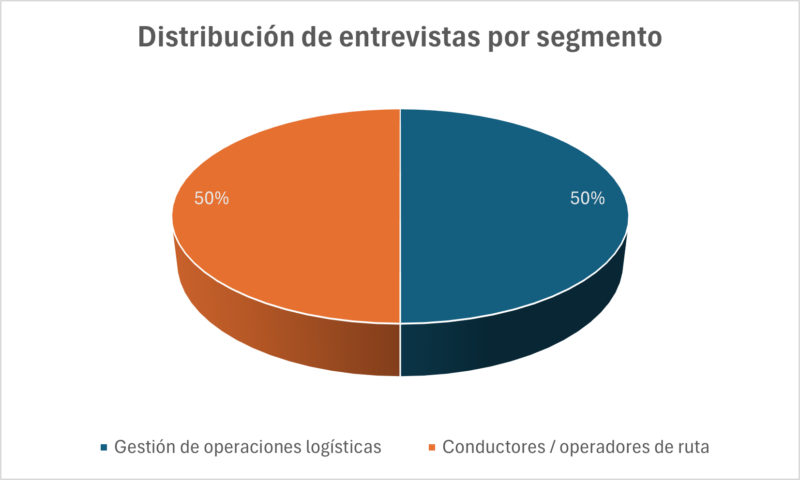

##### 2.2.3.2. Análisis del Segmento 1: Gestión de operaciones logísticas

El segmento de gestión de operaciones logísticas está compuesto por perfiles que supervisan rutas, flotas, conductores, reportes e incidencias. En el caso de las PyMES entrevistadas, se observó que el rol de gestión puede mezclarse con responsabilidades económicas o de decisión, especialmente cuando el entrevistado también participa en decisiones de inversión, relación con clientes o control directo de la operación.

###### Características objetivas del segmento

| Variable objetiva identificada | Entrevistados relacionados | Frecuencia | Porcentaje |
|--------------------------------|----------------------------|------------|------------|
| Utilizan WhatsApp, llamadas o canales informales para coordinar la operación | Ricardo, Miriam, Jorge | 3/3 | 100% |
| Mantienen dependencia de papel, cuadernos, hojas de ruta, boletas o guías físicas | Ricardo, Miriam, Jorge | 3/3 | 100% |
| Realizan validación manual o reactiva cuando existe sospecha, reclamo o discrepancia | Ricardo, Miriam, Jorge | 3/3 | 100% |
| Reportan discrepancias asociadas a kilometraje, combustible, comprobantes o entregas | Ricardo, Miriam, Jorge | 3/3 | 100% |
| Han usado, evaluado o descartado soluciones como GPS, TMS o aplicaciones de ruta | Ricardo, Miriam, Jorge | 3/3 | 100% |
| Identifican pérdida de tiempo administrativo por revisión, transcripción o conciliación de datos | Ricardo, Miriam, Jorge | 3/3 | 100% |
| Reportan pérdida o riesgo de pérdida de clientes por falta de trazabilidad digital | Miriam, Jorge | 2/3 | 66.7% |

En este segmento se confirma que la problemática no se limita a la ausencia total de herramientas digitales. Ricardo opera principalmente con WhatsApp, Excel y documentos físicos; Jorge utiliza llamadas, cuaderno y hojas de ruta; mientras que Miriam cuenta con GPS y TMS, pero mantiene procesos manuales de transcripción y conciliación. Esto evidencia que la brecha principal no es únicamente registrar datos, sino contar con información verificable, estructurada y trazable desde el origen.

###### Características subjetivas del segmento

| Característica subjetiva identificada | Entrevistados relacionados | Frecuencia | Porcentaje | Necesidad asociada |
|--------------------------------------|----------------------------|------------|------------|--------------------|
| Frustración por no contar con evidencia objetiva para resolver discrepancias | Ricardo, Miriam, Jorge | 3/3 | 100% | Contar con evidencias asociadas al servicio, conductor, fecha y ubicación |
| Preocupación por costos, retorno de inversión o sostenibilidad de una nueva herramienta | Ricardo, Miriam, Jorge | 3/3 | 100% | Adoptar una solución de bajo costo, con valor medible y escalamiento progresivo |
| Necesidad de soporte o acompañamiento durante la implementación | Ricardo, Miriam, Jorge | 3/3 | 100% | Reducir el riesgo de abandono por mala implementación |
| Interés en una solución simple que no incremente la complejidad operativa | Ricardo, Miriam, Jorge | 3/3 | 100% | Priorizar baja fricción de adopción |
| Valoración positiva de la evidencia visual como respaldo para auditoría o reclamos | Ricardo, Miriam, Jorge | 3/3 | 100% | Usar captura visual como soporte de validación operativa |
| Necesidad de resultados visibles en piloto o corto plazo | Miriam, Jorge | 2/3 | 66.7% | Demostrar valor antes de escalar la adopción |

Los gestores entrevistados no rechazan la tecnología; sin embargo, condicionan su adopción a que sea confiable, simple, acompañada por soporte y capaz de demostrar impacto. Esta percepción se relaciona directamente con la propuesta de CoBox Smart Vision, ya que el MVP no busca reemplazar un TMS, ERP o sistema de telemetría, sino actuar como una capa de auditoría operativa basada en evidencias visuales verificables.

###### Hallazgos principales del segmento

El primer hallazgo es que los tres entrevistados validan información de manera manual, parcial y reactiva. La revisión ocurre cuando aparece una discrepancia, reclamo o sospecha, no como parte de un proceso sistemático de auditoría. Esto genera dependencia del criterio del gestor y dificulta detectar problemas antes de que escalen.

El segundo hallazgo es que las discrepancias más frecuentes se concentran en kilometraje, combustible, comprobantes y entregas. Estos casos coinciden con los eventos críticos definidos para CoBox Smart Vision: odómetro, comprobantes de combustible, documentos de entrega e incidencias.

El tercer hallazgo es que herramientas como GPS, TMS o aplicaciones de ruta no resuelven por sí solas la brecha de evidencia verificable. En los casos analizados, estas herramientas pueden aportar ubicación o registro histórico, pero no garantizan que la evidencia capturada desde campo sea completa, contextualizada y útil para auditoría.

El cuarto hallazgo es que la falta de trazabilidad tiene impacto económico y comercial. Miriam y Jorge reportaron pérdida de clientes o contratos por no poder entregar evidencia digital suficiente para auditoría o control interno del cliente. En consecuencia, la trazabilidad no solo se relaciona con control operativo, sino también con competitividad comercial.

##### 2.2.3.3. Análisis del Segmento 2: Conductores / operadores de ruta

El segmento de conductores y operadores de ruta concentra la generación de datos y evidencias durante la ejecución del servicio. Los entrevistados realizan operaciones en contextos diferentes: larga distancia, reparto urbano y carga pesada. A pesar de estas diferencias, se identifican patrones comunes relacionados con uso de celular, dependencia de papel, preferencia por evidencias fotográficas, necesidad de simplicidad y operación en condiciones reales de campo.

###### Características objetivas del segmento

| Variable objetiva identificada | Entrevistados relacionados | Frecuencia | Porcentaje |
|--------------------------------|----------------------------|------------|------------|
| Utilizan celular Android como dispositivo principal de trabajo | Edilberto, Yadira, Hipólito | 3/3 | 100% |
| Utilizan WhatsApp, llamadas o fotos como canales reales de reporte | Edilberto, Yadira, Hipólito | 3/3 | 100% |
| Mantienen uso de papel, cuadernillos, boletas, guías o formatos físicos | Edilberto, Yadira, Hipólito | 3/3 | 100% |
| Reportan información durante la ruta y también al cierre del servicio | Edilberto, Yadira, Hipólito | 3/3 | 100% |
| Valoran la fotografía como evidencia objetiva frente a reclamos o discrepancias | Edilberto, Yadira, Hipólito | 3/3 | 100% |
| Identifican condiciones de campo que afectan el registro: señal, luz, cansancio, tráfico o restricciones operativas | Edilberto, Yadira, Hipólito | 3/3 | 100% |
| Han tenido problemas por falta de evidencia, descuentos, reclamos o cuestionamientos posteriores | Edilberto, Yadira, Hipólito | 3/3 | 100% |

Los tres conductores dependen del celular como herramienta principal, pero no necesariamente de aplicaciones especializadas. WhatsApp, llamadas y fotografías son los canales reales de coordinación y evidencia. También se mantiene una alta dependencia de documentos físicos, lo que genera riesgo de pérdida, daño, ilegibilidad o transcripción posterior.

###### Características subjetivas del segmento

| Característica subjetiva identificada | Entrevistados relacionados | Frecuencia | Porcentaje | Necesidad asociada |
|--------------------------------------|----------------------------|------------|------------|--------------------|
| Preferencia por soluciones simples, rápidas y con pocos pasos | Edilberto, Yadira, Hipólito | 3/3 | 100% | Diseñar una experiencia móvil de baja carga cognitiva |
| Valoración de la foto como respaldo ante reclamos, descuentos o dudas | Edilberto, Yadira, Hipólito | 3/3 | 100% | Asociar evidencias visuales a servicio, ubicación, fecha y responsable |
| Necesidad de funcionamiento sin conexión o tolerancia a conectividad limitada | Edilberto, Hipólito | 2/3 | 66.7% | Permitir captura offline y sincronización posterior |
| Necesidad de alertas inmediatas cuando una foto sea borrosa, oscura o incompleta | Edilberto, Yadira, Hipólito | 3/3 | 100% | Validar calidad de imagen antes de cerrar el registro |
| Rechazo a formularios largos, múltiples pantallas o procesos lentos | Edilberto, Yadira, Hipólito | 3/3 | 100% | Reducir pasos y automatizar datos conocidos |
| Preocupación por que la herramienta sea usada como mecanismo de vigilancia o sanción | Hipólito | 1/3 | 33.3% | Comunicar la solución como respaldo y no solo como control |
| Interés en acceder al propio historial de registros | Yadira | 1/3 | 33.3% | Brindar transparencia al conductor sobre sus evidencias capturadas |

Los conductores perciben la evidencia visual no solo como una herramienta para la empresa, sino también como protección frente a reclamos, descuentos injustificados o cuestionamientos posteriores. Este hallazgo es relevante porque refuerza que la solución debe generar confianza en ambos lados de la operación: gestores y conductores.

###### Hallazgos principales del segmento

El primer hallazgo es que la captura fotográfica ya existe como práctica informal. Los conductores toman fotos de boletas, documentos, entregas u odómetros cuando se les solicita o cuando desean protegerse ante posibles reclamos. Sin embargo, estas fotos suelen quedar dispersas en WhatsApp y no se asocian automáticamente a servicio, cliente, ubicación o momento de captura.

El segundo hallazgo es que la carga administrativa del conductor es significativa. Edilberto estima entre 60 y 90 minutos de cierre administrativo luego de una ruta larga, mientras que Yadira estima hasta una hora y media diaria en registros y papeleo durante reparto urbano. Esta evidencia refuerza la hipótesis de que la captura visual guiada puede reducir tiempo de registro y transcripción.

El tercer hallazgo es que las condiciones reales de campo deben orientar el diseño de la solución. La falta de señal, baja iluminación, cansancio, tráfico, restricciones de uso de celular en almacenes, batería limitada y uso de guantes pueden afectar la captura de información. Por ello, la solución debe operar offline, confirmar guardado, validar calidad de imagen y minimizar pasos.

El cuarto hallazgo es que la adopción depende de que la aplicación sea percibida como apoyo y no como vigilancia. Hipólito manifestó desconfianza hacia aplicaciones que puedan usarse para rastrear o sancionar al conductor. Por tanto, CoBox Smart Vision debe comunicar claramente que la evidencia también protege al conductor frente a reclamos o registros incorrectos.

##### 2.2.3.4. Hallazgos transversales entre segmentos

A nivel transversal, los dos segmentos coinciden en que la operación actual depende de herramientas accesibles pero poco estructuradas: WhatsApp, llamadas, papel, cuadernos, hojas de cálculo, boletas físicas, guías y fotografías aisladas. Estas herramientas permiten comunicar o registrar información, pero no garantizan trazabilidad, integridad ni auditabilidad.

  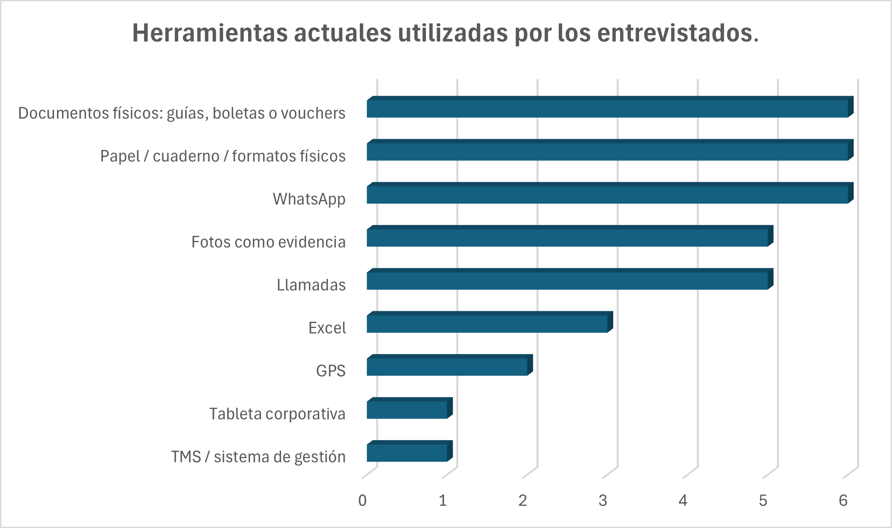

| Hallazgo transversal | Evidencia en gestión | Evidencia en conductores | Implicancia para CoBox Smart Vision |
|----------------------|----------------------|---------------------------|-------------------------------------|
| Alta dependencia de herramientas informales | Los gestores reciben datos por WhatsApp, llamadas, documentos físicos o Excel | Los conductores reportan por WhatsApp, llamadas, fotos y papel | La solución debe capturar datos desde origen y evitar dispersión de evidencias |
| Validación manual y reactiva | Los gestores revisan solo ante sospechas o reclamos | Los conductores entregan información que luego puede ser cuestionada | Se requiere evidencia estructurada y estados de validación |
| La foto ya es una práctica aceptada | Los gestores reciben fotos por WhatsApp de manera informal | Los conductores usan fotos como respaldo o prueba | CoBox SV debe formalizar y asociar automáticamente esas evidencias al servicio |
| La falta de evidencia genera conflictos | Gestores enfrentan discrepancias con conductores o clientes | Conductores enfrentan descuentos, reclamos o cuestionamientos | La evidencia debe beneficiar a ambos actores, no solo al supervisor |
| La adopción depende de baja fricción | Gestores piden simplicidad, soporte y bajo costo | Conductores piden pocos pasos, rapidez y confirmación clara | La experiencia móvil debe ser simple, guiada y tolerante a errores |
| Las condiciones de campo afectan la calidad del registro | Gestores reciben datos incompletos o tardíos | Conductores enfrentan baja señal, poca luz, cansancio y presión operativa | Se requiere captura offline, validación local de calidad de imagen y sincronización posterior |

  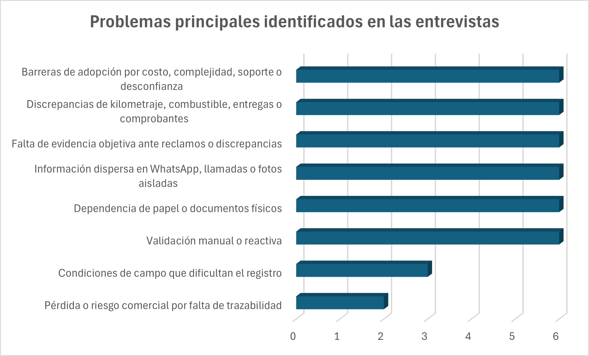

Estos hallazgos refuerzan la brecha definida en el Capítulo I: la diferencia entre tener datos registrados y contar con datos confiables, verificables y trazables. La evidencia obtenida muestra que los datos existen, pero se encuentran dispersos, dependen de transcripción manual o carecen de contexto suficiente para resolver disputas operativas.

##### 2.2.3.5. Validación preliminar de hipótesis Lean UX

Las entrevistas permiten validar cualitativamente varias hipótesis planteadas en el proceso Lean UX. Sin embargo, algunas requieren validación cuantitativa posterior mediante pilotos, métricas de uso y comparación antes/después.

| Hipótesis Lean UX | Evidencia obtenida en entrevistas | Estado |
|-------------------|-----------------------------------|--------|
| La captura visual puede reducir el tiempo de registro frente al ingreso manual | Conductores reportan tiempos altos de cierre o registro; gestores identifican transcripción y conciliación como actividades recurrentes | Parcialmente validada cualitativamente |
| La evidencia asociada al servicio aumenta la confianza de gestores y conductores | Ambos segmentos valoran fotos vinculadas a servicio, fecha, ubicación o conductor para resolver disputas | Validada cualitativamente |
| La validación automática puede reducir errores o evidencias inválidas | Conductores valoran alertas inmediatas por fotos borrosas, oscuras o incompletas | Parcialmente validada cualitativamente |
| La operación offline es necesaria para rutas con conectividad limitada | Conductores de ruta larga y carga pesada mencionan falta de señal en carretera | Validada como necesidad operativa |
| La solución debe mantener baja carga cognitiva para ser adoptada | Los conductores rechazan aplicaciones con muchos pasos y los gestores priorizan facilidad de uso | Validada cualitativamente |
| El modelo de adopción requiere demostrar valor en corto plazo | Gestores solicitan bajo costo, soporte, piloto real y resultados medibles | Parcialmente validada; requiere piloto de negocio |

La validación obtenida es preliminar porque proviene de entrevistas cualitativas. La confirmación definitiva deberá realizarse en un piloto controlado, midiendo reducción de tiempo de registro, disminución de registros observados, tasa de recaptura de evidencias inválidas, nivel de adopción del conductor y percepción de confianza del gestor.

##### 2.2.3.6. Conclusión del análisis de entrevistas

El análisis confirma que la problemática de CoBox Smart Vision no se limita a digitalizar registros existentes. En ambos segmentos se observa que la información operativa ya se genera mediante papeles, mensajes, llamadas, fotografías, hojas de cálculo, GPS o TMS; sin embargo, dicha información no siempre es verificable, oportuna, estructurada ni auditable.

En el segmento de gestión, la principal necesidad es contar con evidencia confiable para revisar servicios, resolver discrepancias, responder reclamos y sustentar decisiones frente a dueños, socios, directorio o clientes. En el segmento de conductores, la necesidad principal es registrar evidencias de forma rápida y simple, sin incrementar la carga operativa, y contar con respaldo objetivo frente a cuestionamientos posteriores.

Por ello, las entrevistas respaldan la oportunidad de desarrollar CoBox Smart Vision como una capa de auditoría operativa basada en evidencia visual verificable. La solución debe priorizar captura guiada, funcionamiento offline, validación local básica de calidad de imagen, asociación de evidencias al servicio, sincronización posterior y una experiencia móvil de baja fricción. Estos hallazgos servirán como insumo directo para la construcción de los User Persona, User Task Matrix, Empathy Mapping y As-Is Scenario Mapping en la sección de Needfinding.

### 2.3. Needfinding

#### 2.3.1 User Personas

A partir del análisis de entrevistas realizado en la sección 2.2.3, se definieron dos user personas representativas de los segmentos objetivo. Estos perfiles sintetizan patrones reales de comportamiento, necesidades y problemáticas identificadas en los usuarios entrevistados.

**Segmento 1: Gestión de operaciones logísticas**

User Persona: **Ricardo Lozano — Coordinador de Operaciones**

Este perfil representa a gestores que operan con herramientas fragmentadas, enfrentan inconsistencias en datos y requieren información confiable para la toma de decisiones.

---

**Segmento 2: Conductores de transporte**

User Persona: **Luis Soto — Conductor de larga distancia**

Este perfil representa a conductores que trabajan en condiciones exigentes, con alta carga operativa, y que necesitan herramientas simples que reduzcan el esfuerzo de registro y respalden su trabajo con evidencia objetiva.

#### 2.3.2 User Task Matrix

A partir de los user personas definidos, se identificaron las tareas clave que cada perfil realiza dentro del proceso logístico, así como su frecuencia e importancia dentro de la operación.

| Tareas / User Persona              | Ricardo Lozano (Frec.) | Ricardo Lozano (Imp.) | Luis Soto (Frec.) | Luis Soto (Imp.) |
|----------------------------------|--------------------------|--------------------------|-------------------------|------------------------|
| Planificar rutas                 | Alta                     | Alta                     | N/A                     | N/A                    |
| Coordinar entregas              | Alta                     | Alta                     | Media                   | Alta                   |
| Registrar kilometraje           | Media                    | Alta                     | Alta                    | Alta                   |
| Reportar consumo de combustible | Media                    | Alta                     | Alta                    | Alta                   |
| Validar información operativa   | Alta                     | Alta                     | Baja                    | Alta                   |
| Consolidar datos                | Alta                     | Alta                     | N/A                     | N/A                    |
| Generar reportes               | Media                    | Alta                     | N/A                     | N/A                    |
| Capturar evidencia (odómetro / entrega) | Baja             | Alta                     | Alta                    | Alta                   |
| Usar aplicaciones móviles       | Media                    | Alta                     | Baja                    | Alta                   |
| Verificar entregas              | Alta                     | Alta                     | Media                   | Alta                   |
| Atender reclamos                | Media                    | Alta                     | Baja                    | Media                  |

**Conclusiones de la sección**

- Ambos perfiles dependen de tareas críticas relacionadas con el registro de kilometraje, consumo de combustible y verificación de entregas, las cuales presentan actualmente problemas de confiabilidad.

- El perfil de gestión (Ricardo Lozano) se enfoca en la consolidación, validación y análisis de la información, siendo altamente dependiente de la precisión de los datos para la toma de decisiones.

- El perfil operativo (Luis Soto) se enfoca en la ejecución del servicio, priorizando herramientas simples que reduzcan la carga de registro y permitan documentar eventos en campo de forma rápida.

- Se identifica como punto crítico compartido la necesidad de contar con evidencia verificable que respalde los datos registrados, reduciendo conflictos operativos y mejorando la trazabilidad.

- La solución debe priorizar la automatización del registro y validación de datos en campo, así como la disponibilidad de información confiable para el análisis operativo.

#### 2.3.3. Empathy Mapping

El Empathy Mapping es una herramienta utilizada para comprender mejor a los usuarios o clientes al explorar sus pensamientos, sentimientos, comportamientos y
necesidades. Se organiza en secciones como ¿Qué escucha?, ¿Qué ve?, ¿Qué piensa y siente?, ¿Qué dice y hace?, Frustraciones y Motivaciones. Ayuda a los equipos de
diseño a crear soluciones más alineadas con las experiencias y perspectivas de los usuarios.

Empathy Map Segmento 1

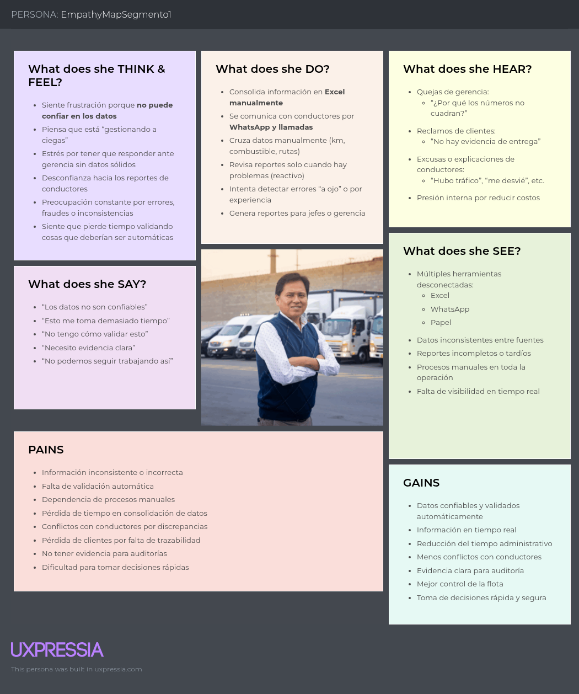

Empathy Map Segmento 2

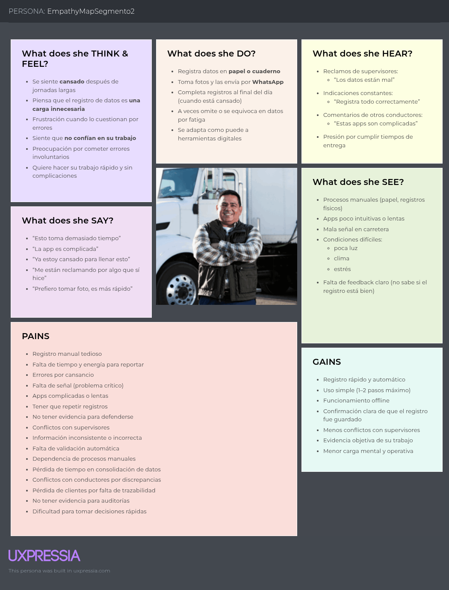

#### 2.3.4. As-is Scenario Mapping

### 2.4. Ubiquitous Language

| Término en Inglés         | Término en Español         | Definición                                                                                                                      |
|--------------------------|----------------------------|-------------------------------------------------------------------------------------------------------------------------------|
| Logistics Operation      | Operación logística        | Proceso de planificación, ejecución y control de servicios de transporte de carga, incluyendo rutas, entregas y registros.     |
| Fleet                   | Flota                      | Conjunto de vehículos gestionados por una empresa de transporte para realizar servicios logísticos.                            |
| Service Event           | Evento operativo           | Suceso relevante durante la operación logística (ej. inicio de ruta, carga, descarga, parada, incidente).                      |
| Evidence Capture        | Captura de evidencia       | Proceso de registrar información visual (fotos, documentos) para validar datos operativos en campo.                            |
| Smart Validation        | Validación inteligente     | Proceso automatizado de verificación de datos mediante inteligencia artificial, reduciendo errores y fraudes.                  |
| Field Operator          | Operador de campo          | Persona encargada de ejecutar servicios logísticos y registrar eventos durante el recorrido (conductor/a).                     |
| Operations Manager      | Gestor de operaciones      | Responsable de coordinar, supervisar y validar la información de las operaciones logísticas.                                   |
| Manual Entry            | Ingreso manual             | Registro de datos realizado por el usuario sin automatización, susceptible a errores humanos.                                  |
| Visual Evidence         | Evidencia visual           | Imagen o documento capturado para respaldar un evento operativo (ej. foto de odómetro, guía firmada).                         |
| Offline Mode            | Modo offline               | Funcionalidad que permite operar la aplicación sin conexión a internet, sincronizando datos posteriormente.                    |
| Route Traceability      | Trazabilidad de ruta       | Capacidad de seguir y auditar el recorrido y eventos de un servicio logístico.                                                 |
| Anomaly Alert           | Alerta de anomalía         | Notificación generada automáticamente ante detección de inconsistencias o posibles fraudes en los datos operativos.            |
| Dashboard               | Panel de control           | Vista gráfica que muestra indicadores clave, reportes y estado de las operaciones logísticas.                                  |
| Proof of Delivery       | Comprobante de entrega     | Evidencia (visual o documental) que certifica la realización exitosa de una entrega.                                           |
| Fuel Consumption        | Consumo de combustible     | Registro y control del uso de combustible por vehículo durante la operación.                                                   |
| Mileage                 | Kilometraje                | Distancia recorrida por un vehículo, registrada para control y auditoría.                                                      |
| User Persona            | Persona usuaria            | Perfil representativo de los usuarios objetivo, utilizado para guiar el diseño y validación de la solución.                    |
| Needfinding             | Identificación de necesidades | Proceso de descubrir y documentar los requerimientos y problemas reales de los usuarios.                                   |
| EventStorming           | EventStorming              | Técnica colaborativa para modelar procesos y eventos clave del dominio logístico.                                              |
| Bounded Context         | Contexto delimitado        | Área específica del dominio donde un modelo es válido y consistente, sin ambigüedades.                                         |
| Product Backlog         | Lista de producto          | Conjunto priorizado de funcionalidades, requisitos y tareas pendientes del producto.                                           |
| Impact Mapping          | Mapeo de impacto           | Técnica para visualizar cómo las funcionalidades contribuyen a los objetivos del negocio.                                      |
| Lean UX                 | Lean UX                    | Metodología ágil para diseñar experiencias de usuario centradas en la validación continua.                                     |
| Stakeholder             | Interesado                 | Persona o grupo que tiene interés o se ve afectado por el proyecto CoBox.                                                     |
| Compliance              | Cumplimiento normativo     | Adherencia a regulaciones y estándares aplicables al transporte y gestión de datos.                                            |
| Service Report          | Reporte de servicio        | Documento o registro que resume los eventos, incidencias y resultados de una operación logística.                              |
| Exception Handling      | Manejo de excepciones      | Proceso de registrar y gestionar eventos no planificados o incidentes durante la operación.                                   |
| Synchronization         | Sincronización             | Proceso de actualizar y consolidar datos entre dispositivos y la plataforma central.                                           |
| User Onboarding         | Incorporación de usuario   | Proceso de registro y capacitación inicial de nuevos usuarios en la plataforma.                                                |
| Field Constraints       | Restricciones de campo     | Condiciones reales que afectan la operación, como conectividad limitada o uso de dispositivos en ambientes adversos.           |
| Georeferenced Photo     | Foto georreferenciada      | Imagen capturada con información de ubicación, utilizada para validar eventos en campo.                                        |
| Audit Trail             | Registro de auditoría      | Historial detallado de acciones y cambios realizados en la plataforma para control y trazabilidad.                             |
| Service Assignment      | Asignación de servicio     | Proceso de designar rutas o tareas específicas a conductores o vehículos.                                                      |
| Mobile Application      | Aplicación móvil           | Herramienta digital utilizada en campo para registrar eventos y evidencias durante la operación.                               |
| Cloud Integration       | Integración en la nube     | Capacidad de la plataforma para conectarse y compartir datos con servicios cloud externos.                                     |
| Evidence Validation     | Validación de evidencia    | Proceso de confirmar la autenticidad y relevancia de la evidencia capturada.                                                  |
| Operational Efficiency  | Eficiencia operativa       | Medida de optimización de recursos y reducción de errores en la gestión logística.                                             |
| Service Schedule        | Programación de servicios  | Planificación anticipada de rutas, entregas y tareas logísticas.                                                              |
| Notification            | Notificación               | Mensaje enviado a usuarios para informar sobre eventos, alertas o tareas pendientes.                                           |
| Exception Report        | Reporte de excepción       | Documento que detalla incidentes o eventos fuera de lo planificado durante la operación.                                       |
| Evidence Sync           | Sincronización de evidencias| Proceso de actualizar y consolidar las evidencias capturadas entre dispositivos y la plataforma central.                      |

---

## Capítulo III: Requirements Specification

### 3.1. To-Be Scenario Mapping
En esta sección se presenta el To-Be Scenario Mapping del sistema, el cual describe cómo se desarrollan las actividades de los usuarios en el escenario propuesto. Para su elaboración, el equipo partió del análisis del escenario actual (As-Is), realizando una etapa de preparación y lluvia de ideas individual, seguida de una revisión conjunta para identificar las fases del proceso y estructurarlas como columnas del mapa.

A partir de este proceso, se definieron las actividades (Doing), pensamientos (Thinking) y emociones (Feeling) de cada User Persona a lo largo de las distintas fases del servicio. El resultado refleja un cambio significativo en la forma de interacción con el sistema, donde se reemplaza el registro manual de información por un enfoque basado en captura de evidencia y validación automática de datos.

En comparación con el escenario actual, el To-Be Scenario introduce mejoras orientadas a reducir errores humanos, incrementar la confiabilidad de la información y facilitar la operación en campo, especialmente en entornos con conectividad limitada. Asimismo, se fortalece la trazabilidad de los servicios mediante el registro estructurado de evidencias, incidencias y estados operativos.

A continuación, se presentan los To-Be Scenario Mapping correspondientes a cada segmento de usuario.

#### Segmento 1: Gestión de Operaciones Logísticas

#### Segmento 2: Conductores de Transporte

### 3.2. User Stories

En esta sección se presentan los **Epics**, **User Stories**, **Technical Stories** y **Non‑Functional Stories** del proyecto, definidos a partir de las necesidades identificadas en los segmentos de gestión de operaciones logísticas y conductores de unidades de carga. Las historias cubren las funcionalidades principales del producto digital, el sitio web estático (landing page), los componentes técnicos (API, autenticación) y los atributos de calidad (disponibilidad, seguridad, rendimiento).

Cada historia sigue el patrón **«Como [persona], quiero [acción] para [beneficio concreto]»**. Los criterios de aceptación se expresan como escenarios **Given‑When‑Then** verificables, en tiempo presente y sin referencias a detalles de interfaz de usuario. Las Technical Stories utilizan el rol `Developer` y describen interacciones request/response. Las Non‑Functional Stories abordan atributos de calidad identificados en el Capítulo IV.

| Epic/Story ID | Título | Descripción | Criterios de Aceptación | Relacionado con (Epic ID) |
|---------------|--------|-------------|-------------------------|---------------------------|
| EP01 | Gestión operativa de servicios | Centraliza la planificación, consulta y seguimiento de servicios logísticos para gestores y conductores. | *No aplica (Epic)* | — |
| EP02 | Captura y validación inteligente | Automatiza el registro y validación de información operativa a partir de evidencia visual y datos contextuales. | *No aplica (Epic)* | — |
| EP03 | Incidencias y trazabilidad | Permite registrar eventos operativos, anomalías y evidencias para mejorar la auditoría y resolución de conflictos. | *No aplica (Epic)* | — |
| EP04 | Reportes y control operativo | Proporciona reportes, alertas e indicadores basados en datos validados para la toma de decisiones. | *No aplica (Epic)* | — |
| EP-LP | Sitio web estático (Landing Page) | Presenta la propuesta de valor, beneficios, segmentos y mecanismos de contacto del producto para captar clientes. | *No aplica (Epic)* | — |
| EP-API | API RESTful e integración | Expone servicios interoperables para aplicaciones web, móvil e integraciones externas. | *No aplica (Epic)* | — |
| EP06 | Operación offline y sincronización | Asegura continuidad operativa en campo con conectividad limitada y sincronización posterior. | *No aplica (Epic)* | — |
| US-01 | Consultar servicios programados | **Como** gestor de operaciones, **quiero** consultar los servicios logísticos programados por período y estado, **para** supervisar la operación diaria sin depender de reportes manuales. | **Escenario 1: consulta por período**   **Given** que existen servicios registrados entre el 01/05/2026 y el 07/05/2026   **When** el gestor selecciona ese rango de fechas en el panel   **Then** el sistema muestra una lista paginada con unidad (placa), conductor (nombre), ruta (origen‑destino) y estado (pendiente/en proceso/completado) en menos de 3 segundos.    **Escenario 2: filtrado por estado**   **Given** que hay servicios en estado “en proceso” y “completado”   **When** el gestor aplica el filtro “en proceso”   **Then** el sistema muestra únicamente los servicios con ese estado, manteniendo el resto de la información. | EP01 |
| US-02 | Asignar conductor y unidad a servicio | **Como** gestor de operaciones, **quiero** asignar un conductor y una unidad a un servicio pendiente, **para** evitar la doble asignación de recursos y asegurar que cada servicio tenga los recursos correctos antes de iniciar la ruta. | **Escenario 1: asignación válida**   **Given** un servicio con ID S-123 en estado “pendiente”, el conductor “Luis Soto” disponible y la unidad “V-456” libre en el mismo horario   **When** el gestor selecciona ambos recursos y confirma   **Then** el sistema guarda la relación (servicio‑conductor‑unidad), cambia el estado del servicio a “asignado” y muestra un mensaje de éxito.    **Escenario 2: conflicto de superposición**   **Given** la unidad “V-456” ya está asignada a otro servicio que se solapa en horario (ej. 10:00‑12:00)   **When** el gestor intenta asignarla al servicio S-123 con horario 11:00‑13:00   **Then** el sistema rechaza la operación, muestra “Unidad no disponible en el horario seleccionado” y conserva el servicio sin asignar. | EP01 |
| US-03 | Consultar servicios asignados del día | **Como** conductor, **quiero** consultar mis servicios asignados para el día actual, **para** planificar mi jornada y conocer los horarios de salida sin necesidad de llamar al gestor. | **Escenario 1: consulta diaria con asignaciones**   **Given** que el conductor “Luis Soto” tiene 3 servicios asignados para el 07/05/2026 con horarios 08:00, 12:00 y 16:00   **When** accede a la aplicación móvil y pulsa “Mis servicios hoy”   **Then** el sistema muestra la lista con destino, horario y estado (pendiente/en proceso) ordenada cronológicamente, todo en menos de 2 segundos.    **Escenario 2: sin asignaciones**   **Given** que no hay servicios asignados para ese día   **When** el conductor consulta   **Then** el sistema muestra el mensaje “No tienes servicios programados para hoy. Contacta a tu gestor.” | EP01 |
| US-04 | Registrar inicio de servicio | **Como** conductor, **quiero** registrar el inicio de un servicio cuando salgo de la base, **para** dejar constancia oficial del momento de salida y que el gestor pueda auditar cualquier retraso. | **Escenario 1: inicio válido**   **Given** un servicio asignado con ID S-123 en estado “asignado” y el conductor autenticado con permiso sobre ese servicio   **When** el conductor pulsa “Iniciar servicio” y confirma   **Then** el sistema cambia el estado a “en proceso”, registra la fecha/hora (timestamp del dispositivo) y muestra “Servicio iniciado a las HH:MM”.    **Escenario 2: inicio no autorizado**   **Given** el conductor intenta iniciar un servicio que no está asignado a su perfil   **When** pulsa “Iniciar servicio” sobre ese servicio   **Then** el sistema rechaza la acción con el mensaje “No puedes iniciar este servicio. No está asignado a tu usuario.” | EP01 |
| US-05 | Consultar historial de servicios | **Como** gestor, **quiero** consultar el historial de servicios ejecutados en un rango de fechas, **para** revisar el desempeño operativo y detectar patrones de incumplimiento. | **Escenario 1: consulta con resultados**   **Given** que existen 15 servicios completados entre el 01/04/2026 y el 30/04/2026   **When** el gestor consulta ese período   **Then** el sistema muestra cada servicio con fecha, unidad, conductor, kilometraje final, combustible registrado, estado de validación (validado/observado) y enlace a evidencias.    **Escenario 2: período sin datos**   **Given** que no hay servicios en el rango solicitado (ej. futuro)   **When** el gestor realiza la consulta   **Then** el sistema muestra “No se encontraron servicios en el período seleccionado” y ofrece sugerir otro rango. | EP01 |
| US-06 | Capturar evidencia de odómetro | **Como** conductor, **quiero** capturar una foto del odómetro al iniciar y al finalizar cada servicio, **para** registrar el kilometraje sin anotarlo manualmente y evitar errores de transcripción. | **Escenario 1: captura válida**   **Given** el conductor está en el punto de control del servicio (inicio o fin) y la cámara está activa   **When** toma una foto donde el odómetro es legible (resolución ≥ 1024x768, enfoque nítido, iluminación ≥ 200 lux)   **Then** el sistema guarda la imagen localmente, la asocia al servicio, muestra “Evidencia de odómetro guardada” y registra un timestamp.    **Escenario 2: foto ilegible**   **Given** la foto capturada está borrosa (varianza de Laplaciano < 100) o con poca luz (lux < 50)   **When** el sistema analiza la imagen localmente   **Then** muestra el mensaje “Foto no clara, por favor toma otra” y no guarda la imagen, permitiendo hasta 3 reintentos. | EP02 |
| US-07 | Extraer kilometraje automáticamente | **Como** gestor, **quiero** que el sistema extraiga automáticamente la lectura del odómetro desde la foto usando OCR local, **para** resolver discrepancias de kilometraje con evidencia objetiva y reducir la revisión manual. | **Escenario 1: extracción exitosa**   **Given** una foto de odómetro con el marcador claramente visible (dígitos de al menos 20 píxeles de alto, contraste ≥ 0.7)   **When** el sistema ejecuta el modelo de OCR en el dispositivo   **Then** extrae el valor numérico (ej. 12450), lo registra como “extraído automáticamente”, y marca la evidencia como “validada por sistema” en menos de 2 segundos.    **Escenario 2: valor inconsistente con el contexto**   **Given** el valor extraído es 12450 pero el kilometraje de inicio del servicio era 12350 (diferencia de solo 100 km en una ruta que debería ser 400 km)   **When** el sistema valida la coherencia   **Then** marca la evidencia como “inconsistente – requiere revisión del gestor” y genera una alerta de anomalía. | EP02 |
| US-08 | Validar evidencia de entrega | **Como** gestor, **quiero** que el sistema valide automáticamente la evidencia de entrega (foto de la guía firmada), **para** contar con un respaldo verificable que permita responder reclamos de clientes. | **Escenario 1: validación exitosa**   **Given** una foto de la guía de remisión con el texto “RECIBIDO” y una firma visible   **When** el sistema procesa la imagen (OCR + detección de firma)   **Then** la marca como “entrega validada”, extrae la fecha/hora de recepción y asocia la evidencia al servicio.    **Escenario 2: evidencia incompleta**   **Given** la foto no contiene firma o está borrosa   **When** se analiza   **Then** el sistema marca la entrega como “observada – requiere verificación manual” y notifica al gestor. | EP02 |
| US-09 | Validar comprobante de combustible | **Como** gestor, **quiero** validar automáticamente los comprobantes de combustible (foto de la boleta), **para** detectar inconsistencias como grifos fuera de ruta o fechas incorrectas. | **Escenario 1: comprobante consistente**   **Given** un comprobante con fecha 07/05/2026, monto S/150, y la ruta del servicio incluye un grifo de la misma cadena en esa ubicación   **When** el sistema extrae los metadatos (fecha, monto, RUC del grifo) y los contrasta con el recorrido planificado   **Then** lo marca como “consistente” y lo asocia al servicio.    **Escenario 2: inconsistencia geográfica**   **Given** el comprobante es de un grifo en Chincha pero el servicio transcurrió solo en Lima Metropolitana   **When** se valida la ubicación (GPS de la foto o texto de dirección)   **Then** el sistema genera una alerta “Combustible fuera de ruta – revisar” y retiene la evidencia para auditoría. | EP02 |
| US-10 | Registrar captura guiada de evidencia | **Como** conductor, **quiero** recibir retroalimentación inmediata sobre la calidad de la foto (enfoque, iluminación), **para** corregir la captura en el momento y evitar que el gestor reclame por evidencias inválidas. | **Escenario 1: calidad aceptable**   **Given** la cámara activa y el conductor enfoca el odómetro   **When** el sistema detecta que la imagen cumple (enfoque, contraste, región de interés)   **Then** muestra un ícono verde “Buena foto” y permite guardar.    **Escenario 2: baja iluminación**   **Given** la luz ambiental es < 100 lux   **When** el conductor intenta capturar   **Then** el sistema muestra “Poca luz, activa el flash” y activa automáticamente el flash si está disponible; si aún así no mejora, sugiere usar linterna. | EP02 |
| US-11 | Registrar datos manuales de contingencia | **Como** conductor, **quiero** ingresar manualmente el kilometraje o combustible cuando la foto no sea válida después de varios intentos, **para** no detener la operación, siempre que justifique el motivo. | **Escenario 1: contingencia permitida**   **Given** el sistema ha rechazado la foto 3 veces por mala calidad   **When** el conductor pulsa “Ingreso manual” y escribe “Fotografía imposible por lluvia intensa”   **Then** el sistema guarda el dato manual con estado “pendiente de revisión” y registra la justificación.    **Escenario 2: contingencia sin justificación**   **Given** el conductor intenta ingresar datos manuales sin proporcionar un motivo   **When** pulsa “Guardar”   **Then** el sistema muestra “Debes justificar el ingreso manual” y no guarda. | EP02 |
| US-12 | Detectar anomalías operativas | **Como** gestor, **quiero** que el sistema detecte automáticamente anomalías (kilometraje inusualmente alto/bajo, consumo fuera de rango), **para** intervenir oportunamente antes de que se conviertan en un reclamo de cliente. | **Escenario 1: anomalía detectada**   **Given** un servicio donde el kilometraje reportado (600 km) supera en más del 20% la distancia georreferenciada (500 km)   **When** el sistema ejecuta la validación automática al finalizar el servicio   **Then** genera una alerta “Posible sobrekilometraje” en el panel del gestor, con trazabilidad del caso.    **Escenario 2: sin anomalías**   **Given** todos los datos están dentro de los rangos esperados (±5%)   **When** se completa la validación   **Then** no se generan alertas y el servicio se marca como “validado”. | EP02 |
| US-13 | Reportar incidencia operativa | **Como** conductor, **quiero** reportar una incidencia (accidente, avería, bloqueo) durante el servicio, **para** dejar constancia oficial del evento y que el gestor pueda tomar acciones sin tener que llamarme. | **Escenario 1: registro exitoso**   **Given** ocurre un bloqueo por huayco en la ruta   **When** el conductor selecciona “Reportar incidencia”, elige categoría “Bloqueo vial”, escribe “Huayco en km 45, paso suspendido por 2 horas” y adjunta una foto opcional   **Then** el sistema guarda la incidencia con timestamp, ubicación (GPS), la asocia al servicio y envía una notificación al gestor.    **Escenario 2: datos incompletos**   **Given** el conductor no selecciona ninguna categoría y deja el campo descripción vacío   **When** pulsa “Guardar”   **Then** el sistema muestra “Debes completar al menos la categoría y una descripción breve”. | EP03 |
| US-14 | Registrar paradas no planificadas | **Como** conductor, **quiero** registrar una parada no planificada (control policial, descanso forzoso), **para** respaldar los retrasos con evidencia de ubicación y hora. | **Escenario 1: parada registrada**   **Given** el conductor se detiene en un peaje por control de SUTRAN   **When** pulsa “Registrar parada”, selecciona “Control policial” y confirma   **Then** el sistema guarda la hora de inicio, ubicación, y luego al reanudar guarda la hora de fin, calculando la duración.    **Escenario 2: sincronización posterior**   **Given** el conductor registra la parada sin conexión (offline)   **When** más tarde recupera señal   **Then** el sistema sincroniza automáticamente la parada con todos sus datos sin pérdida. | EP03 |
| US-15 | Consultar incidencias y observaciones | **Como** gestor, **quiero** consultar el listado de incidencias y observaciones activas, ordenadas por severidad, **para** priorizar las acciones correctivas. | **Escenario 1: consulta de incidencias activas**   **Given** existen 3 incidencias (1 de alta severidad, 2 de baja) y 5 observaciones   **When** el gestor accede al módulo “Incidencias”   **Then** el sistema muestra primero las de alta severidad, luego las de baja, y al final las observaciones, cada una con servicio asociado, fecha y estado.    **Escenario 2: filtrado por severidad**   **Given** el gestor selecciona filtro “Alta severidad”   **Then** se muestran solo las incidencias con esa etiqueta. | EP03 |
| US-16 | Resolver incidencia con trazabilidad | **Como** gestor, **quiero** cerrar una incidencia registrando la resolución y evidencia de cierre, **para** mantener un historial auditable. | **Escenario 1: cierre válido**   **Given** una incidencia abierta con ID I-789   **When** el gestor escribe “Se reprogramó la entrega, el cliente recibió el producto el día siguiente sin recargo” y adjunta un comprobante de acuerdo   **Then** el sistema cambia el estado a “resuelta”, almacena la resolución y la fecha.    **Escenario 2: cierre sin justificación**   **Given** el gestor intenta cerrar sin agregar ningún comentario ni evidencia   **When** pulsa “Cerrar”   **Then** el sistema muestra “Debes indicar la acción tomada para cerrar la incidencia”. | EP03 |
| US-17 | Consultar trazabilidad completa del servicio | **Como** gestor, **quiero** ver una línea de tiempo completa de cada servicio: asignación, inicio, evidencias, incidencias, validaciones y cierre, **para** auditar la ejecución paso a paso. | **Escenario 1: trazabilidad completa**   **Given** un servicio que tuvo 2 evidencias, 1 incidencia y validación automática parcial   **When** el gestor selecciona “Ver trazabilidad”   **Then** el sistema muestra orden cronológico: asignación (fecha), inicio (timestamp), evidencia 1 (foto + extracción OK), incidencia (reporte y resolución), evidencia 2 (observada), cierre.    **Escenario 2: información parcial**   **Given** un servicio donde faltan algunas evidencias obligatorias   **When** se consulta la trazabilidad   **Then** el sistema resalta en rojo los elementos faltantes y muestra mensaje “Evidencia de odómetro final no registrada”. | EP03 |
| US-18 | Visualizar alertas operativas | **Como** gestor, **quiero** ver un panel de alertas activas (anomalías, incidencias no resueltas) con niveles de severidad, **para** actuar rápidamente. | **Escenario 1: alertas activas**   **Given** hay 3 alertas: 1 de alta (combustible fuera de ruta), 2 de media (evidencia de entrega observada)   **When** el gestor ingresa al dashboard   **Then** las alertas se muestran agrupadas por severidad, con íconos de color rojo (alta) y amarillo (media), y un contador en la barra de navegación.    **Escenario 2: sin alertas**   **Given** no hay ninguna anomalía ni incidencia abierta   **When** se carga el dashboard   **Then** se muestra “No hay alertas activas. La operación está en estado normal.” | EP04 |
| US-19 | Consultar indicadores de confiabilidad | **Como** gestor, **quiero** consultar indicadores como % de evidencias validadas automáticamente, número de observaciones, y tiempo promedio de revisión, **para** evaluar la calidad del registro operativo. | **Escenario 1: indicadores disponibles para el mes**   **Given** en abril 2026 se procesaron 120 servicios   **When** el gestor consulta “Indicadores de confiabilidad” para el período 01/04‑30/04   **Then** el sistema muestra: 78% validación automática, 22% observaciones, tiempo promedio de revisión 12 min (vs 45 min previo).    **Escenario 2: filtro temporal**   **Given** el gestor cambia el filtro a la última semana   **Then** se recalcula y muestra los indicadores para ese subperíodo. | EP04 |
| US-20 | Generar reporte de servicios validados | **Como** gestor, **quiero** generar un reporte en PDF o Excel de los servicios completados con sus evidencias validadas, **para** sustentar decisiones ante clientes o la gerencia. | **Escenario 1: generación exitosa**   **Given** se selecciona el período 01/04‑30/04 y el formato PDF   **When** se pulsa “Generar reporte”   **Then** el sistema produce un archivo PDF descargable en menos de 10 segundos, que incluye lista de servicios, kilómetros validados, número de entregas, incidencias resueltas y un resumen de indicadores.    **Escenario 2: período sin datos**   **Given** no hay servicios en el rango solicitado   **When** se intenta generar   **Then** el sistema muestra “No hay datos en el período seleccionado” y no genera el archivo. | EP04 |
| US-21 | Comparar desempeño por unidad y conductor | **Como** gestor, **quiero** comparar métricas (kilometraje promedio, consumo por km, incidencias) entre diferentes unidades y conductores, **para** identificar patrones de ineficiencia. | **Escenario 1: comparación disponible**   **Given** existen al menos 5 servicios completados para las unidades A, B y C en el último mes   **When** el gestor selecciona estas unidades y el indicador “consumo l/100km”   **Then** el sistema muestra un gráfico de barras con el consumo de cada unidad, destacando la de mayor consumo.    **Escenario 2: datos insuficientes**   **Given** una unidad tiene solo 1 servicio registrado   **When** se solicita comparación   **Then** el sistema muestra un aviso “Datos insuficientes para la unidad X (mínimo 3 servicios requeridos)”. | EP04 |
| US-22 | Consultar propuesta de valor del producto | **Como** visitante (dueño de PyME de transporte), **quiero** acceder a una landing page que explique claramente qué problema resuelve CoBox Smart Vision y sus beneficios, **para** decidir si es relevante para mi operación. | **Escenario 1: acceso a contenido principal**   **Given** el visitante ingresa a la URL del producto   **When** la página carga   **Then** muestra en la sección principal: “Audita tus servicios con evidencia visual verificable”, seguido de 3 beneficios principales (reducción de discrepancias, ahorro de tiempo, trazabilidad).    **Escenario 2: navegación por secciones**   **Given** el visitante hace clic en “Funcionalidades”   **Then** se desplaza a una sección que describe captura offline, validación automática y reportes, con íconos y texto legible en móvil. | EP-LP |
| US-23 | Consultar funcionalidades clave | **Como** visitante del segmento logístico, **quiero** ver una lista clara de funcionalidades (captura de odómetro, validación IA, reportes, offline), **para** entender rápidamente cómo la solución mejora la trazabilidad. | **Escenario 1: consulta de funcionalidades**   **Given** el visitante está en la landing page   **When** hace scroll a la sección “¿Qué puede hacer CoBox Smart Vision?”   **Then** se muestran 4 tarjetas con título, breve descripción y un ícono representativo.    **Escenario 2: contenido segmentado**   **Given** el visitante selecciona la pestaña “Para gestores”   **Then** se muestran funcionalidades específicas: dashboard, alertas, reportes. En la pestaña “Para conductores”: captura guiada, offline, incidencias. | EP-LP |
| US-24 | Solicitar demostración comercial | **Como** visitante interesado, **quiero** completar un formulario corto (nombre, empresa, correo, teléfono) para solicitar una demostración personalizada, **para** ver la solución aplicada a mi flota real sin compromiso. | **Escenario 1: solicitud exitosa**   **Given** el visitante llena todos los campos obligatorios con formato válido (email válido, teléfono 9 dígitos)   **When** pulsa “Solicitar demo”   **Then** el sistema muestra “Gracias, un asesor se contactará en las próximas 24 horas” y envía una notificación al equipo comercial.    **Escenario 2: datos inválidos**   **Given** el visitante omite el teléfono o escribe un email sin @   **When** envía el formulario   **Then** el sistema resalta los campos incorrectos y muestra “Corrige los errores antes de enviar”. | EP-LP |
| US-25 | Consultar evidencia de resultados y casos de uso | **Como** visitante, **quiero** leer casos de uso reales o pilotos con métricas como reducción de discrepancias o ahorro de tiempo, **para** confiar en que la solución ya ha sido validada. | **Escenario 1: revisión de casos de uso**   **Given** el visitante accede a la sección “Resultados”   **When** hace clic en “Ver caso de estudio – Transportes Valdivia” (piloto simulado)   **Then** se muestra un resumen: “Reducción del 35% en tiempo de revisión de discrepancias, 0 pérdida de evidencias”.    **Escenario 2: navegación temática**   **Given** el visitante selecciona el filtro “PyME de distribución urbana”   **Then** se muestran solo los casos aplicables a ese segmento. | EP-LP |
| US-26 | Contactar al equipo comercial | **Como** visitante con dudas específicas (precios, integración), **quiero** enviar un mensaje a través de un formulario de contacto, **para** obtener respuestas directas sin pedir una demostración completa. | **Escenario 1: envío exitoso**   **Given** el visitante completa nombre, email y mensaje (mínimo 10 caracteres)   **When** pulsa “Enviar consulta”   **Then** el sistema registra la consulta y responde con un correo automático de confirmación.    **Escenario 2: validación de campos**   **Given** el visitante deja el mensaje vacío   **When** intenta enviar   **Then** el sistema muestra “El mensaje no puede estar vacío”. | EP-LP |
| TS-01 | Autenticación y autorización API | **Como** Developer, **quiero** implementar autenticación OAuth2 (Auth0) con tokens JWT y control de acceso basado en roles, **para** proteger los endpoints de la API. | **Escenario 1: autenticación válida**   **Given** credenciales válidas de un gestor   **When** se llama a `/api/auth/login`   **Then** el sistema retorna un token JWT con expiración de 1 hora y claims `role=gestor`.    **Escenario 2: acceso denegado por rol**   **Given** un token de conductor   **When** se intenta acceder a `/api/reports/delete`   **Then** la API retorna HTTP 403 Forbidden con mensaje “Permiso insuficiente”. | EP-API |
| TS-02 | Gestión de servicios vía API | **Como** Developer, **quiero** disponer de endpoints RESTful para crear, consultar y actualizar servicios (CRUD), **para** que la aplicación web y móvil puedan consumirlos. | **Escenario 1: consulta de servicios**   **Given** token válido de gestor   **When** `GET /api/services?date=2026-05-07`   **Then** retorna lista de servicios en JSON con estructura definida (OpenAPI).    **Escenario 2: creación con datos inválidos**   **Given** se envía un servicio sin fecha de inicio   **When** `POST /api/services`   **Then** retorna HTTP 400 y un array de errores de validación. | EP-API |
| TS-03 | Captura y validación de evidencias vía API | **Como** Developer, **quiero** un endpoint para subir imágenes de evidencias y otro para consultar el estado de validación, **para** que la app móvil pueda enviar fotos y verificar su procesamiento. | **Escenario 1: carga exitosa de evidencia**   **Given** un archivo JPEG < 5 MB y el metadato `serviceId`   **When** `POST /api/evidences` multipart   **Then** retorna HTTP 202 Accepted con un `evidenceId` y un mensaje “En cola de procesamiento”.    **Escenario 2: evidencia no válida**   **Given** el archivo no es una imagen (ej. PDF)   **When** se intenta subir   **Then** retorna HTTP 415 Unsupported Media Type. | EP-API |
| TS-04 | Gestión de incidencias y alertas vía API | **Como** Developer, **quiero** endpoints para reportar incidencias, consultar alertas y cerrar casos, **para** integrar la lógica de incidencias con otros sistemas. | **Escenario 1: registro de incidencia**   **Given** un conductor autenticado   **When** `POST /api/incidents` con categoría, descripción y `serviceId`   **Then** retorna HTTP 201 Created y el ID de la incidencia.    **Escenario 2: consulta de alertas activas**   **Given** gestor autenticado   **When** `GET /api/alerts?status=active`   **Then** retorna lista de alertas con severidad y servicio asociado. | EP-API |
| TS-05 | Reportes e indicadores vía API | **Como** Developer, **quiero** endpoints que entreguen métricas agregadas (porcentaje de validación, tiempo promedio de revisión) y generen reportes en PDF, **para** que el frontend pueda mostrar dashboards. | **Escenario 1: consulta de indicadores**   **Given** token de gestor y filtros de fecha   **When** `GET /api/metrics/reliability?from=2026-04-01&to=2026-04-30`   **Then** retorna JSON con `autoValidationRate`, `manualEntries`, `avgReviewTimeMinutes`.    **Escenario 2: generación de reporte**   **Given** los mismos filtros   **When** `POST /api/reports/generate` con formato=pdf   **Then** retorna un enlace de descarga temporal (URL firmada) válida por 10 minutos. | EP-API |
| NF-01 | Recuperación ante fallos de red | **Como** conductor, **quiero** que si la sincronización falla, el sistema reintente automáticamente con backoff exponencial (1s, 2s, 4s hasta 3 veces), **para** no perder datos en rutas con cobertura inestable. | **Escenario 1: reintento exitoso**   **Given** hay 5 evidencias pendientes y la conexión se restablece después de 2 fallos   **When** el sistema ejecuta la sincronización automática   **Then** después del segundo reintento, envía todos los datos y los marca como sincronizados, sin intervención del usuario.    **Escenario 2: fallo definitivo**   **Given** después de 3 reintentos la conexión sigue caída   **Then** el sistema mantiene los datos en estado “pendiente” y programa un nuevo intento en 30 minutos, notificando al conductor con un ícono de advertencia. | EP06 |
| NF-02 | Seguridad de evidencias en reposo | **Como** administrador de plataforma, **quiero** que todas las evidencias almacenadas en el dispositivo móvil estén cifradas con AES-256, **para** proteger datos sensibles en caso de pérdida o robo del teléfono. | **Escenario 1: cifrado en almacenamiento local**   **Given** el conductor captura una evidencia sin conexión   **When** la imagen se guarda en el disco local   **Then** el archivo se escribe cifrado usando una clave derivada de un secreto seguro (no hardcodeado) y solo la aplicación puede descifrarlo.    **Escenario 2: acceso sin autorización**   **Given** un tercero extrae la tarjeta SD del dispositivo   **When** intenta leer los archivos de imágenes   **Then** no puede descifrar el contenido sin la clave de la aplicación. | EP06 |

### 3.3. Impact Mapping
En esta sección se presenta el Impact Mapping del sistema, el cual permite establecer la relación entre los objetivos de negocio, los actores involucrados, los cambios de comportamiento esperados y las funcionalidades necesarias para alcanzarlos.

El proceso de elaboración se basó en los User Personas previamente definidos, identificando cómo cada uno contribuye al logro de los objetivos del negocio. A partir de ello, se definieron los impactos deseados en su comportamiento, los entregables que permiten generar dichos impactos y las User Stories que materializan estas funcionalidades.

El Impact Mapping permite alinear el desarrollo del producto con los objetivos estratégicos, asegurando que cada funcionalidad aporte valor real al negocio y responda a las necesidades identificadas en el análisis previo.

#### Segmento 1: Gestión de Operaciones Logísticas

#### Segmento 2: Conductores de Transporte

### 3.4. Product Backlog
En esta sección se presenta el Product Backlog priorizado del proyecto. El orden de las historias responde al valor que aportan al negocio y al producto, priorizando primero aquellas que permiten comunicar la propuesta de valor, captar interés comercial y validar tempranamente el núcleo funcional de la solución.  

Asimismo, el backlog incorpora historias orientadas a la operación en campo, validación automática, trazabilidad y análisis operativo, junto con las historias técnicas necesarias para soportar la interoperabilidad y el funcionamiento integral de la plataforma.

| # Orden | User Story ID | Título | Descripción | Story Points (1/2/3/5/8) |
|---------|---------------|--------|-------------|--------------------------|
| 1 | US-22 | Consultar propuesta de valor del producto | Como visitante, deseo conocer la propuesta de valor del producto para evaluar si se adapta a mi operación logística. | 3 |
| 2 | US-24 | Solicitar demostración comercial | Como visitante, deseo solicitar una demostración para conocer la solución aplicada a mi operación. | 5 |
| 3 | US-23 | Consultar funcionalidades clave | Como visitante del segmento logístico, deseo consultar las funcionalidades clave del producto para comprender cómo mejora la trazabilidad y validación operativa. | 3 |
| 4 | US-26 | Contactar al equipo comercial | Como visitante, deseo contactar al equipo comercial para resolver dudas sobre adopción, integración o precios. | 2 |
| 5 | US-25 | Consultar evidencia de resultados y casos de uso | Como visitante, deseo consultar casos de uso y resultados esperados para confiar en la propuesta de la solución. | 3 |
| 6 | US-03 | Consultar servicios asignados del día | Como conductor, deseo consultar mis servicios asignados del día para planificar mi jornada. | 5 |
| 7 | US-04 | Registrar inicio de servicio | Como conductor, deseo registrar el inicio de un servicio para dejar constancia del momento de salida. | 3 |
| 8 | US-06 | Capturar evidencia de odómetro | Como conductor, deseo capturar una imagen del odómetro para registrar el kilometraje sin ingresarlo manualmente. | 5 |
| 9 | US-10 | Registrar captura guiada de evidencia | Como conductor, deseo recibir validaciones básicas al momento de capturar una evidencia para evitar registros inválidos. | 3 |
| 10 | US-27 | Registrar evidencias sin conexión | Como conductor, deseo registrar evidencias y eventos sin conexión para continuar mi trabajo en zonas con cobertura limitada. | 8 |
| 11 | US-28 | Sincronizar registros pendientes | Como conductor, deseo sincronizar automáticamente mis registros pendientes cuando la conectividad se restablece para conservar la continuidad operativa. | 5 |
| 12 | US-29 | Consultar estado de validación y sincronización | Como conductor, deseo consultar el estado de mis registros para saber si fueron guardados, sincronizados o observados. | 3 |
| 13 | US-11 | Registrar datos manuales de contingencia | Como conductor, deseo registrar datos manuales como contingencia cuando una evidencia no puede ser validada automáticamente para no detener la operación. | 3 |
| 14 | US-13 | Reportar incidencia operativa | Como conductor, deseo reportar incidencias durante un servicio para dejar constancia de eventos que afectan la operación. | 3 |
| 15 | US-14 | Registrar paradas no planificadas | Como conductor, deseo registrar paradas no planificadas para respaldar retrasos o desvíos ocurridos en ruta. | 5 |
| 16 | US-01 | Consultar servicios programados | Como gestor, deseo consultar los servicios logísticos programados para supervisar la operación diaria. | 5 |
| 17 | US-02 | Asignar conductor y unidad a servicio | Como gestor, deseo asignar un conductor y una unidad a un servicio para organizar su ejecución. | 5 |
| 18 | US-07 | Extraer kilometraje automáticamente | Como gestor, deseo que el sistema extraiga automáticamente el kilometraje desde la evidencia visual para reducir errores humanos. | 8 |
| 19 | US-08 | Validar evidencia de entrega | Como gestor, deseo que el sistema valide automáticamente la evidencia de entrega para contar con respaldo verificable del servicio. | 8 |
| 20 | US-09 | Validar comprobante de combustible | Como gestor, deseo validar automáticamente comprobantes de combustible para detectar inconsistencias operativas. | 8 |
| 21 | US-12 | Detectar anomalías operativas | Como gestor, deseo que el sistema detecte anomalías en kilometraje, combustible o evidencias para intervenir oportunamente. | 8 |
| 22 | US-15 | Consultar incidencias y observaciones | Como gestor, deseo consultar incidencias y observaciones operativas para priorizar acciones correctivas. | 5 |
| 23 | US-17 | Consultar trazabilidad completa del servicio | Como gestor, deseo consultar la trazabilidad completa de un servicio para auditar su ejecución con evidencias y eventos. | 8 |
| 24 | US-18 | Visualizar alertas operativas | Como gestor, deseo visualizar alertas operativas para actuar rápidamente ante riesgos o inconsistencias. | 5 |
| 25 | US-16 | Resolver incidencia con trazabilidad | Como gestor, deseo registrar la resolución de una incidencia para mantener un historial auditable del caso. | 3 |
| 26 | US-19 | Consultar indicadores de confiabilidad | Como gestor, deseo consultar indicadores de confiabilidad de datos para evaluar la calidad del registro operativo. | 5 |
| 27 | US-20 | Generar reporte de servicios validados | Como gestor, deseo generar reportes de servicios validados para sustentar decisiones y auditorías internas. | 5 |
| 28 | US-21 | Comparar desempeño por unidad y conductor | Como gestor, deseo comparar el desempeño por unidad y conductor para identificar patrones operativos y oportunidades de mejora. | 5 |
| 29 | US-05 | Consultar historial de servicios | Como gestor, deseo consultar el historial de servicios ejecutados para revisar el desempeño operativo. | 3 |
| 30 | TS-02 | Gestión de servicios vía API | Como Developer, deseo consumir endpoints para registrar, consultar y actualizar servicios logísticos desde aplicaciones externas. | 5 |
| 31 | TS-03 | Captura y validación de evidencias vía API | Como Developer, deseo consumir endpoints para cargar evidencias y consultar su estado de validación desde aplicaciones cliente. | 8 |
| 32 | TS-04 | Gestión de incidencias y alertas vía API | Como Developer, deseo consumir endpoints para registrar incidencias y consultar alertas operativas integradas. | 5 |
| 33 | TS-05 | Reportes e indicadores vía API | Como Developer, deseo consumir endpoints de indicadores y reportes para integrarlos con dashboards y servicios externos. | 5 |
| 34 | TS-01 | Autenticación y autorización API | Como Developer, deseo implementar autenticación y autorización seguras para proteger el acceso a los servicios de la plataforma. | 5 |

A continuación, se presenta el enlace al tablero de Trello donde se puede visualizar el Product Backlog de manera interactiva:

[Product Backlog en Trello](https://trello.com/invite/b/65483fffcafdad61c4da7629/ATTI3fc72917563f03e2b9eb1a1fd770af39A7368F5C/cobox)

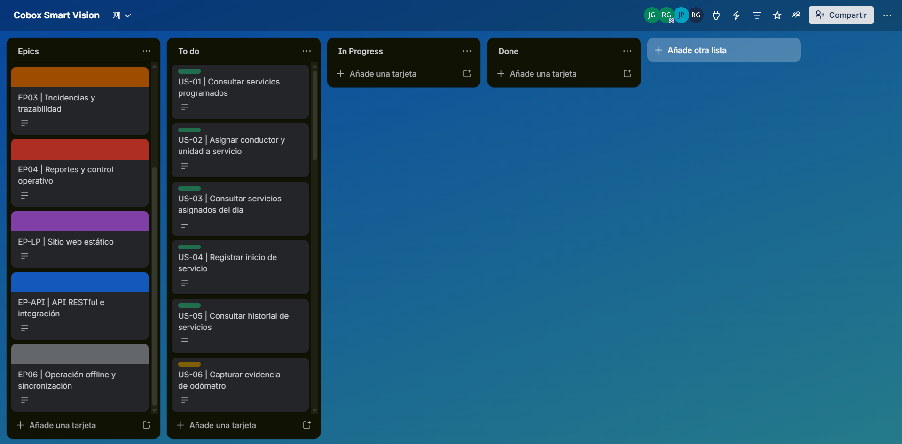

## Capítulo IV: Strategic-Level Software Design

### 4.1. Strategic-Level Attribute-Driven Design
#### 4.1.1. Design Purpose
El objetivo supremo del diseño arquitectónico de **CoBox** es definir un entramado técnico descentralizado y resiliente que traduzca las exigencias del ecosistema logístico en componentes de software escalables. Este enfoque integra paradigmas emergentes con las severas limitaciones del trabajo de campo, tales como conectividad intermitente, restricciones de hardware y condiciones operativas adversas.

Para asegurar que la arquitectura soporte la eficiencia, seguridad y operatividad ininterrumpida, el propósito de diseño se estructura bajo los siguientes lineamientos fundamentales: 
**1. Operatividad Descentralizada mediante Inteligencia en el Borde (Edge AI)** 
Transformar la captura de datos en un proceso autónomo que no dependa de la conectividad constante a internet, resolviendo así las restricciones de las zonas rurales y las limitaciones del hardware móvil (Restricciones C-1, C-7 y C-9)
. El diseño estipula la migración del cómputo analítico directamente a los smartphones mediante Modelos de Lenguaje Pequeños (SLMs) y Modelos de Visión-Lenguaje Multimodales (como NaViT)
. Esto permite ejecutar tareas complejas —como la extracción óptica (OCR) de odómetros y validación de guías físicas— de manera estrictamente local, garantizando tiempos de respuesta inferiores a los 50 milisegundos y optimizando el consumo energético durante la conducción.  
**2. Prevención de Fraudes y Resiliencia Estructural con Multi-Nube y Blockchain** Satisfacer los drivers críticos de disponibilidad operativa y protección de información sensible. Para mitigar bloqueos de proveedores y latencias de red, la plataforma orquesta cargas de trabajo distribuidas simultáneamente entre Amazon Web Services (AWS) y Google Cloud Platform (GCP) apoyándose en enrutamiento simétrico
. Paralelamente, para erradicar las discrepancias manuales y cumplir con las normativas legales de trazabilidad documental (Restricción C-5), la arquitectura entrelaza redes neuronales con tecnología Blockchain, creando libros mayores inmutables que certifican la autenticidad de cada entrega o carga de combustible mediante evidencias fotográficas blindadas criptográficamente.  
.
**3. Modelado de Dominio (DDD) y Aislamiento de Funcionalidades Asegurar la coherencia y evolución del código fuente aplicando el Diseño Guiado por el Dominio (DDD).** El ecosistema se segmenta lógicamente en contextos autónomos (Manejo de Flota, Entregas, Incidencias, Mantenimiento y Analítica), los cuales se materializan como microservicios hexagonales independientes
. Para sortear los cuellos de botella de la comunicación síncrona, estos módulos interactúan a través de un bus de eventos (RabbitMQ)
. Asimismo, toda solicitud externa atraviesa un API Gateway centralizado que enruta el tráfico y aplica políticas de Control de Acceso Basado en Roles (RBAC), garantizando la privacidad de los datos según las leyes peruanas (Restricción C-8).  
.
**4. Validación Empírica Continua guiada por el Proceso ADD v3 Gobernar la evolución del sistema a través del método de Diseño Guiado por Atributos (ADD v3)**
 Las decisiones arquitectónicas y los límites de cada microservicio se modelan de manera exhaustiva empleando vistas formales de C4 y diagramas UML
. Para validar que estas decisiones cumplan con los escenarios de calidad exigidos (e.g., tolerancia a fallos, soporte para concurrencia masiva), el diseño impone una observabilidad integral mediante telemetría avanzada (Prometheus y Grafana), permitiendo adaptar la solución dinámicamente frente a las variaciones del entorno logístico sin interrumpir las operaciones en curso.  
#### 4.1.2. Attribute-Driven Design Inputs
#### 4.1.2.1. Primary Functionality (Primary User Stories)

##### 1. Inteligencia en el Borde (Edge AI) para la Extracción Automática Al analizar las historias US-07 (Extraer kilometraje automáticamente) y US-08 (Validar evidencia de entrega)
 El diseño descarta el procesamiento en la nube tradicional. Para evitar que la aplicación dependa de la red y colapse en zonas rurales, apliqué Inteligencia en el Borde. Esto significa que el procesamiento de visión artificial (OCR) se ejecuta localmente en el hardware del dispositivo móvil del transportista mediante Modelos de Lenguaje Pequeños (SLMs), permitiendo validar el kilometraje y las guías de remisión en milisegundos y con cero consumo de datos.
 
##### 2. Arquitectura Orientada a Eventos (Offline-First) Las funcionalidades de US-27 (Registrar evidencias sin conexión) y US-28 (Sincronizar registros pendientes)
 Exigían resolver la intermitencia de conectividad de la infraestructura de telecomunicaciones (Épica 06). Para ello, apliqué un paradigma de persistencia local descentralizada con sincronización asíncrona. El teléfono móvil actúa como un nodo autónomo; cuando no hay señal, guarda los metadatos y, al detectar red, orquesta automáticamente la transmisión de los paquetes retenidos a través de colas de mensajes distribuidas (Event-Driven), garantizando cero pérdida de información.

##### 3. Blockchain para Trazabilidad y No Repudio La auditoría operativa es estricta, lo que se refleja en la historia US-17 (Consultar trazabilidad completa del servicio). 
Para blindar cronológicamente eventos como asignación, inicio, validaciones e incidencias, apliqué la integración de bases de datos con libros mayores inmutables (Blockchain). Cada evidencia validada por la IA genera una firma criptográfica, haciendo que los registros sean a prueba de manipulaciones o fraudes, cumpliendo con las normativas legales de protección documental del sector transporte.
##### 4. Redes de Confianza Cero (Zero-Trust) y API Gateway Para el requisito TS-01 (Autenticación y autorización API)
Que permite el acceso a sistemas de terceros, el diseño perimetral se fundamentó en una arquitectura API-First bajo el modelo de Zero-Trust. Esto implementa pasarelas de seguridad (API Gateways) que exigen la validación estricta de tokens de acceso e identidades para cualquier solicitud que intente interactuar con el backend de la plataforma, denegando el acceso de forma determinista ante permisos insuficientes.
De esta forma, la selección de funcionalidades primarias (Primary User Stories) queda fusionada orgánicamente con los patrones de Edge Computing, Blockchain y sistemas distribuidos, dándole a CoBox el rigor de una arquitectura moderna, resiliente y de alta disponibilidad.

##### 4.1.2.2. Quality Attribute Scenarios

A continuación, se definen los escenarios de atributos de calidad (Quality Attribute Scenarios) priorizados para la plataforma **CoBox**, los cuales actuarán como drivers arquitectónicos clave para la toma de decisiones del sistema, alineando las necesidades operativas de la logística con capacidades de Edge AI.

| ID    | Atributo                      | Fuente                   | Estímulo                                      | Artefacto                          | Entorno                                      | Respuesta                                                                 | Medida                                             |
|-------|------------------------------|--------------------------|-----------------------------------------------|------------------------------------|----------------------------------------------|---------------------------------------------------------------------------|----------------------------------------------------|
| QA-01 | Disponibilidad / Resiliencia | Usuario (Conductor)      | Registro de evidencias sin conectividad       | Módulo Offline y Sincronización    | Operación en campo sin red                   | Almacena datos localmente y sincroniza al recuperar conexión              | 100% sincronización sin pérdida de datos           |
| QA-02 | Rendimiento (Performance)    | Gestor / Sistema         | Procesamiento de imagen (odómetro)            | Módulo Edge AI / OCR               | Ejecución en tiempo real en dispositivo      | Extrae kilometraje automáticamente y lo valida                            | Procesamiento < 2 segundos                         |
| QA-03 | Seguridad / Integridad       | Developer / App Externa  | Acceso a servicios de trazabilidad            | API Gateway + Autenticación        | Consumo de APIs por terceros                 | Valida credenciales y retorna token o acceso denegado                     | 0 accesos no autorizados; latencia < 1 s           |
| QA-04 | Interoperabilidad            | Sistema / Developer      | Solicitud externa de datos/logística          | API RESTful                        | Integración con sistemas externos (ERP)      | Procesa solicitudes en JSON y responde con datos o errores estructurados  | 100% solicitudes válidas atendidas                 |
| QA-05 | Usabilidad                   | Usuario (Conductor)      | Captura de imagen de evidencia                | Interfaz móvil (captura guiada)    | Uso en campo con presión operativa           | Valida calidad de imagen y solicita repetición si es necesario             | 90% éxito en el primer intento                     |
| QA-06 | Escalabilidad                | Múltiples Conductores    | Pico de envíos concurrentes                   | Backend asíncrono / clústeres      | Reconexiones masivas o cierre de turnos      | Procesa solicitudes concurrentes sin colapsar                             | Soporta hasta 3x usuarios sin latencia > 3 s       |

 Descripción Detallada de Escenarios

 QA-01: Disponibilidad / Resiliencia
El sistema garantiza operación offline, permitiendo capturar evidencias sin conexión. Los datos se almacenan localmente y se sincronizan automáticamente al restablecer conectividad, evitando pérdida de información.

 QA-02: Rendimiento (Edge AI)
El procesamiento de imágenes se ejecuta en el dispositivo (Edge AI), extrayendo automáticamente el kilometraje del odómetro en tiempo real, reduciendo latencia y errores humanos.

 QA-03: Seguridad / Integridad
El API Gateway controla el acceso mediante autenticación estricta. Solo solicitudes con credenciales válidas reciben acceso, bloqueando cualquier intento no autorizado.

 QA-04: Interoperabilidad
La API REST permite integración con sistemas externos (ERP, dashboards), procesando solicitudes en formato JSON y asegurando compatibilidad y manejo de errores.

 QA-05: Usabilidad
La app guía al usuario en la captura de evidencias, validando la calidad de imágenes en tiempo real y reduciendo errores operativos.

QA-06: Escalabilidad
El sistema maneja picos de carga mediante procesamiento asíncrono, soportando múltiples usuarios concurrentes sin degradación significativa del rendimiento.

##### 4.1.2.3. Constraints

A continuación, se presenta la reestructuración de las restricciones (constraints) del sistema, fundamentadas en paradigmas arquitectónicos modernos, redes distribuidas e Inteligencia Artificial descentralizada.

| ID   | Restricción Evolucionada (Constraint) | Justificación Científica / Tecnológica |
|------|--------------------------------------|----------------------------------------|
| **C-1** | **Autonomía Operativa Descentralizada (Edge Intelligence)** | El ecosistema debe ejecutar validaciones analíticas in situ sin depender de la nube. El uso de Modelos de Lenguaje Pequeños (SLMs) y arquitecturas multimodales (ej. OCR avanzado) permite procesar datos con latencias < 50 ms, operando como nodo autónomo. |
| **C-2** | **Eficiencia Financiera mediante Optimización Multi-Nube** | La orquestación con contenedores (Kubernetes) permite balancear cargas entre instancias spot y bajo demanda (AWS, GCP), evitando vendor lock-in y optimizando costos. |
| **C-3** | **Fusión de Sensores y Nodos Edge 6G** | La combinación de sensores y network slicing en 5G/6G permite decisiones en tiempo real sin depender de APIs externas, reduciendo vulnerabilidad y latencia. |
| **C-4** | **Interfaces Multimodales y NLP** | Modelos generativos transforman lenguaje natural en operaciones automatizadas, reduciendo fricción y facilitando adopción por usuarios con baja alfabetización digital. |
| **C-5** | **Trazabilidad Inmutable mediante Blockchain-IA** | Registros distribuidos + IA garantizan integridad, auditabilidad y cumplimiento normativo (ej. transporte farmacéutico), reduciendo fraude. |
| **C-6** | **Interoperabilidad Asíncrona (Event-Driven & API Gateway)** | Arquitectura basada en eventos permite integración con sistemas legacy sin afectar rendimiento, asegurando bajo acoplamiento. |
| **C-7** | **Compresión de Modelos ante Restricciones de Hardware** | Técnicas como cuantización (8 bits) y destilación de conocimiento reducen consumo de memoria, energía y calor en dispositivos móviles. |
| **C-8** | **Soberanía de Datos y Zero Trust** | Procesamiento en el edge evita exposición de datos sensibles. La arquitectura Zero Trust reduce riesgos de ciberataques y violaciones de privacidad. |
| **C-9** | **Transmisión Asíncrona de Datos Contenerizados** | Uso de data pipelines con caché local permite sincronización diferida cuando hay conectividad estable, garantizando integridad de datos. |
| **C-10** | **Despliegue Continuo (MLOps) y OTA** | Permite actualizaciones sin detener operaciones mediante despliegues OTA y pruebas A/B, asegurando evolución continua del sistema. |

---

## 4.1.3 Architectural Drivers Backlog

| Driver ID | Título | Descripción | Importancia | Architecture Technical Complexity |
| :--- | :--- | :--- | :--- | :--- |
| **DR-01** | **Disponibilidad (Alta Disponibilidad Multi-Nube)** | Capacidad del sistema logístico para mantener una operatividad ininterrumpida ante fallos de infraestructura, orquestando instancias redundantes en un entorno multi-nube (AWS y GCP). Requiere enrutamiento BGP simétrico y bases de datos distribuidas (ej. CockroachDB) para evitar el bloqueo de proveedores y garantizar el atributo de fiabilidad funcional (ISO 25010). | Alta | Alta |
| **DR-02** | **Rendimiento bajo Conectividad Limitada (Operatividad Offline / Edge AI)** | Capacidad de la aplicación móvil para ejecutar inferencias analíticas complejas in situ con latencias inferiores a 50 milisegundos. Cumpliendo con la eficiencia de desempeño (ISO 25010), el sistema debe procesar visión artificial multimodal (OCR) sin conexión a internet y sincronizar la telemetría asíncronamente mediante firmas criptográficas locales al recuperar la cobertura. | Alta | Alta |
| **DR-03** | **Seguridad y No Repudio (Trazabilidad inmutable)** | Grado en el que la plataforma mitiga la manipulación de datos sensibles (kilometraje, evidencias fotográficas) para cumplir con normativas estrictas del sector transporte. Exige la integración de redes neuronales con registros inmutables basados en Blockchain, asegurando la autenticidad, integridad y el no repudio de la información procesada (ISO 25010). | Alta | Alta |
| **DR-04** | **Mantenibilidad (Aislamiento Estructural y Modularidad)** | Capacidad del ecosistema para evolucionar sin disrupciones operativas, fundamentado en la mantenibilidad y modificabilidad (ISO 25010). Impone la partición estricta de la arquitectura bajo el paradigma de Diseño Guiado por el Dominio (DDD), aislando las lógicas de negocio en microservicios independientes (Contextos Delimitados) que interactúan asíncronamente mediante *message brokers* (ej. RabbitMQ). | Alta | Media |
| **DR-05** | **Interoperabilidad (Integración B2B y API-First)** | Capacidad técnica del sistema para intercambiar datos de manera eficiente con infraestructuras heredadas de clientes (sistemas ERP) y proveedores logísticos externos. Se sustenta en el estándar de compatibilidad e interoperabilidad (ISO 25010), requiriendo un patrón de *API Gateway* centralizado que enrute solicitudes, aplique límites de tasa (*rate limiting*) y estandarice contratos JSON/REST. | Media | Media |
| **DR-06** | **Observabilidad (Telemetría Distribuida y Analizabilidad)** | Atributo que permite el diagnóstico y monitoreo proactivo del estado interno de los microservicios en la topología multi-nube. Para garantizar la analizabilidad (ISO 25010), exige la inserción de agentes de telemetría (Prometheus, Grafana) para la recolección empírica de métricas de concurrencia, latencia y uso de recursos, facilitando la resolución de incidentes en tiempo real. | Alta | Media |
| **DR-07** | **Escalabilidad (Elasticidad Computacional)** | Capacidad de la arquitectura para absorber incrementos abruptos de carga transaccional o expansión en el volumen de la flota sin degradar los tiempos de respuesta. Implica la contenerización de las cargas de trabajo e implementación de autoescalado basado en orquestación, asegurando la resiliencia en la asignación dinámica de recursos de cómputo (ISO 25010). | Alta | Alta |
#### 4.1.4. Architectural Design Decisions
| Driver ID | Título                                    | Decisión Arquitectónica                       | Pros                                                                                                                                                                | Contras                                                                                                                                                                   |
| --------- | ----------------------------------------- | --------------------------------------------- | ------------------------------------------------------------------------------------------------------------------------------------------------------------------- | ------------------------------------------------------------------------------------------------------------------------------------------------------------------------- |
| **AD-01** | Procesamiento Offline / Baja conectividad | **Edge AI (Procesamiento en el dispositivo)** | - Latencia mínima (milisegundos). - No depende de conexión a internet. - Reduce carga del backend. - Alta disponibilidad en campo.                         | - Mayor complejidad (MLOps, optimización de modelos). - Requiere hardware móvil con capacidad (NPU). - Mayor consumo energético en dispositivos.                    |
| **AD-02** | Disponibilidad / Resiliencia              | **Arquitectura Event-Driven (Offline-First)** | - Sistema no se bloquea sin red. - Persistencia local garantiza cero pérdida de datos. - Escala bien ante reconexiones masivas. - Alta disponibilidad.     | - Consistencia eventual (no inmediata). - Alta complejidad (manejo de eventos, conflictos). - Requiere infraestructura de mensajería (RabbitMQ).              |
| **AD-03** | Seguridad / Trazabilidad                  | **Blockchain para registros inmutables**      | - Integridad de datos garantizada. - Previene fraude y manipulación. - Trazabilidad completa (no repudio).                                                    | - Alta latencia en transacciones. - Costos elevados de infraestructura. - Escalabilidad limitada (crecimiento del ledger). - Alta complejidad (smart contracts). |
| **AD-04** | Seguridad / Control de acceso             | **Zero-Trust + API Gateway**                  | - Seguridad perimetral robusta. - Validación estricta de identidad (JWT). - Control centralizado (RBAC, rate limiting). - Protege contra ataques externos. | - Incremento de latencia (validaciones). - Punto crítico (si el gateway falla, afecta todo). - Complejidad media en configuración.                                  |
| **AD-05** | Escalabilidad / Mantenibilidad            | **Microservicios con DDD (Hexagonal)**        | - Escalabilidad independiente por servicio. - Aislamiento de fallos. - Alta mantenibilidad por bounded contexts. - Flexibilidad tecnológica.               | - Complejidad muy alta (orquestación, comunicación). - Costos mayores de infraestructura. - Consistencia eventual. - Necesidad de patrones distribuidos (Saga).  |

#### 4.1.5. Quality Attribute Scenario Refinements

| ID     | Atributo                     | Fuente                                      | Estímulo                                                                 | Artefacto                                                                 | Entorno                                                                 | Respuesta Refinada                                                                                                                                                                                                                                                                              | Medida Refinada                                                                                                                        |
|--------|-----------------------------|---------------------------------------------|--------------------------------------------------------------------------|--------------------------------------------------------------------------|-------------------------------------------------------------------------|--------------------------------------------------------------------------------------------------------------------------------------------------------------------------------------------------------------------------------------------------------------------------------------------------|----------------------------------------------------------------------------------------------------------------------------------------|
| QA-01  | Disponibilidad / Resiliencia | Dispositivo móvil del conductor (Nodo Edge) | Caída abrupta de la conexión de red (4G/3G) durante el registro         | Arquitectura Orientada a Eventos (Offline-First con almacenamiento local) | Operación en rutas rurales con conectividad intermitente                | El sistema persiste el evento en almacenamiento local embebido (SQLite/Realm) mediante patrón *Store-and-Forward*. Al restablecer conexión, sincroniza de forma asíncrona mediante un *Message Broker* evitando pérdida de datos.                                                               | Persistencia < 50 ms. Sincronización completa < 5 s. Pérdida de datos = 0%.                                                             |
| QA-02  | Rendimiento (Performance)   | Sistema / Usuario operario                  | Captura y procesamiento de imagen (odómetro o documento)                | Edge AI (Modelos SLM cuantificados)                                      | Dispositivo móvil con recursos limitados                               | El procesamiento se ejecuta localmente en la NPU del dispositivo usando modelos cuantificados (INT8), extrayendo texto sin enviar imágenes completas al backend.                                                                                                                                | Latencia < 150 ms. RAM < 200 MB. Precisión OCR ≥ 95%.                                                                                   |
| QA-03  | Seguridad / Integridad      | Actor malicioso / Usuario externo           | Intento de acceso no autorizado o manipulación de datos                 | Zero-Trust + API Gateway + Blockchain                                    | Redes públicas e integraciones externas                                | El API Gateway valida cada solicitud mediante JWT bajo modelo Zero-Trust. Cada transacción válida genera un hash criptográfico registrado en Blockchain, garantizando inmutabilidad.                                                                                                          | Validación < 50 ms. Integridad de datos garantizada (0% alteración post-registro).                                                     |
| QA-04  | Escalabilidad              | Sistema (Alta concurrencia)                 | Reconexión simultánea de múltiples nodos (flota completa)               | Microservicios + Orquestación (Kubernetes)                               | Pico de carga 3x superior a lo normal                                  | El sistema escala horizontalmente creando nuevas réplicas de microservicios y distribuyendo carga mediante colas de mensajería, evitando saturación del sistema.                                                                                                                               | Escalado < 60 s. Throughput > 5000 TPS. Latencia < 300 ms.                                                                             |
| QA-05  | Consistencia               | Microservicios internos                     | Actualización distribuida de estado de entrega                          | Event-Driven + DDD + Patrón Saga                                         | Sistema distribuido con múltiples contextos                            | El microservicio emite eventos de dominio mediante patrón *Outbox*. Otros servicios consumen eventos y actualizan estado de forma eventual. Se aplican compensaciones en caso de fallos.                                                                                                        | Consistencia eventual < 500 ms (p99). Inconsistencia = 0% con idempotencia y DLQ.                                                      |
| QA-06  | Usabilidad en Campo        | Conductor                                  | Registro de evidencia en condiciones adversas                           | Interfaz móvil + Edge AI                                                 | Campo operativo (fatiga, baja señal, estrés)                           | El sistema valida en tiempo real calidad de captura (iluminación, enfoque) y proporciona retroalimentación inmediata para corrección antes del envío.                                                                                                                                          | Feedback < 50 ms. Reducción de errores de captura < 2%.                                                                                 |

### Justificación de Impacto Arquitectónico

La refinación de los escenarios de atributos de calidad permite transformar requerimientos abstractos en criterios medibles y verificables, alineando directamente los drivers arquitectónicos con el comportamiento real del sistema.

El uso de Edge AI reduce la dependencia de la conectividad, mejorando la disponibilidad y el rendimiento en campo. La arquitectura orientada a eventos permite tolerancia a fallos de red mediante consistencia eventual controlada. La integración de Blockchain garantiza la integridad de la información, mientras que el enfoque Zero-Trust fortalece la seguridad perimetral.

Finalmente, la arquitectura de microservicios permite escalar el sistema de manera independiente según la carga, asumiendo como trade-off una mayor complejidad en la coordinación y consistencia distribuida.

Este enfoque asegura que CoBox no solo sea funcional, sino resiliente, escalable y alineado con las condiciones reales del entorno logístico.

### 4.2. Strategic-Level Domain-Driven Design
#### 4.2.1. EventStorming

#### 4.2.2. Candidate Context Discovery

Se aplicó Event Storming para identificar los Bounded Contexts del sistema. El análisis se basó en funcionalidades, procesos y eventos clave del proyecto.

**Técnicas utilizadas**

 **Start-With-Value:**
Gestión operativa de servicios logísticos
Validación automática de evidencias
Gestión de incidencias y trazabilidad
Reportes y analítica operativa

 **Look-For-Pivotal-Events:**
• “Asignación de servicio a conductor”
• “Captura de evidencia (odómetro, entrega, combustible)”
• “Validación automática de datos”
• “Registro de incidencia operativa”
• “Sincronización offline de registros”
• “Generación de reporte validado”

 **Start-With-Simple:**
Los eventos se agruparon por afinidad funcional y coherencia de reglas, delimitando áreas independientes y evitando solapamientos entre procesos.

### Finalmente, se delimitaron **cinco (5) Bounded Contexts**, cada uno responsable de un conjunto específico de funcionalidades, reglas de negocio y eventos dentro del sistema:

---

### **1. Fleet Management**

**Descripción:**  
Este contexto se encarga de la **gestión integral de la flota de transporte**, permitiendo el registro, actualización y control de los vehículos. Incluye la asignación de unidades a rutas, la gestión de estados (activo, en mantenimiento, inactivo) y la consulta del historial operativo, asegurando la disponibilidad y trazabilidad de los recursos logísticos.

---

### **2. Delivery Management**

**Descripción:**  
Gestiona el **ciclo completo de las entregas**, desde su asignación hasta su finalización. Incluye la ejecución por parte de los conductores, el seguimiento del estado de las entregas y la validación mediante evidencias, garantizando el cumplimiento de las operaciones logísticas.

---

### **3. Incident Management**

**Descripción:**  
Este contexto permite el **registro, clasificación, seguimiento y resolución de incidencias operativas** que ocurren durante la ejecución de las entregas o la operación de la flota. Facilita la trazabilidad de los eventos y el control de su impacto en el servicio.

---

### **4. Evidence Management**

**Descripción:**  
Se encarga de la **captura, almacenamiento y validación automática de evidencias operativas**, como odómetro, combustible o confirmaciones de entrega. Este contexto garantiza la integridad, consistencia y disponibilidad de los datos utilizados para validar las operaciones.

---

### **5. Reports Management**

**Descripción:**  
Responsable de la **generación, consulta y análisis de reportes operativos**, permitiendo la toma de decisiones basada en información validada. Incluye la construcción de métricas, dashboards e indicadores clave del desempeño del sistema.

---

Cada contexto definido agrupa sus propios **eventos, reglas de negocio y agregados**, lo que facilita la **modularidad, escalabilidad y mantenibilidad** del sistema.

#### 4.2.3. Domain Message Flows Modeling

Se modelaron las interacciones entre los Bounded Contexts identificados en el sistema, con el objetivo de visualizar cómo colaboran para resolver escenarios clave del negocio logístico. El análisis considera comandos, eventos, reglas de negocio, agregados, vistas y la posible integración con sistemas externos.

Para este modelado se utilizó la técnica de Domain Storytelling, que permite representar de manera clara las acciones de los actores principales y los flujos de mensajes entre contextos, facilitando la comprensión de la dinámica operativa del sistema.

Enfoque utilizado:

- Se partió del modelo de Event Storming definido en etapas previas del proyecto.
- Se seleccionaron los casos de uso más relevantes, como la asignación de servicios, registro de evidencias y validación de información operativa.
- Se describieron los flujos considerando: 
o Actores: gestores de operaciones y conductores de carga. 
o Bounded Contexts: Flotas, Incidentes,mantenimiento , delivery, evidencias. 
o Comandos: asignar servicio, registrar evidencia, reportar incidente. 
o Eventos: ServiceAssigned, EvidenceCaptured, EvidenceValidated, IncidentReported, ServiceCompleted. 
o Reglas: validación automática de evidencias, control de integridad de datos. 
o Vistas: dashboards analíticos para gestores, historial de servicios para conductores. 
o Integración: posible conexión con sistemas de gestión existentes y dispositivos móviles. 

Resultados:

- Se modelaron flujos representativos que cubren desde la asignación de un servicio hasta la validación y cierre del mismo.
- Se incluyeron los principales Bounded Contexts, reflejando la colaboración entre Gestión de Operaciones, Ejecución en Campo y Validación Automática.
- Se describió el flujo completo: el gestor asigna un servicio, el conductor registra evidencias en campo, el sistema valida automáticamente la información y se actualiza el estado del servicio.
- Se identificaron puntos de integración y transferencia de mensajes entre contextos, asegurando trazabilidad y consistencia de la información.

Este modelado aporta un mejor entendimiento del sistema, reduce el acoplamiento entre contextos y sienta las bases para el diseño de APIs, eventos y la arquitectura evolutiva del producto.

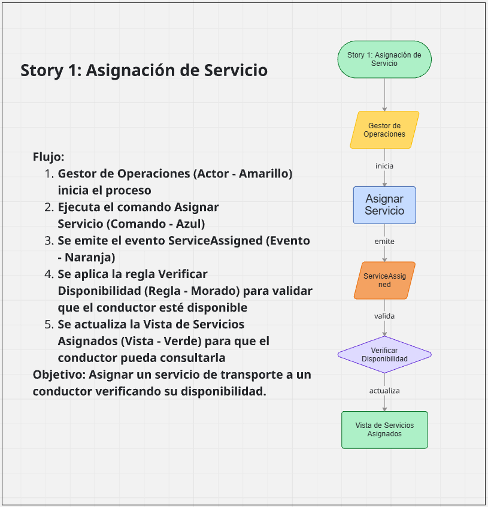

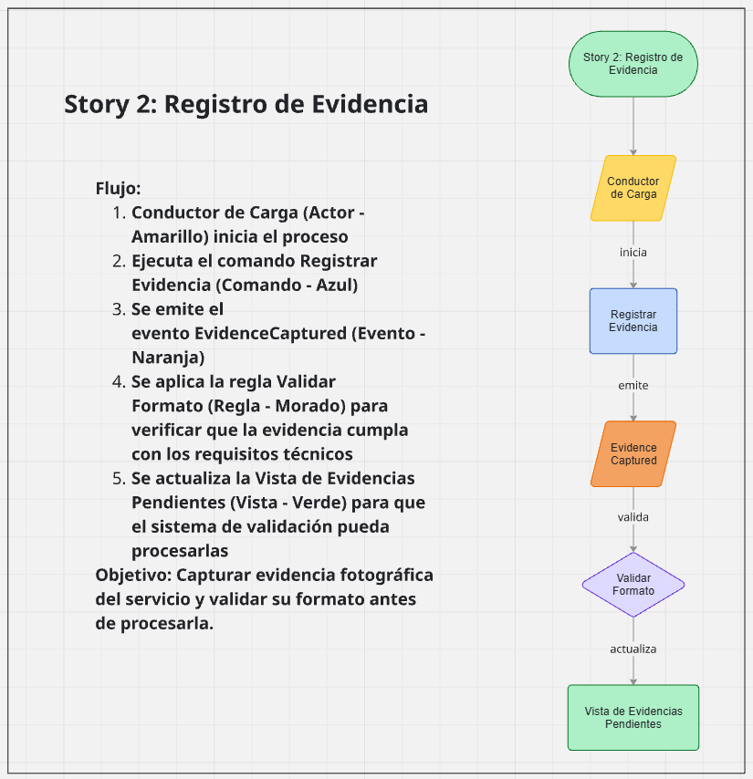

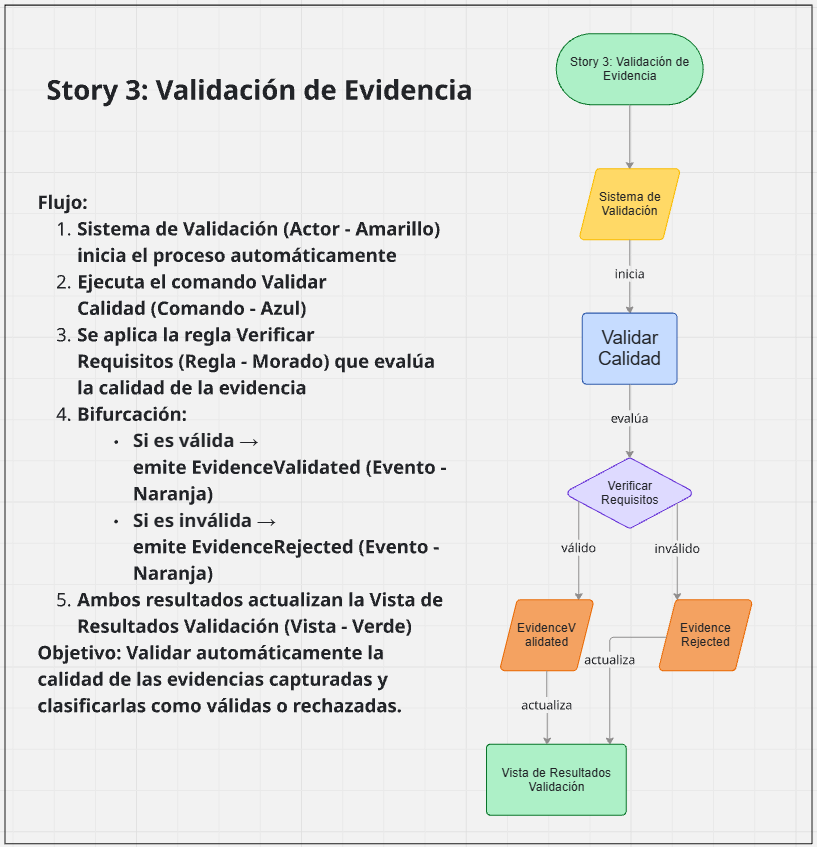

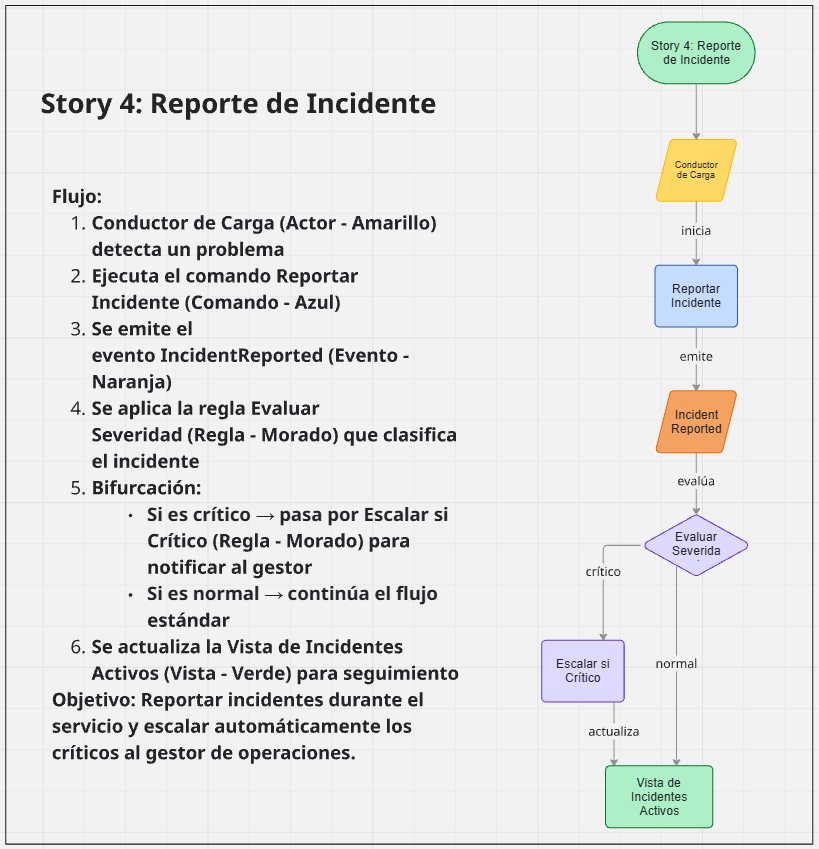

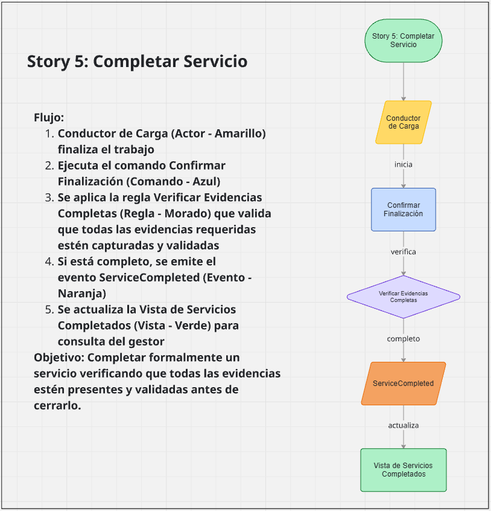

#### 4.2.4. Bounded Context Canvases
- **Fleet Management**

  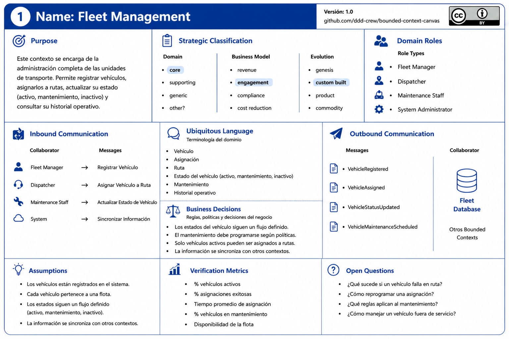

- **Delivery Management**

  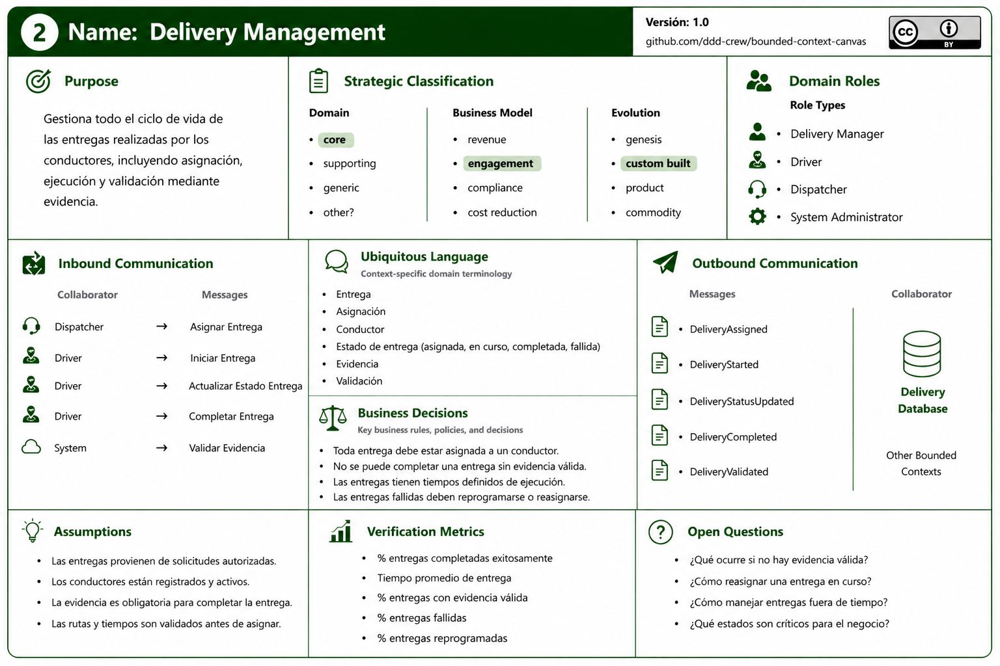

- **Incident Management**

  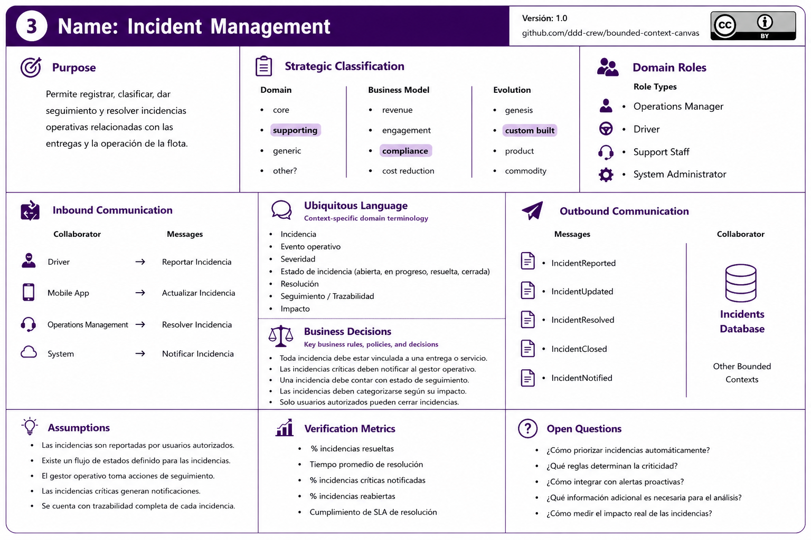

- **Evidence Management**

  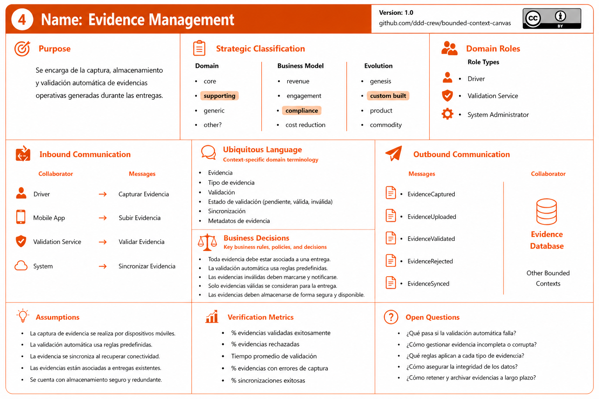

- **Reports Management**

  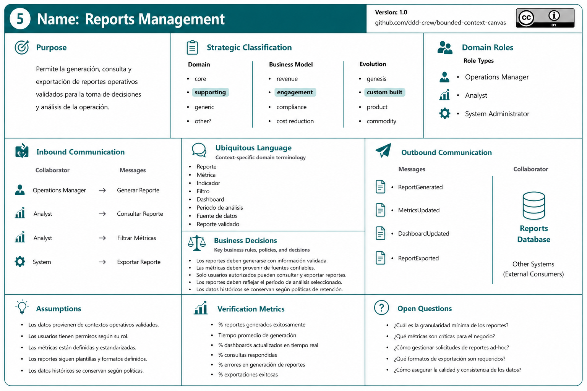

#### 4.2.5. Context Mapping

### 4.3. Software Architecture

La arquitectura de software de **CoBox Smart Vision** representa la evolución de la plataforma CoBox hacia una solución distribuida orientada a la auditoría logística inteligente, incorporando capacidades avanzadas de visión computacional, validación automática de evidencias y operación móvil resiliente en campo.

A diferencia de una implementación centralizada tradicional, CoBox Smart Vision se construye sobre la base arquitectónica previamente establecida en CoBox, la cual adopta principios de **microservicios**, **Attribute-Driven Design (ADD)** y despliegue contenerizado en nube. Sobre dicha base se incorporan nuevos dominios funcionales especializados en procesamiento de evidencias visuales, validación inteligente de información operativa, sincronización offline-first y trazabilidad ampliada de eventos logísticos.

La solución atiende principalmente a dos perfiles de usuario. El **Gestor de Operaciones** supervisa servicios, incidencias, métricas operativas, evidencias y reportes mediante interfaces web orientadas al control de la operación. El **Conductor** interactúa con una aplicación móvil para registrar eventos de ruta, capturar evidencias visuales, reportar incidencias y sincronizar información durante la ejecución del servicio, incluso en escenarios de conectividad intermitente.

Desde la perspectiva tecnológica, la arquitectura mantiene un enfoque **cloud-native híbrido y escalable**. La capa backend se compone de servicios desarrollados con **Java 21 y Spring Boot 3.4**, expuestos mediante APIs REST y gestionados a través de un **API Gateway**, complementados por mecanismos de enrutamiento, seguridad perimetral y control de tráfico mediante **NGINX Reverse Proxy** y políticas de rate limiting. La capa web se implementa con **React TypeScript**, mientras que la solución móvil multiplataforma se desarrolla con **Flutter**.

En infraestructura, **AWS** continúa como proveedor principal para ejecución de servicios, contenedores, almacenamiento de evidencias y persistencia operacional mediante servicios como **Amazon EC2**, **Amazon ECR**, **Amazon S3** y **Amazon Aurora PostgreSQL**. De forma complementaria, **Google Cloud Platform** aporta capacidades especializadas de inteligencia artificial mediante **Vertex AI Vision** y **Document AI**, orientadas al análisis de imágenes, extracción documental y validación automática de registros operativos.

La arquitectura prioriza atributos de calidad críticos para el dominio logístico: escalabilidad horizontal, alta disponibilidad, operación offline-first, sincronización confiable, seguridad de extremo a extremo, observabilidad técnica, trazabilidad auditable y evolución incremental de servicios. Para monitoreo y diagnóstico se emplea una pila de observabilidad basada en **Prometheus** y **Grafana**. Las credenciales, tokens y secretos operativos se gestionan mediante variables de entorno o servicios especializados de secret management, evitando su exposición en código fuente o artefactos desplegables.

#### 4.3.1. Software Architecture System Landscape Diagram

El diagrama de paisaje del sistema presenta a **CoBox Smart Vision** dentro del ecosistema empresarial y tecnológico donde opera la organización logística. En este nivel se identifican los actores principales, la plataforma central y los sistemas externos estratégicos que habilitan identidad digital, capacidades inteligentes, comunicaciones operativas e infraestructura cloud.

A diferencia de una representación centrada únicamente en infraestructura, el paisaje del sistema busca mostrar cómo CoBox Smart Vision articula la relación entre la operación logística diaria, la supervisión gerencial y los servicios especializados necesarios para una operación moderna basada en trazabilidad y validación automática de información.

CoBox Smart Vision se posiciona como el núcleo digital de la operación: centraliza servicios logísticos, evidencias, incidencias, validaciones y reportes; mientras se integra con proveedores externos para autenticación, inteligencia artificial, notificaciones e infraestructura escalable.

---

**Elementos principales del diagrama**

- **Gestor de Operaciones**: usuario responsable de supervisar servicios, revisar incidencias, validar evidencias y consultar indicadores operativos.
- **Conductor**: usuario de campo encargado de registrar eventos, capturar evidencias y sincronizar información desde la aplicación móvil.
- **Administrador de Plataforma**: usuario interno responsable de configuración, catálogos, usuarios, políticas y monitoreo funcional.
- **CoBox Smart Vision**: plataforma principal de gestión logística inteligente, trazabilidad y auditoría automatizada.
- **Auth0 Identity Provider**: proveedor externo IAM para autenticación y emisión de tokens de acceso.
- **Google Cloud AI Services**: servicios especializados de IA (Vertex AI Vision / Document AI) para procesamiento visual y documental.
- **Notification Services**: servicios de correo, SMS o mensajería para alertas operativas y notificaciones.
- **AWS Cloud Platform**: infraestructura principal de ejecución, almacenamiento y persistencia.
- **Observability Platform**: monitoreo técnico, métricas, dashboards y diagnóstico operativo.

---

**Justificación de decisiones**

El paisaje del sistema refleja una evolución arquitectónica respecto a versiones previas de CoBox. La autenticación deja de ser una responsabilidad interna y se desacopla hacia un proveedor IAM especializado, reduciendo complejidad operativa y fortaleciendo seguridad. Asimismo, la inteligencia artificial se consume como capacidad externa administrada, evitando construir y mantener modelos propios en una primera etapa.

AWS se mantiene como plataforma principal por continuidad operativa e inversión previa, mientras que GCP se incorpora selectivamente como proveedor especializado de visión computacional. Esta estrategia multi-cloud pragmática maximiza capacidades sin introducir sobrearquitectura innecesaria.

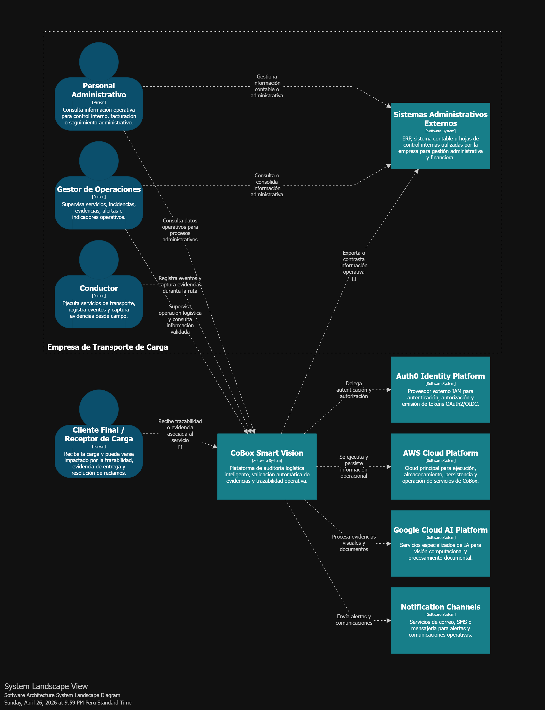

#### 4.3.2. Software Architecture Context Level Diagrams

El diagrama de contexto presenta a **CoBox Smart Vision** como el sistema central dentro de la solución, delimitando sus relaciones directas con los usuarios principales y con los sistemas externos que habilitan capacidades transversales. En este nivel no se detallan bases de datos, contenedores internos ni mecanismos de despliegue, ya que dichos elementos corresponden a los diagramas de contenedores y despliegue.

CoBox Smart Vision concentra las capacidades de gestión logística, registro de eventos operativos, captura de evidencias, validación automática, trazabilidad, incidencias, reportes y auditoría. El **Gestor de Operaciones** interactúa con el sistema para supervisar servicios, revisar alertas, consultar reportes y validar información operativa. El **Conductor** utiliza el sistema durante la ejecución del servicio para registrar eventos, capturar evidencias visuales, reportar incidencias y sincronizar información desde campo. El **Administrador de Plataforma** gestiona configuraciones operativas, catálogos, usuarios y parámetros del sistema.

En cuanto a sistemas externos, **Auth0 Identity Provider** se encarga de la autenticación y emisión de tokens bajo estándares OAuth2/OIDC. **Google Cloud AI Services** provee capacidades especializadas para visión computacional y procesamiento documental. **Notification Services** permite el envío de alertas o comunicaciones operativas. **AWS Cloud Platform** representa la plataforma principal donde se ejecutan y hospedan los componentes internos de CoBox Smart Vision. Finalmente, la **Observability Platform** permite monitorear el estado técnico de la solución, sus servicios y métricas operativas de infraestructura.

---

**Elementos principales del diagrama**

- **CoBox Smart Vision**: sistema central de gestión logística inteligente, validación automática de evidencias, trazabilidad operativa, incidencias y reportes.
- **Gestor de Operaciones**: actor responsable de supervisar servicios, consultar alertas, revisar evidencias y tomar decisiones operativas.
- **Conductor**: actor responsable de registrar eventos, capturar evidencias visuales, reportar incidencias y sincronizar información en campo.
- **Administrador de Plataforma**: actor responsable de configurar parámetros operativos, catálogos, usuarios y políticas funcionales.
- **Auth0 Identity Provider**: sistema externo encargado de autenticación, autorización y emisión de tokens OAuth2/OIDC.
- **Google Cloud AI Services**: proveedor externo de capacidades de inteligencia artificial para análisis visual y documental.
- **Notification Services**: sistema externo para envío de notificaciones operativas por correo, SMS o canales equivalentes.
- **AWS Cloud Platform**: plataforma principal de infraestructura donde se ejecuta la solución.
- **Observability Platform**: sistema externo o transversal para monitoreo técnico, métricas y dashboards operativos.

---

**Justificación de decisiones**

El contexto arquitectónico separa explícitamente las responsabilidades internas de CoBox Smart Vision de las capacidades delegadas a proveedores especializados. La autenticación se desacopla mediante Auth0, evitando mantener un servicio IAM propio y reduciendo riesgos de seguridad asociados a la gestión interna de credenciales. La validación inteligente se apoya en Google Cloud AI Services, permitiendo incorporar visión computacional y procesamiento documental sin entrenar ni desplegar modelos propios en esta etapa.

AWS se mantiene como plataforma principal de ejecución por continuidad con la arquitectura previa de CoBox, mientras que la observabilidad se modela como una capacidad transversal necesaria para operar microservicios, API Gateway, reverse proxy y procesos de validación asíncrona. Esta separación permite evolucionar la arquitectura sin perder trazabilidad con la base existente de microservicios y despliegue contenerizado.

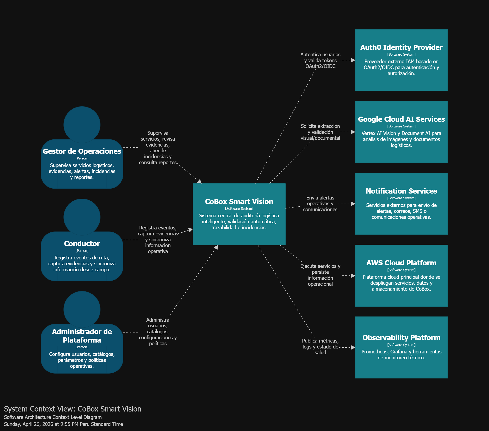

#### 4.3.3. Software Architecture Container Level Diagrams

El diagrama de contenedores representa la evolución de CoBox desde una arquitectura de microservicios previamente validada hacia **CoBox Smart Vision**, incorporando nuevos contenedores especializados para captura de evidencias, validación inteligente, sincronización offline y auditoría operativa.

A diferencia de una arquitectura monolítica modular, CoBox Smart Vision mantiene una separación por servicios alineada con los bounded contexts definidos en el análisis de dominio. Esta decisión permite conservar la base arquitectónica existente de CoBox, basada en microservicios desplegados con Docker, API Gateway, NGINX Reverse Proxy y mecanismos de control de tráfico, incorporando nuevas capacidades sin representar un retroceso arquitectónico.

La solución se organiza alrededor de aplicaciones cliente, capa de entrada, microservicios de dominio, servicios transversales, almacenamiento, integración con IA y observabilidad. La aplicación web permite a los gestores supervisar servicios, alertas, incidencias, evidencias y reportes. La aplicación móvil Flutter permite a los conductores capturar evidencias, registrar eventos operativos y sincronizar información en escenarios de conectividad limitada.

---

**Elementos principales del diagrama**

- **Web Application**: aplicación React TypeScript utilizada por gestores de operaciones para supervisión, análisis, reportes, evidencias e incidencias.
- **Mobile Application**: aplicación Flutter utilizada por conductores para captura de evidencias, registro de eventos, operación offline y sincronización posterior.
- **NGINX Reverse Proxy**: componente de entrada para terminación HTTPS, enrutamiento inicial y protección perimetral.
- **API Gateway**: punto central de exposición de APIs, enrutamiento hacia microservicios, control de acceso, rate limiting y agregación de solicitudes.
- **Auth0 Identity Provider**: proveedor externo IAM para autenticación y emisión de tokens OAuth2/OIDC.
- **Fleet Management Service**: microservicio responsable de vehículos, estados de flota, asignaciones y datos operativos de unidades.
- **Delivery Management Service**: microservicio responsable del ciclo de vida de servicios logísticos y entregas.
- **Evidence Management Service**: microservicio especializado en captura, registro, almacenamiento y consulta de evidencias visuales y documentales.
- **AI Validation Service**: microservicio orquestador de validaciones automáticas mediante Vertex AI Vision y Document AI.
- **Incident Management Service**: microservicio responsable del registro, seguimiento y resolución de incidencias operativas.
- **Reporting & Analytics Service**: microservicio responsable de reportes validados, indicadores operativos y consultas analíticas.
- **Maintenance Service**: microservicio responsable del historial de mantenimiento y estado operativo de unidades.
- **Operational Database**: base de datos PostgreSQL / Amazon Aurora PostgreSQL para persistencia operacional, transaccional y de auditoría.
- **Evidence Storage**: Amazon S3 para almacenamiento seguro de imágenes, documentos y evidencias asociadas a servicios.
- **Observability Stack**: Prometheus y Grafana para monitoreo técnico, métricas, dashboards y diagnóstico de servicios.

---

**Justificación de decisiones**

El uso de microservicios permite preservar la arquitectura base de CoBox y extenderla con capacidades especializadas de Smart Vision sin concentrar toda la lógica en un único backend. Los bounded contexts se reflejan como servicios independientes o especializados, reduciendo acoplamiento entre gestión de flota, entregas, evidencias, incidencias, mantenimiento y reportes.

La autenticación se desacopla mediante **Auth0**, reemplazando progresivamente el IAM propio basado en JWT por un proveedor especializado. El API Gateway conserva la responsabilidad de validar tokens, aplicar políticas de acceso y enrutar solicitudes hacia los microservicios correspondientes.

El **Evidence Management Service** y el **AI Validation Service** representan la evolución central de Smart Vision, ya que incorporan el flujo de captura, almacenamiento, procesamiento y validación automática de evidencias. La aplicación móvil mantiene almacenamiento local para soportar operación offline y sincronización posterior, mientras que la validación avanzada se ejecuta mediante servicios administrados de IA en GCP.

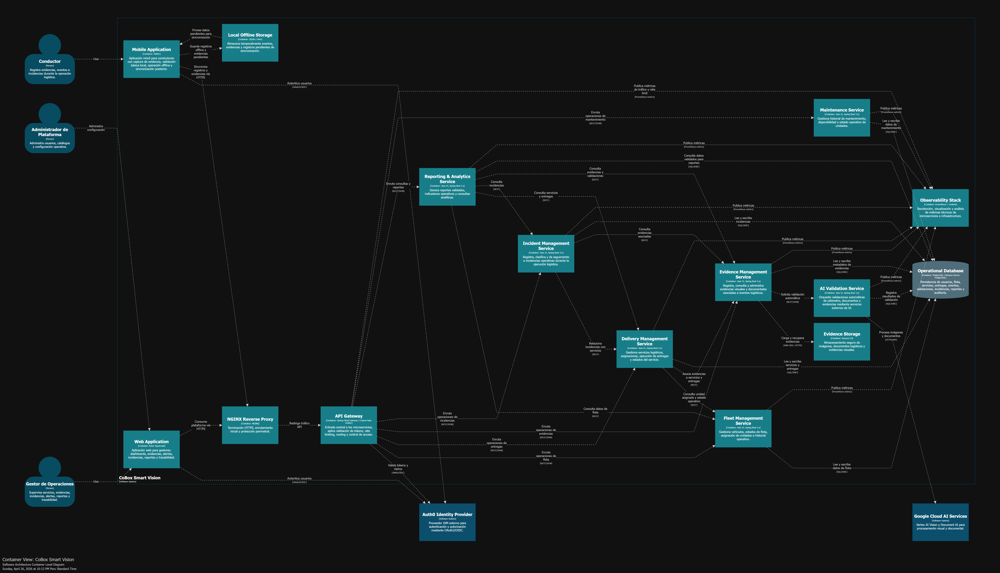

#### 4.3.4. Software Architecture Deployment Diagrams

El diagrama de despliegue describe la distribución física y lógica de los componentes de **CoBox Smart Vision**, representando la evolución de la plataforma CoBox hacia una solución distribuida basada en microservicios, identidad desacoplada, operación móvil offline-first e integración multi-cloud para capacidades inteligentes.

La arquitectura se despliega principalmente sobre **AWS**, donde residen los componentes propios de CoBox Smart Vision: capa de entrada, gateway de APIs, microservicios de dominio, almacenamiento operacional, evidencias y observabilidad. De forma complementaria, **Google Cloud Platform** se integra como proveedor externo especializado para procesamiento visual y documental mediante servicios administrados de IA. Asimismo, **Auth0** se incorpora como plataforma externa de identidad y acceso, reemplazando progresivamente el servicio IAM propietario implementado en versiones anteriores.

Los usuarios interactúan desde dos canales principales. El **Gestor de Operaciones** accede mediante navegador web a la aplicación administrativa, mientras que el **Conductor** utiliza una aplicación móvil Flutter instalada en dispositivos Android o iOS. Esta aplicación mantiene almacenamiento local seguro para operar en escenarios sin conectividad y sincroniza registros pendientes cuando la red se restablece.

En el perímetro cloud, las solicitudes ingresan por un **NGINX Reverse Proxy**, responsable de terminación HTTPS y protección inicial, para luego ser dirigidas hacia el **API Gateway**, donde se aplican validaciones de tokens, políticas de acceso, rate limiting y enrutamiento hacia los microservicios correspondientes.

Los servicios de dominio se ejecutan como contenedores Docker sobre nodos EC2, permitiendo despliegue independiente, replicabilidad controlada y evolución incremental. La persistencia transaccional se mantiene en **Amazon Aurora PostgreSQL**, mientras que las evidencias visuales y documentales se almacenan en **Amazon S3**. La plataforma incorpora monitoreo técnico mediante **Prometheus** y **Grafana**, recolectando métricas de gateway, reverse proxy y microservicios.

---

**Elementos principales del diagrama**

- **Operations Workstation**: estación de trabajo del Gestor de Operaciones con acceso web.
- **Mobile Device**: dispositivo Android/iOS del Conductor con aplicación Flutter.
- **Local Offline Storage**: almacenamiento local cifrado para registros pendientes y evidencias temporales.
- **Auth0 Cloud**: plataforma externa de autenticación y autorización.
- **NGINX Reverse Proxy**: entrada HTTPS y protección perimetral.
- **API Gateway**: punto central de APIs, rate limiting y routing interno.
- **Application Services Node**: host EC2 con contenedores de microservicios.
- **Fleet Management Service**: servicio de gestión de flota.
- **Delivery Management Service**: servicio de gestión de entregas.
- **Evidence Management Service**: servicio de evidencias visuales y documentales.
- **AI Validation Service**: servicio orquestador de validaciones inteligentes.
- **Incident Management Service**: servicio de incidencias operativas.
- **Reporting & Analytics Service**: servicio de reportes e indicadores.
- **Maintenance Service**: servicio de mantenimiento de unidades.
- **Amazon ECR**: registro de imágenes Docker.
- **Amazon Aurora PostgreSQL**: base de datos operacional.
- **Amazon S3**: almacenamiento de evidencias.
- **Observability Node**: Prometheus y Grafana.
- **Google Cloud AI Platform**: Vertex AI Vision y Document AI.

---

**Justificación de decisiones**

El despliegue conserva la línea evolutiva de CoBox basada en contenedores y separación de servicios, evitando un retroceso hacia arquitecturas monolíticas. El uso de **EC2 + Docker + ECR** resulta suficiente para el alcance académico y operativo del proyecto, sin introducir complejidad adicional asociada a orquestadores como Kubernetes.

La autenticación se externaliza hacia **Auth0**, reduciendo carga de mantenimiento interno y fortaleciendo controles de acceso. La combinación **AWS + GCP** responde a una estrategia pragmática: AWS como plataforma principal de operación y GCP como proveedor especializado de IA. La aplicación móvil mantiene almacenamiento local para asegurar continuidad operativa en rutas con conectividad limitada.

La arquitectura propuesta permite escalar horizontalmente la capa de servicios, incorporar nuevos bounded contexts y evolucionar capacidades inteligentes sin rediseñar la plataforma base.

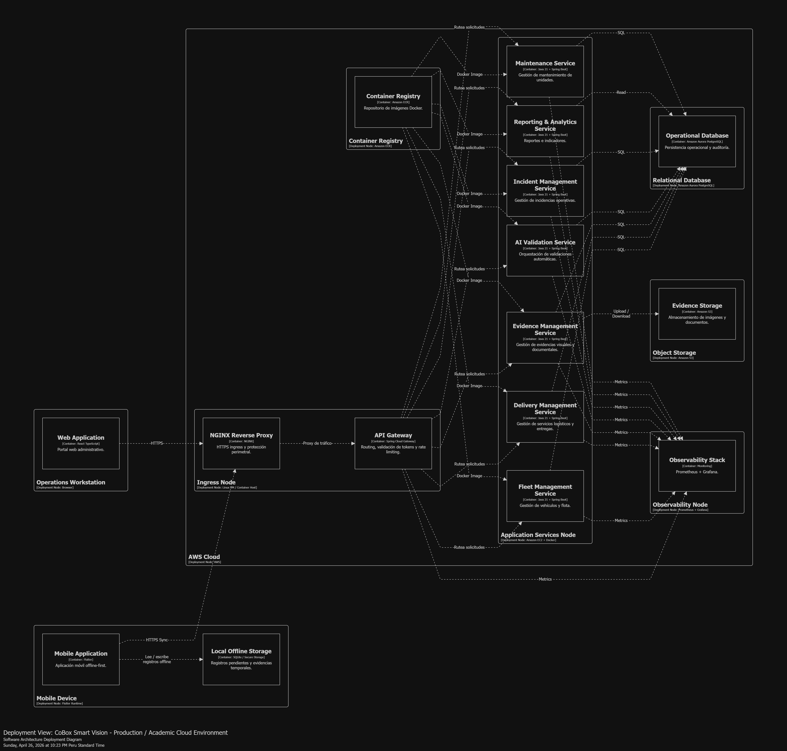

# Referencias Bibliograficas

CargoNet. (2025, January 21). *2024 supply chain risk trends analysis*. Verisk Analytics. https://www.cargonet.com/news-and-events/cargonet-in-the-media/2024-theft-trends/

Fortune Business Insights. (2026). *Digital logistics market size, share & industry analysis, by solution, by application, by deployment mode, by end-user, and regional forecast, 2026–2034* (Report ID: FBI109139). https://www.fortunebusinessinsights.com/digital-logistics-market-109139

Ministerio de la Producción. (2024). *Tasa de informalidad MYPE: Ficha técnica*. Observatorio PRODUCEmpresarial. https://www.producempresarial.pe/tasa-de-informalidad-mype-ficha-tecnica/

Ministerio de Transportes y Comunicaciones. (2025, November 24). *Estadística: Servicios de transporte terrestre por carretera - parque automotor*. Plataforma del Estado Peruano. https://www.gob.pe/institucion/mtc/informes-publicaciones/344892-estadistica-servicios-de-transporte-terrestre-por-carretera-parque-automotor
