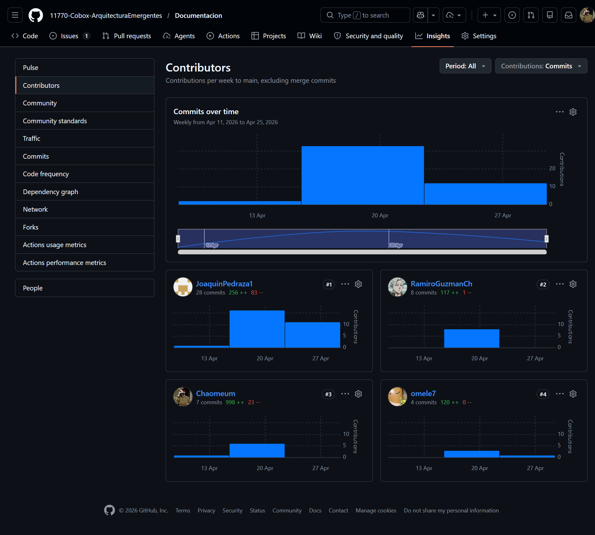
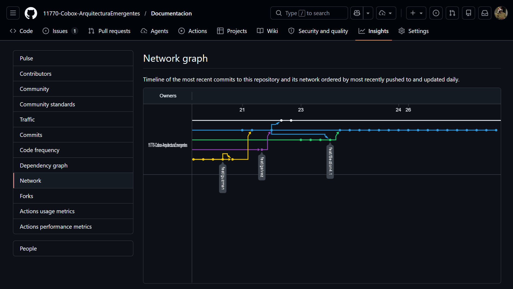
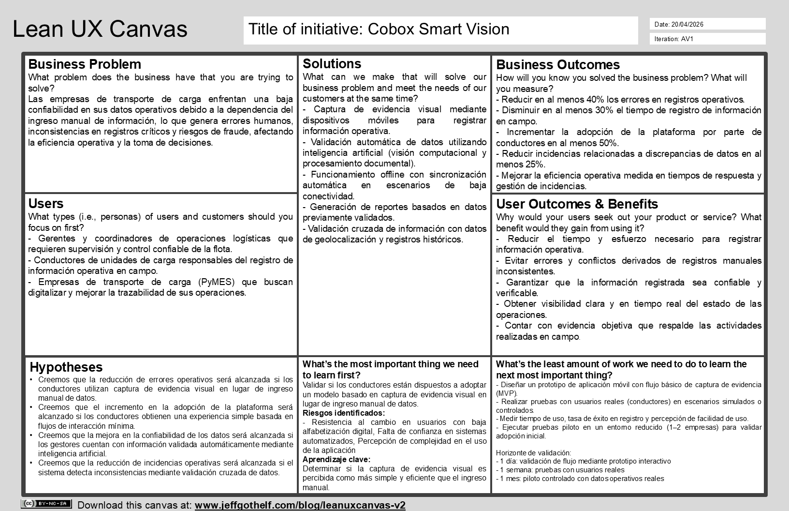
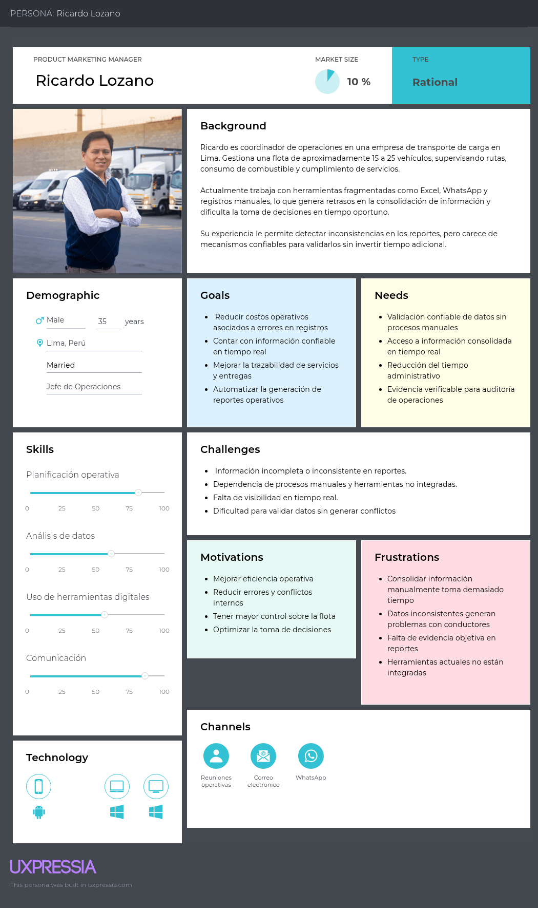
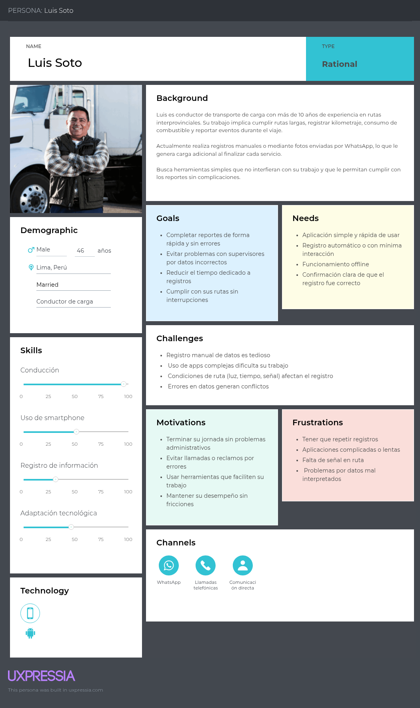

  <strong>UNIVERSIDAD PERUANA DE CIENCIAS APLICADAS</strong>

  

  Ingeniería de Software  
  1ASI0728 Arquitecturas De Software Emergentes  
  2026-10  
  Profesor: <strong>Christian Luis De Los Rios Fernandez
</strong>   
  Report  
  CoWare – Producto: CoBox

 

<strong>Team Members:</strong>

<table align="center">
  <thead>
    <tr>
      <th>Member</th>
      <th>Código</th>
    </tr>
  </thead>
  <tbody>
    <tr>
      <td>Ramiro Alexander Guzmán Chávez</td>
      <td>U202217062</td>
    </tr>
    <tr>
      <td>Diego Ivan Cabrera Buitron</td>
      <td>U20211B293</td>
    </tr>
    <tr>
      <td>Joaquín Pedraza Maldonado</td>
      <td>U202218514</td>
    </tr>
    <tr>
      <td>Jhon Alexander Galvez Chambi</td>
      <td>U202323270</td>
    </tr>
  </tbody>
</table>

  

  <strong>Abril, 2026</strong>  
  <strong>URL del proyecto:</strong> 
  <a href="https://github.com/11770-Cobox-ArquitecturaEmergentes">
    https://github.com/11770-Cobox-ArquitecturaEmergentes
  </a>

---

## Registro de Versiones del Informe

| Versión | Fecha       | Autor                          | Descripción                                                                 |
|---------|-------------|--------------------------------|-----------------------------------------------------------------------------|
| TB1     | 09/04/2026  | Ramiro Alexander Guzmán Chávez |  |
| TB1     | 09/04/2026  |   Diego Ivan Cabrera Buitron   |  |
| TB1     | 04/04/2026  |  Jhon Alexander Galvez Chambi  |  |
| TB1     | 04/04/2026  |   Joaquín Pedraza Maldonado    |  |

## Project Report Collaboration Insights

| URL del repositorio del reporte |
| :-----------------------------------: |
| [https://github.com/11770-Cobox-ArquitecturaEmergentes/Documentacion](https://github.com/11770-Cobox-ArquitecturaEmergentes/Documentacion) |

**AV1:**

Para la elaboración de la entrega AV1 de este informe, el equipo se organizó mediante reuniones de coordinación a través de un canal de Discord. En estas reuniones se definió la distribución de actividades, se asignaron responsables por capítulo y se establecieron fechas de revisión periódica para asegurar el avance progresivo de cada integrante.

| Integrante | Usuario Github | Detalle de avance |
|------------|----------------|-------------------|
| Diego Ivan Cabrera Buitron | `omele7` |  |
| Joaquín Pedraza Maldonado | `JoaquinPedraza1` |  |
| Ramiro Alexander Guzmán Chávez | `RamiroGuzmanCh` | |
| Jhon Alexander Galvez Chambi | `Chaomeum` |  |

**Report Repository Insights:** 

En esta sección se presentan los analíticos de colaboración y los commits realizados en GitHub por los miembros del equipo dentro del repositorio del informe durante la fase AV1. Esta evidencia permite visualizar la participación de los integrantes y la evolución del trabajo colaborativo a lo largo del desarrollo del reporte.

- Report Contributors:

- Report Network:

## Contenido
#### Tabla de contenidos

- [Carátula](#carátula)
- [Registro de Versiones del Informe](#registro-de-versiones-del-informe)
- [Project Report Collaboration Insights](#project-report-collaboration-insights)
- [Contenido](#contenido)
- [Student Outcome](#student-outcome)

- [Capítulo I: Introducción](#capítulo-i-introducción)
  - [1.1. Startup Profile](#11-startup-profile)
    - [1.1.1. Descripción de la Startup](#111-descripción-de-la-startup)
    - [1.1.2. Perfiles de integrantes del equipo](#112-perfiles-de-integrantes-del-equipo)
  - [1.2. Solution Profile](#12-solution-profile)
    - [1.2.1. Antecedentes y problemática](#121-antecedentes-y-problemática)
    - [1.2.2. Lean UX Process](#122-lean-ux-process)
      - [1.2.2.1. Lean UX Problem Statements](#1221-lean-ux-problem-statements)
      - [1.2.2.2. Lean UX Assumptions](#1222-lean-ux-assumptions)
      - [1.2.2.3. Lean UX Hypothesis Statements](#1223-lean-ux-hypothesis-statements)
      - [1.2.2.4. Lean UX Canvas](#1224-lean-ux-canvas)
  - [1.3. Segmentos objetivo](#13-segmentos-objetivo)

- [Capítulo II: Requirements Elicitation & Analysis](#capítulo-ii-requirements-elicitation--analysis)
  - [2.1. Competidores](#21-competidores)
    - [2.1.1. Análisis competitivo](#211-análisis-competitivo)
    - [2.1.2. Estrategias y tácticas frente a competidores](#212-estrategias-y-tácticas-frente-a-competidores)
  - [2.2. Entrevistas](#22-entrevistas)
    - [2.2.1. Diseño de entrevistas](#221-diseño-de-entrevistas)
    - [2.2.2. Registro de entrevistas](#222-registro-de-entrevistas)
    - [2.2.3. Análisis de entrevistas](#223-análisis-de-entrevistas)
  - [2.3. Needfinding](#23-needfinding)
    - [2.3.1. User Personas](#231-user-personas)
    - [2.3.2. User Task Matrix](#232-user-task-matrix)
    - [2.3.3. Empathy Mapping](#233-empathy-mapping)
    - [2.3.4. As-is Scenario Mapping](#234-as-is-scenario-mapping)
  - [2.4. Ubiquitous Language](#24-ubiquitous-language)

- [Capítulo III: Requirements Specification](#capítulo-iii-requirements-specification)
  - [3.1. To-Be Scenario Mapping](#31-to-be-scenario-mapping)
  - [3.2. User Stories](#32-user-stories)
  - [3.3. Impact Mapping](#33-impact-mapping)
  - [3.4. Product Backlog](#34-product-backlog)

- [Capítulo IV: Strategic-Level Software Design](#capítulo-iv-strategic-level-software-design)
  - [4.1. Strategic-Level Attribute-Driven Design](#41-strategic-level-attribute-driven-design)
    - [4.1.1. Design Purpose](#411-design-purpose)
    - [4.1.2. Attribute-Driven Design Inputs](#412-attribute-driven-design-inputs)
      - [4.1.2.1. Primary Functionality (Primary User Stories)](#4121-primary-functionality-primary-user-stories)
      - [4.1.2.2. Quality Attribute Scenarios](#4122-quality-attribute-scenarios)
      - [4.1.2.3. Constraints](#4123-constraints)
    - [4.1.3. Architectural Drivers Backlog](#413-architectural-drivers-backlog)
    - [4.1.4. Architectural Design Decisions](#414-architectural-design-decisions)
    - [4.1.5. Quality Attribute Scenario Refinements](#415-quality-attribute-scenario-refinements)
  - [4.2. Strategic-Level Domain-Driven Design](#42-strategic-level-domain-driven-design)
    - [4.2.1. EventStorming](#421-eventstorming)
    - [4.2.2. Candidate Context Discovery](#422-candidate-context-discovery)
    - [4.2.3. Domain Message Flows Modeling](#423-domain-message-flows-modeling)
    - [4.2.4. Bounded Context Canvases](#424-bounded-context-canvases)
    - [4.2.5. Context Mapping](#425-context-mapping)
  - [4.3. Software Architecture](#43-software-architecture)
    - [4.3.1. Software Architecture System Landscape Diagram](#431-software-architecture-system-landscape-diagram)
    - [4.3.2. Software Architecture Context Level Diagrams](#432-software-architecture-context-level-diagrams)
    - [4.3.3. Software Architecture Container Level Diagrams](#433-software-architecture-container-level-diagrams)
    - [4.3.4. Software Architecture Deployment Diagrams](#434-software-architecture-deployment-diagrams)

## Student Outcome

### ABET – EAC - Student Outcome 3

**Criterio:** Capacidad de comunicarse efectivamente con un rango de audiencias.

En el siguiente cuadro se describen las acciones realizadas y enunciados de conclusiones por parte del equipo, que permiten sustentar el haber alcanzado el logro del ABET – EAC - Student Outcome 3.

| Criterio específico | Acciones realizadas | Conclusiones |
|----------------------|---------------------|--------------|
| Comunica oralmente sus ideas y/o resultados con objetividad a público de diferentes especialidades y niveles jerárquicos, en el marco del desarrollo de un proyecto en ingeniería. | | |
| Comunica en forma escrita ideas y/o resultados con objetividad a público de diferentes especialidades y niveles jerárquicos, en el marco del desarrollo de un proyecto en ingeniería. | | |

## Capítulo I: Introducción

### 1.1. Startup Profile

#### 1.1.1. Descripción de la Startup

CoWare es una startup tecnológica orientada a la transformación digital del sector logístico de transporte de carga, enfocada en mejorar la eficiencia operativa, la trazabilidad de los servicios y la confiabilidad de la información generada durante la ejecución de operaciones.

La iniciativa surge a partir de la identificación de una problemática recurrente en pequeñas y medianas empresas del sector: la dependencia de procesos manuales y herramientas no integradas como hojas de cálculo, registros físicos y aplicaciones de mensajería, lo cual genera fragmentación de la información, errores en el registro de datos y limitaciones para supervisar y auditar las operaciones de manera efectiva.

Misión: Desarrollar soluciones tecnológicas que permitan mejorar la eficiencia y trazabilidad de las operaciones logísticas del transporte de carga mediante la digitalización y automatización progresiva de sus procesos.

Visión: Consolidarse como una startup referente en soluciones digitales para el sector logístico, impulsando la modernización de la gestión del transporte de carga a través del uso de tecnologías innovadoras.

#### 1.1.2. Perfiles de integrantes del equipo

**Joaquin Pedraza Maldonado – Ingeniería de Software – U202218514**  

Estudio Ing. Software. Me considero que soy una persona perseverante, entusiasta en aprender cosas nuevas. Me gusta ayudar a los demás y sé trabajar en equipo. Cuento con conocimientos en lenguajes de Programación como C++, Python,CSS, JavaScript.

**Ramiro Alexander Guzman Chavez – Ingeniería de Software – U202217062**  

Mi perfil se basa en ser una persona responsable, disciplinada en todo aspecto y comprometida con las actividades que me puedan tocar.
Considero que tengo una experiencia altamente capacitada para este tipo de tareas. Suelo desarrollarme de manera positiva en los trabajos grupales y tengo conocimientos en bases de datos, lo cual puede aportar de manera importante al equipo.
Además, cuento con conocimientos en lenguajes de programación como Java y JavaScript, lo que me permite desarrollar soluciones tanto del lado del backend como del frontend, contribuyendo a proyectos de desarrollo de software de manera integral.

**Jhon Alexander Galvez Chambi - Ingeniería de Software - U202323270**  

Soy una persona responsable y comprometida con la consecución de los mejores resultados en trabajo en equipo. Poseo experiencia en diversos lenguajes de programación, incluyendo Python, JavaScript y C++, así como en varios de los frameworks asociados a estos lenguajes. Además, tengo conocimientos en tecnologías emergentes como Cloud Computing e Internet de las Cosas (IoT), y estoy dispuesto a aportar mi experiencia en estas áreas para contribuir al éxito de los proyectos en los que participo.

### 1.2. Solution Profile

CoWare desarrolla CoBox como su producto principal, una plataforma digital que permite centralizar la gestión de servicios logísticos, facilitando la planificación, el monitoreo de recorridos, el registro de eventos operativos y la generación de reportes.

A partir de esta base, el proyecto evoluciona hacia **CoBox Smart Vision**, una propuesta que introduce capacidades de automatización inteligente orientadas a reducir la intervención manual en el registro de información y mejorar la confiabilidad de los datos operativos. Esta evolución responde a la necesidad de avanzar desde la digitalización de procesos hacia mecanismos más robustos de validación de información en entornos logísticos.

Esta nueva propuesta considera las condiciones reales del entorno de operación, incluyendo escenarios de conectividad limitada y usuarios con distintos niveles de alfabetización digital, lo que implica priorizar simplicidad de uso, eficiencia en campo y consistencia en el registro de información.

#### 1.2.1 Antecedentes y problemática

En el sector logístico de transporte de carga, especialmente en pequeñas y medianas empresas, persiste una alta dependencia de procesos manuales y herramientas no integradas como hojas de cálculo, registros físicos y aplicaciones de mensajería. Esta situación genera fragmentación de la información, errores en el registro de datos y una limitada capacidad para auditar las operaciones de forma confiable.

Si bien soluciones como CoBox permiten digitalizar parcialmente estos procesos, aún existe una fuerte dependencia del ingreso manual de datos, lo que introduce riesgos significativos como errores humanos, inconsistencias en la información y posibles fraudes en el reporte de kilometraje y consumo de combustible.

En este contexto, el problema central evoluciona desde la falta de digitalización hacia la falta de **validación automática de la información operativa**, lo que limita la confiabilidad de los datos utilizados para la toma de decisiones.

Para estructurar la problemática, se aplica la técnica de las 5W + 2H:

| Elemento | Descripción |
|----------|------------|
| **Who** | Empresas de transporte de carga, gestores logísticos y conductores que registran y supervisan operaciones. |
| **What** | Registro manual de información crítica (kilometraje, combustible, entregas), susceptible a errores y manipulación. |
| **Where** | En oficinas de operación logística, empresas de transporte, y en campo a través de dispositivos móviles utilizados por los choferes. |
| **When** | Durante la ejecución de servicios logísticos y procesos de reporte posterior. |
| **Why** | Debido a la ausencia de herramientas que automaticen la captura y validación de datos operativos. |
| **How** | Mediante el uso de registros manuales, fotografías no validadas y sistemas desconectados. |
| **How Much** | Impacto en costos operativos, pérdida de eficiencia y riesgos de fraude (a validar en etapas de investigación). |

##### Objetivos de la solución

- Reducir la dependencia del ingreso manual de datos
- Incrementar la confiabilidad de la información operativa
- Automatizar la validación de evidencias en campo
- Mejorar la trazabilidad de los servicios logísticos

##### Restricciones del proyecto

- Operación en entornos con conectividad limitada
- Usuarios con bajo nivel de alfabetización digital
- Necesidad de integración con infraestructura cloud existente

En respuesta a esta problemática, se plantea la evolución hacia CoBox Smart Vision, una solución que incorpora inteligencia artificial de visión y procesamiento en el borde para validar automáticamente la información capturada en campo, eliminando la dependencia del ingreso manual y garantizando la integridad de los datos.

#### 1.2.2. Lean UX Process

##### 1.2.2.1 Lean UX Problem Statements

El dominio del problema se sitúa en la gestión operativa del transporte de carga, donde la captura, validación y uso de información en campo representan un factor crítico para la eficiencia y confiabilidad de las operaciones logísticas.

El segmento de clientes está compuesto principalmente por pequeñas y medianas empresas de transporte de carga, incluyendo gestores logísticos y conductores, quienes requieren herramientas que les permitan registrar, validar y supervisar información operativa de manera eficiente y confiable.

Los principales puntos de dolor identificados incluyen la alta dependencia del ingreso manual de datos, la existencia de errores humanos en registros críticos, la posibilidad de manipulación o fraude en reportes operativos y la falta de mecanismos de validación automática que aseguren la integridad de la información.

Existe una brecha significativa entre las soluciones actuales, enfocadas principalmente en la digitalización de procesos, y la necesidad de contar con sistemas que validen automáticamente la información capturada en campo mediante evidencia verificable.

En este contexto, la visión del producto es evolucionar hacia una solución que no solo registre información, sino que sea capaz de interpretarla y validarla automáticamente mediante el uso de tecnologías de inteligencia artificial, reduciendo la intervención humana y mejorando la confiabilidad de los datos.

La estrategia consiste en implementar un enfoque progresivo basado en captura de evidencia visual, procesamiento inteligente de datos y validación cruzada con información contextual, priorizando la usabilidad en campo y la adaptabilidad a entornos de conectividad limitada.

El segmento inicial se enfoca en empresas de transporte de carga con flotas pequeñas y medianas que presentan procesos manuales o semi-digitalizados y que requieren mejorar la trazabilidad y confiabilidad de sus operaciones.

##### 1.2.2.2 Lean UX Assumptions

###### Business Assumptions

1. Creemos que nuestros clientes necesitan una forma automatizada y confiable de gestionar las operaciones logísticas del transporte de carga, que reduzca la dependencia del ingreso manual de datos.
2. Estas necesidades se resuelven mediante una solución que no solo digitalice procesos, sino que valide automáticamente la información operativa a partir de evidencia visual y procesamiento inteligente.
3. Nuestros clientes iniciales serán pequeñas y medianas empresas de transporte de carga que buscan mejorar la confiabilidad de sus datos y reducir errores operativos y riesgos de fraude.
4. El valor más importante de lo que el cliente requiere de nuestro servicio es la trazabilidad verificable y la integridad de la información en cada servicio logístico realizado.
5. El cliente puede tener los siguientes beneficios adicionales: reducción de tiempo administrativo, validación automática de evidencias, disminución de conflictos operativos, y mejora en el control de desempeño de la flota.
6. Vamos a adquirir clientes mediante marketing directo a empresas de transporte, demostraciones del sistema enfocadas en reducción de fraude y eficiencia operativa, y recomendaciones de clientes satisfechos.
7. Haremos dinero a través de suscripciones mensuales basadas en el número de usuarios, vehículos y funcionalidades avanzadas de validación y analítica.
8. Nuestra competencia principal serán sistemas ERP logísticos tradicionales, hojas de cálculo y plataformas de gestión de flotas que no cuentan con validación automática de datos.
9. Los venceremos ya que nuestra plataforma se enfoca en la validación inteligente de información operativa mediante evidencia digital, con una experiencia de usuario simple y adaptada al trabajo en campo.
10. Nuestro mayor riesgo es que las empresas tradicionales se resistan a confiar en sistemas automatizados basados en inteligencia artificial o perciban la solución como compleja.
11. Resolveremos esto mediante interfaces ultra-simples, flujos de uso basados en captura de evidencia (en lugar de ingreso manual), funcionamiento offline y acompañamiento en la adopción.
12. ¿Qué otras suposiciones tenemos que, si resultan falsas, harán que nuestro negocio/proyecto fracase?
    * Que las empresas de transporte están dispuestas a adoptar soluciones que automaticen la validación de datos y reduzcan su control manual.
    * Que los conductores adoptarán un modelo basado en captura de evidencia visual en lugar de ingreso manual de información.
    * Que las empresas valoran la confiabilidad y verificabilidad de los datos por encima de mantener procesos manuales conocidos.

###### User Assumptions

1. ¿Quién será nuestro usuario?
   * El usuario principal de CoBox Smart Vision son gerentes y coordinadores de operaciones logísticas que necesitan información confiable y validada para supervisar su flota.
   * También está dirigido a conductores de carga que requieren una herramienta simple para registrar eventos mediante captura de evidencia sin procesos manuales complejos.

2. ¿Dónde encaja nuestro producto en su vida?
   * Se integra en la rutina diaria tanto en oficinas como en campo, siendo utilizado durante la ejecución de servicios para capturar y validar información operativa en tiempo real o de manera diferida.

3. ¿Qué problemas resuelve nuestro producto?
   * Se busca resolver la dependencia del ingreso manual de datos, la falta de confiabilidad en registros operativos y la ausencia de mecanismos de validación de evidencias.
   * Los procesos manuales generan errores, inconsistencias y conflictos entre conductores y gestores, debido a la falta de información verificable.

4. ¿Cómo y Cuándo es usado nuestro producto?
   * Es utilizado durante todas las etapas del proceso logístico, especialmente en campo mediante dispositivos móviles para captura de evidencia, y en oficinas para monitoreo y análisis.
   * Los gestores acceden principalmente desde aplicaciones web, mientras los conductores utilizan la aplicación móvil durante la ejecución del servicio.

5. ¿Qué características son importantes?
   * Captura de evidencia visual para registro de información operativa
   * Validación automática de datos mediante inteligencia artificial
   * Funcionamiento offline con sincronización posterior
   * Generación de reportes basados en datos validados
   * Interfaz simple con mínima interacción requerida

6. ¿Cómo luce y se comporta nuestro producto?
   * Presenta interfaces diferenciadas: dashboards analíticos para gestores y aplicación móvil con flujo simplificado para conductores.
   * Se comporta de forma eficiente en campo, priorizando rapidez, validación automática, confirmaciones claras y sincronización cuando existe conectividad.

##### 1.2.2.3 Lean UX Hypothesis Statements

Creemos que al reemplazar el ingreso manual de datos por un modelo basado en captura de evidencia visual, los conductores reducirán el tiempo requerido para registrar información operativa.
Sabremos que estamos en lo correcto cuando se observe una disminución en el tiempo promedio de registro por servicio y una reducción en la carga operativa percibida por los usuarios en campo.

Creemos que al incorporar validación automática de datos mediante inteligencia artificial, será posible reducir errores humanos y detectar inconsistencias en los registros operativos.
Sabremos que estamos en lo correcto cuando disminuyan las discrepancias en datos críticos como kilometraje y consumo de combustible, y se identifiquen automáticamente registros anómalos.

Creemos que al utilizar evidencia digital verificable en lugar de registros manuales, se incrementará la confianza de los gestores en la información operativa.
Sabremos que estamos en lo correcto cuando se reduzcan los conflictos entre conductores y coordinadores, y aumente la aceptación de los datos registrados como fuente confiable para auditoría.

Creemos que al diseñar una experiencia de usuario basada en flujos simples y mínima interacción, los conductores adoptarán la aplicación sin resistencia significativa.
Sabremos que estamos en lo correcto cuando se mantenga un alto nivel de uso activo de la aplicación y se reduzca la necesidad de soporte técnico durante la operación.

Creemos que al ofrecer información validada automáticamente y disponible de forma oportuna, los gestores podrán tomar decisiones más rápidas y efectivas.
Sabremos que estamos en lo correcto cuando se reduzcan los tiempos de respuesta ante incidencias operativas y se evidencie una mejora en indicadores de gestión logística.

##### 1.2.2.4. Lean UX Canvas

### 1.3. Segmentos Objetivo

CoWare identifica dos segmentos principales dentro del dominio del transporte de carga, los cuales cumplen roles diferenciados en la operación logística y presentan necesidades específicas frente a la evolución hacia soluciones basadas en validación automática de información.

#### Segmento Primario: Gestión de Operaciones Logísticas

Este segmento está conformado por gerentes, coordinadores y responsables de operaciones en pequeñas y medianas empresas de transporte de carga que administran flotas vehiculares y supervisan la ejecución de servicios logísticos.

- **Perfil organizacional**: Empresas con estructuras operativas tradicionales que han iniciado procesos de digitalización, pero aún presentan dependencia de registros manuales y herramientas no integradas.

- **Necesidades clave**: Requieren información confiable, consistente y oportuna para la toma de decisiones, así como mecanismos que les permitan validar la veracidad de los datos reportados desde campo.

- **Problemas relevantes**:
  - Inconsistencias en registros de kilometraje y consumo de combustible
  - Dificultad para auditar operaciones con evidencia verificable
  - Conflictos internos por discrepancias en datos reportados
  - Limitada trazabilidad en tiempo real

- **Motivaciones principales**:
  - Reducir riesgos de fraude y errores operativos
  - Mejorar la eficiencia en la gestión de flota
  - Contar con datos auditables para control y toma de decisiones

- **Relación con la solución**:
  Este segmento se beneficia directamente de la evolución hacia CoBox Smart Vision, al obtener información validada automáticamente mediante inteligencia artificial, lo que incrementa la confiabilidad de los datos y permite una gestión basada en evidencia.

---

#### Segmento Secundario: Conductores de Unidades de Carga

Este segmento está compuesto por los operadores de campo encargados de ejecutar los servicios de transporte y registrar eventos operativos durante el recorrido.

- **Perfil demográfico**: Conductores con experiencia en el sector, con niveles diversos de alfabetización digital, que operan en entornos de alta exigencia y condiciones variables de conectividad.

- **Responsabilidades operativas**:
  - Registrar kilometraje, consumo de combustible y eventos del servicio
  - Proporcionar evidencia de entregas y actividades realizadas
  - Mantener comunicación con el equipo de operaciones

- **Problemas relevantes**:
  - Carga operativa asociada al ingreso manual de datos
  - Riesgo de errores involuntarios en registros
  - Conflictos derivados de falta de evidencia objetiva
  - Dificultades para usar herramientas complejas en campo

- **Necesidades funcionales**:
  - Interacción simple y rápida durante la operación
  - Funcionamiento offline en zonas con baja conectividad
  - Reducción del esfuerzo necesario para registrar información

- **Motivaciones principales**:
  - Facilitar el cumplimiento de sus tareas operativas
  - Evitar conflictos con supervisores por discrepancias de datos
  - Contar con respaldo objetivo de su trabajo

- **Relación con la solución**:
  La evolución hacia CoBox Smart Vision introduce un cambio significativo en este segmento, reemplazando el ingreso manual de datos por un modelo basado en captura de evidencia visual, lo que reduce la carga operativa y mejora la precisión de los registros.

---

## Capítulo II: Requirements Elicitation & Analysis

### 2.1. Competidores

Se han identificado tres competidores relevantes dentro del dominio de soluciones digitales para gestión de flotas y operaciones logísticas, los cuales representan alternativas actuales en el mercado y permiten establecer un contraste con la propuesta de CoBox Smart Vision.

**Competidor 1: Samsara**  
Web: https://www.samsara.com/mx  

Plataforma líder en la Nube de Operaciones Conectadas que utiliza IA de vanguardia para transformar la seguridad y eficiencia operativa. Más allá de la telemática tradicional, destaca por sus cámaras con visión computacional que previenen accidentes en tiempo real y su ecosistema integral que centraliza datos de seguridad, cumplimiento (ELD) y mantenimiento en una sola interfaz inteligente.

**Competidor 2: Powerfleet**  
Web: https://www.fleetcomplete.com/es/  

Powerfleet es una solución global especializada en la unificación de datos de flotas mixtas. Su ventaja competitiva es la plataforma Unity, que integra datos de hardware propietario, sensores de terceros y sistemas originales de fabricantes (OEMs). Se enfoca en la visibilidad total del ciclo de vida del activo, permitiendo una integración profunda con ERPs corporativos mediante APIs robustas.

**Competidor 3: Driv.in**  
Web: https://driv.in/  

Driv.in es un TMS SaaS especializado en la optimización de la última milla y distribución urbana en Latinoamérica. Su núcleo es un potente algoritmo de ruteo dinámico que reduce costos logísticos y emisiones. Sobresale por su capacidad de gestionar la experiencia del cliente final (notificaciones y ETAs precisas) y herramientas de control de entregas (Proof of Delivery) adaptadas a la realidad operativa de la región.

A pesar de las capacidades de estos competidores, ninguno de ellos se enfoca de manera central en la validación automática de datos mediante inteligencia artificial a partir de evidencia visual, lo que representa una oportunidad de diferenciación para CoBox Smart Vision.

#### 2.1.1. Análisis competitivo

<table style="width:100%; border-collapse: collapse; font-family: sans-serif; font-size: 14px; border: 1px solid #000;">
    <thead>
        <tr style="background-color: #f2f2f2;">
            <th colspan="6" style="border: 1px solid #000; padding: 10px; text-align: left; font-size: 18px;">Competitive Analysis Landscape</th>
        </tr>
        <tr>
            <td style="border: 1px solid #000; padding: 10px; font-weight: bold; width: 15%;">¿Por qué llevar a cabo este análisis?</td>
            <td colspan="5" style="border: 1px solid #000; padding: 10px; vertical-align: top;">
                Identificar las capacidades, limitaciones y enfoques de soluciones actuales en el mercado de gestión logística, con el fin de determinar oportunidades de diferenciación para CoBox Smart Vision, especialmente en la validación automática de datos operativos mediante inteligencia artificial.
                  
            </td>
        </tr>
        <tr style="text-align: center; font-weight: bold; background-color: #fafafa;">
            <td colspan="2" style="border: 1px solid #000; padding: 10px; width: 30%;">Nombre y Logo</td>
            <td style="border: 1px solid #000; padding: 10px; width: 17.5%;">
                CoBox SV 
                

                    
                

            </td>
            <td style="border: 1px solid #000; padding: 10px; width: 17.5%;">
                Samsara 
                

                    
                

            </td>
            <td style="border: 1px solid #000; padding: 10px; width: 17.5%;">
                Powerfleet 
                

                    
                

            </td>
            <td style="border: 1px solid #000; padding: 10px; width: 17.5%;">
                Driv.in 
                

                    
                

            </td>
        </tr>
    </thead>
    <tbody>
        <tr>
            <td rowspan="2" style="border: 1px solid #000; padding: 10px; font-weight: bold; text-align: center; writing-mode: vertical-lr; transform: rotate(180deg);">Perfil</td>
            <td style="border: 1px solid #000; padding: 10px;">Overview</td>
            <td style="border: 1px solid #000;">Plataforma de auditoría logística basada en IA que valida automáticamente datos operativos mediante evidencia visual.</td>
            <td style="border: 1px solid #000;">Nube de Operaciones Conectadas con enfoque en seguridad proactiva e inteligencia de datos IoT.</td>
            <td style="border: 1px solid #000;">Ecosistema de Datos Unificados para activos mixtos, agnóstico al hardware y centrado en integración empresarial.</td>
            <td style="border: 1px solid #000;">TMS SaaS especializado en orquestación de última milla, ruteo dinámico y experiencia de entrega.</td>
        </tr>
        <tr>
            <td style="border: 1px solid #000; padding: 10px;">Ventaja competitiva ¿Qué valor ofrece a los clientes?</td>
            <td style="border: 1px solid #000;">Validación automática con IA sin hardware especializado, eliminando el error humano en auditorías.</td>
            <td style="border: 1px solid #000;">Seguridad preventiva basada en IA de visión y una experiencia de usuario (UX) líder en la industria.</td>
            <td style="border: 1px solid #000;">Interoperabilidad total (plataforma Unity) e integración nativa con fabricantes de vehículos (OEMs).</td>
            <td style="border: 1px solid #000;">Optimización logística profunda adaptada a las restricciones específicas de LATAM (barreras geográficas, pagos, etc.).</td>
        </tr>
        <tr>
            <td rowspan="2" style="border: 1px solid #000; padding: 10px; font-weight: bold; text-align: center; writing-mode: vertical-lr; transform: rotate(180deg); background-color: #f9f9f9;">Perfil de Marketing</td>
            <td style="border: 1px solid #000; padding: 10px; background-color: #f9f9f9;">Mercado objetivo</td>
            <td style="border: 1px solid #000; background-color: #f9f9f9;">PyMES y contratistas logísticos con procesos manuales y alta rotación.</td>
            <td style="border: 1px solid #000; background-color: #f9f9f9;">Grandes corporativos (Enterprise) de transporte, construcción y servicios públicos.</td>
            <td style="border: 1px solid #000; background-color: #f9f9f9;">Flotas industriales mixtas, maquinaria pesada y empresas con infraestructura IT compleja (SAP/Oracle).</td>
            <td style="border: 1px solid #000; background-color: #f9f9f9;">Empresas de Retail, Consumo Masivo (CPG) y logística de distribución urbana en LATAM.</td>
        </tr>
        <tr>
            <td style="border: 1px solid #000; padding: 10px; background-color: #f9f9f9;">Estrategias de marketing</td>
            <td style="border: 1px solid #000; background-color: #f9f9f9;">Enfoque en la "Verdad Operativa" y reducción inmediata de fraude/costos administrativos.</td>
            <td style="border: 1px solid #000; background-color: #f9f9f9;">Marketing basado en Seguridad y ROI a través de la prevención de accidentes y ahorro de combustible.</td>
            <td style="border: 1px solid #000; background-color: #f9f9f9;">Estrategia de "Data-First": eficiencia a través de la integración de silos de información corporativa.</td>
            <td style="border: 1px solid #000; background-color: #f9f9f9;">Crecimiento regional basado en la digitalización de la experiencia del cliente final y eficiencia de rutas.</td>
        </tr>
        <tr>
            <td rowspan="3" style="border: 1px solid #000; padding: 10px; font-weight: bold; text-align: center; writing-mode: vertical-lr; transform: rotate(180deg);">Perfil de Producto</td>
            <td style="border: 1px solid #000; padding: 10px;">Productos & Servicios</td>
            <td style="border: 1px solid #000;">IA de visión, validación de documentos/fotos, App móvil, Backend Cloud con trazabilidad.</td>
            <td style="border: 1px solid #000;">Dashcams con IA, Sensores de activos, ELD, Monitoreo de temperatura, Software de seguridad.</td>
            <td style="border: 1px solid #000;">Pasarela de datos Unity, Telemática para activos no motorizados, Integración API, Control de carga.</td>
            <td style="border: 1px solid #000;">Algoritmo de ruteo, Módulo de liquidación de fletes, App de conductor, Tracking en tiempo real para el cliente.</td>
        </tr>
        <tr>
            <td style="border: 1px solid #000; padding: 10px;">Precios & Costos</td>
            <td style="border: 1px solid #000;">Suscripción accesible SaaS Pure-Play (sin inversión inicial en equipos).</td>
            <td style="border: 1px solid #000;">Alto costo: Modelo de contrato multianual (Hardware + Licencia por unidad).</td>
            <td style="border: 1px solid #000;">Medio-Alto: Basado en volumen de activos e integraciones de software requeridas.</td>
            <td style="border: 1px solid #000;">Medio: Modelo SaaS escalable por número de usuarios o vehículos.</td>
        </tr>
        <tr>
            <td style="border: 1px solid #000; padding: 10px;">Canales de distribución (Web y/o Móvil)</td>
            <td style="border: 1px solid #000;">Web + Mobile (BYOD - Bring Your Own Device).</td>
            <td style="border: 1px solid #000;">Web + Hardware IoT propietario + Mobile.</td>
            <td style="border: 1px solid #000;">Web + Cloud Integration + Mobile.</td>
            <td style="border: 1px solid #000;">Web + Mobile + Integración con WhatsApp/SMS.</td>
        </tr>
        <tr>
            <td rowspan="5" style="border: 1px solid #000; padding: 10px; font-weight: bold; text-align: center; writing-mode: vertical-lr; transform: rotate(180deg); background-color: #fdfdfd;">Análisis SWOT</td>
            <td style="border: 1px solid #000; padding: 10px; font-size: 11px; background-color: #fdfdfd;" colspan="5">
                Realice esto para su startup y sus competidores. Sus fortalezas deberían apoyar sus oportunidades y contribuir a lo que ustedes definen como su posible ventaja competitiva.
            </td>
        </tr>
        <tr>
            <td style="border: 1px solid #000; padding: 10px;">Fortalezas</td>
            <td style="border: 1px solid #000;">Agilidad, validación visual inteligente, no requiere instalación física.</td>
            <td style="border: 1px solid #000;">Precisión extrema de sensores, marca global consolidada, IA de cabina.</td>
            <td style="border: 1px solid #000;">Flexibilidad de datos, compatible con flotas pre-existentes, soporte Enterprise.</td>
            <td style="border: 1px solid #000;">Dominio del mercado regional, UX muy sencilla, integración de pagos locales.</td>
        </tr>
        <tr>
            <td style="border: 1px solid #000; padding: 10px;">Debilidades</td>
            <td style="border: 1px solid #000;">Dependencia de la calidad de cámara del usuario y conectividad móvil.</td>
            <td style="border: 1px solid #000;">Rigidez de hardware (cerrado), dependencia de red 5G/4G constante.</td>
            <td style="border: 1px solid #000;">Complejidad de configuración inicial para unificar datos dispersos.</td>
            <td style="border: 1px solid #000;">Menor enfoque en la validación profunda de integridad de datos (fraude).</td>
        </tr>
        <tr>
            <td style="border: 1px solid #000; padding: 10px;">Oportunidades</td>
            <td style="border: 1px solid #000;">Automatización del "Checkout" logístico en empresas que hoy usan papel o Excel.</td>
            <td style="border: 1px solid #000;">Expansión hacia la automatización total de almacenes con drones/robots.</td>
            <td style="border: 1px solid #000;">Consolidación como el estándar de datos para seguros de flotas (Insurtech).</td>
            <td style="border: 1px solid #000;">Expansión a mercados emergentes fuera de LATAM con desafíos similares.</td>
        </tr>
        <tr>
            <td style="border: 1px solid #000; padding: 10px;">Amenazas</td>
            <td style="border: 1px solid #000;">Gigantes de IoT añadiendo capas de validación por software gratuitas.</td>
            <td style="border: 1px solid #000;">Regulaciones de privacidad de datos biométricos más estrictas a nivel global.</td>
            <td style="border: 1px solid #000;">Competidores que ofrezcan integración gratuita con APIs estandarizadas.</td>
            <td style="border: 1px solid #000;">Entrada de actores globales (como Uber Direct) al espacio de última milla.</td>
        </tr>
    </tbody>
</table>

#### 2.1.2. Estrategias y tácticas frente a competidores

**Estrategia de posicionamiento:**

CoBox Smart Vision se posiciona como una solución especializada en la validación automática de información operativa mediante inteligencia artificial, orientada a mejorar la confiabilidad de los datos en entornos logísticos.

A diferencia de plataformas de gestión de flotas o sistemas de planificación logística, la propuesta no busca reemplazar soluciones existentes, sino resolver una brecha específica relacionada con la integridad y verificabilidad de los datos, especialmente en escenarios donde el ingreso manual de información genera errores o inconsistencias.

Este posicionamiento permite enfocar la solución en segmentos que actualmente no cuentan con herramientas avanzadas de validación, particularmente pequeñas y medianas empresas de transporte de carga con procesos manuales o semi-digitalizados.

**Estrategias frente a competidores:**

1. _Estrategia de diferenciación por especialización:_
  En lugar de competir en amplitud funcional con plataformas como Samsara o Powerfleet, CoBox Smart Vision se enfoca en un dominio específico: la validación automática de datos operativos mediante evidencia visual.
  Esta especialización permite desarrollar capacidades profundas en el uso de inteligencia artificial aplicada a la interpretación de imágenes y documentos, generando un valor que no es ofrecido por soluciones tradicionales centradas en la gestión o monitoreo.

2. _Estrategia de entrada por segmento desatendido (PyMES):_
  La solución se orienta inicialmente a pequeñas y medianas empresas de transporte de carga, las cuales presentan altos niveles de dependencia de procesos manuales y menor acceso a soluciones avanzadas debido a costos o complejidad de implementación.
  Este segmento representa una oportunidad estratégica, ya que las soluciones existentes están principalmente diseñadas para empresas medianas y grandes con mayor capacidad de inversión en infraestructura y sistemas.

3. _Estrategia de reducción de fricción de adopción:_
  A diferencia de soluciones que requieren instalación de hardware especializado o procesos complejos de integración, CoBox Smart Vision prioriza un modelo basado en dispositivos móviles y captura de evidencia visual, reduciendo la barrera de entrada y facilitando la adopción por parte de usuarios en campo.
  Este enfoque permite validar rápidamente la propuesta de valor sin necesidad de inversiones iniciales elevadas.

**Tácticas frente a competidores**

1. _Enfoque en casos de uso críticos:_
  Priorizar escenarios específicos donde la validación automática de datos tenga mayor impacto, como el registro de kilometraje, validación de documentos logísticos y verificación de entregas, permitiendo demostrar valor tangible en etapas tempranas.

2. _Validación temprana con usuarios reales:_
  Realizar pruebas piloto con conductores y gestores logísticos para evaluar la facilidad de uso, la aceptación del modelo basado en evidencia visual y el impacto en la reducción de errores operativos.
  
3. _Simplificación extrema de la experiencia de usuario:_
  Diseñar interfaces con flujos mínimos de interacción, donde el usuario capture evidencia en lugar de ingresar datos manualmente, reduciendo la carga cognitiva y facilitando la adopción en campo.

4. _Enfoque en métricas de valor:_
  Medir el impacto de la solución mediante indicadores concretos como reducción de errores, disminución del tiempo de registro y mejora en la confiabilidad de los datos, permitiendo sustentar el valor frente a alternativas existentes.

### 2.2. Entrevistas

#### 2.2.1 Diseño de entrevistas

El diseño de entrevistas tiene como objetivo validar las hipótesis planteadas en el proceso Lean UX, particularmente aquellas relacionadas con la adopción de soluciones basadas en inteligencia artificial, la reducción del ingreso manual de datos y la confiabilidad de la información operativa.

Se han definido dos segmentos objetivo para la recolección de información: gestores de operaciones logísticas y conductores de unidades de carga.

---

**Segmento 1: Gestión de operaciones logísticas**

1. ¿Cuál es su rol dentro de la empresa y cuáles son sus principales responsabilidades en la gestión de la flota?  
2. ¿Cuántos vehículos administra y qué tipo de operaciones logísticas realiza (distribución, larga distancia, última milla)?  
3. ¿Cómo se registran actualmente los datos operativos como kilometraje, consumo de combustible y entregas?  
4. ¿Qué herramientas utiliza actualmente para gestionar y supervisar estas operaciones?  
5. ¿Qué problemas o inconsistencias ha identificado en los datos reportados por los conductores?  
6. ¿Qué impacto tienen estos errores o discrepancias en la operación y en la toma de decisiones?  
7. ¿Cómo valida actualmente la veracidad de la información reportada desde campo?  
8. ¿Qué tan importante es para usted contar con información verificable y auditada automáticamente?  
9. ¿Qué tan dispuesto estaría a utilizar una solución que valide automáticamente los datos mediante el análisis de imágenes o evidencia visual?  
10. ¿Qué preocupaciones tendría respecto al uso de sistemas automatizados basados en inteligencia artificial?  
11. ¿Qué beneficios esperaría obtener de una solución que elimine la necesidad de validar manualmente la información?  
12. ¿Qué factores serían determinantes para adoptar una nueva herramienta tecnológica en su operación (costo, facilidad de uso, precisión, integración, etc.)?  

---

**Segmento 2: Conductores / operadores de ruta**

1. ¿Cuánto tiempo lleva trabajando como conductor de transporte de carga y qué tipo de rutas realiza?  
2. ¿Cómo registra actualmente el inicio y fin de cada viaje?  
3. ¿Cómo registra el kilometraje y consumo de combustible durante sus recorridos?  
4. ¿Cuánto tiempo le toma completar estos registros al finalizar un servicio?  
5. ¿Qué dificultades ha tenido al registrar información durante o después de un viaje?  
6. ¿Ha tenido problemas o conflictos relacionados con errores en los datos que registra?  
7. ¿Qué tan cómodo se siente utilizando aplicaciones móviles en su trabajo diario?  
8. ¿Preferiría capturar una fotografía del odómetro o documento en lugar de ingresar los datos manualmente? ¿Por qué?  
9. ¿Qué tan fácil o difícil cree que sería utilizar una aplicación que valide automáticamente la información a partir de una imagen?  
10. ¿Qué condiciones podrían dificultar el uso de este tipo de aplicación (iluminación, conectividad, tiempo, etc.)?  
11. ¿Qué características considera importantes para que una aplicación sea fácil de usar durante sus rutas?  
12. ¿Qué lo motivaría a completar correctamente el registro de información en cada servicio?  

#### 2.2.2. Registro de entrevistas

**Segmento 1: Gestión de operaciones logísticas**

**Entrevista #1**

**Datos generales**

| Detalle       | Información                                      |
|---------------|--------------------------------------------------|
| Entrevistado  | Ricardo Valdivia Quispe                          |
| Rol           | Coordinador de Operaciones                       |
| Empresa       | Transportes Valdivia SAC                         |
| Edad          | 38 años                                          |
| Origen        | Huancayo, reside en Lima Norte                   |
| Flota         | 14 unidades — rutas Lima–Junín–Pasco             |

---

**Resumen de la entrevista**

Ricardo coordina una flota de 14 camiones en una empresa familiar de transporte interprovincial. Gestiona toda la operación con WhatsApp, Excel y llamadas telefónicas, sin herramientas integradas. Un intento previo de implementar GPS fue abandonado al año por costos de mensualidad.

Identifica inconsistencias frecuentes en el kilometraje reportado por los conductores —diferencias de 50 a 60 km sin justificación— y boletas de combustible que no corresponden a la fecha o ruta del servicio. No cuenta con ningún mecanismo real de auditoría: su única validación es cruzar manualmente los datos con Google Maps, lo que califica él mismo como "intuición, no auditoría".

El impacto más directo de estas discrepancias es doble: conflictos internos con conductores que no pueden resolverse por falta de evidencia, e incapacidad de proyectar costos de combustible con datos confiables para reportar al gerente general. Describe su situación con claridad: *"eso no es gestión, es adivinar"*.

Muestra disposición media-alta ante una solución de captura visual y validación automática, condicionada a que no le genere más carga operativa a él. El modelo que le genera mayor interés es el de alertas proactivas ante anomalías, no el de consulta activa. Sus principales objeciones son la precisión del sistema ante falsos positivos, la privacidad de los datos y la necesidad de un caso económico claro para convencer al dueño, dado el antecedente negativo con el GPS.

---

**Entrevista #2**

**Datos generales**

| Detalle       | Información                                          |
|---------------|------------------------------------------------------|
| Entrevistada  | Miriam Ccori Huanca                                  |
| Rol           | Jefa de Operaciones                                  |
| Empresa       | Grupo Ccori Logística EIRL                           |
| Edad          | 44 años                                              |
| Origen        | Cusco, reside en San Juan de Lurigancho              |
| Flota         | 22 unidades — distribución retail Lima Metropolitana |

---

**Resumen de la entrevista**

Miriam dirige las operaciones de una empresa de distribución retail fundada por su familia en Cusco, con 22 unidades activas en Lima. Reporta ante un directorio de tres socios, lo que le exige presentar datos operativos confiables de forma periódica. A pesar de contar con un TMS instalado hace tres años y GPS en todas las unidades, el sistema está subutilizado: los conductores siguen llenando papel y el equipo transcribe manualmente al sistema, generando doble trabajo para el mismo dato.

Sus problemas principales son la variabilidad inexplicable de consumo de combustible entre unidades similares —hasta un 30% de diferencia sin causa técnica identificada— y la incapacidad de resolver disputas con clientes por falta de evidencia de entrega. Ambos problemas le han generado consecuencias concretas: pérdida de un contrato de cliente corporativo que exigía trazabilidad formal, y cuestionamientos recurrentes del directorio ante márgenes operativos inconsistentes.

Su validación actual consiste en cruzar manualmente el registro GPS con los reportes del conductor solo cuando hay un reclamo puntual, lo que la deja con visibilidad reactiva y parcial sobre la operación. Describe la necesidad de datos auditables como urgente tanto para retener clientes como para sostener su posición ante los socios.

Muestra alta disposición hacia una solución de captura visual y validación automática, pero exige implementación gradual tras una mala experiencia previa con un TMS que fue lanzado sin soporte adecuado. Sus criterios de adopción incluyen integración con sistemas existentes, soporte postventa con SLA claro, gestión del cambio con conductores veteranos y resultados medibles en los primeros dos meses.

---

**Entrevista #3**

**Datos generales**

| Detalle       | Información                                           |
|---------------|-------------------------------------------------------|
| Entrevistado  | Jorge Mamani Apaza                                    |
| Rol           | Gerente General y fundador                            |
| Empresa       | Trans Mamani Cargo SAC                                |
| Edad          | 52 años                                               |
| Origen        | Puno, reside en Villa El Salvador                     |
| Flota         | 8 unidades propias + 6 en alquiler — rutas Lima–sur   |

---

**Resumen de la entrevista**

Jorge fundó su empresa en 2003 con un solo camión. Hoy administra 14 unidades operativas sin ningún sistema formal: usa cuaderno físico, WhatsApp y llamadas telefónicas para controlar toda la operación. Es el único decisor de la empresa, lo que simplifica el proceso de adopción pero también concentra en él todas las resistencias al cambio.

La transición de empresa pequeña a mediana le generó una pérdida de control que reconoce con preocupación: antes conocía cada detalle de la operación porque la manejaba personalmente, hoy no puede hacer seguimiento confiable de 14 unidades, especialmente de las 6 alquiladas cuyos conductores no son de su confianza directa. Ha tenido casos documentados de odómetros manipulados en unidades alquiladas y boletas de combustible de grifos que no corresponden a la ruta reportada.

El impacto económico es concreto: estima que hay un margen mensual inexplicable producto de kilómetros y combustible inflados, y perdió un cliente en Arequipa que solicitó reportes formales de cada servicio para su auditoría interna, algo que Jorge no pudo proveer. Señala con honestidad: *"me da vergüenza mostrarles mi cuaderno"*.

Su disposición ante tecnología es escéptica pero pragmática: no rechaza la solución, pero exige verla funcionar en una de sus unidades reales antes de comprometerse. El término "inteligencia artificial" le genera distancia; el valor debe comunicársele en lenguaje operativo concreto. Es el perfil de cierre más rápido si el piloto convence, ya que no necesita aprobación de ningún comité. Sus condiciones son simplicidad real de uso, precio accesible para una pyme y acompañamiento en el arranque.

---

**Segmento 2: Conductores / operadores de ruta**

**Entrevista #1**

**Datos generales**

| Detalle       | Información                                         |
|---------------|-----------------------------------------------------|
| Entrevistado  | Edilberto Poma Condori                              |
| Rol           | Conductor de larga distancia                        |
| Ruta          | Lima–Arequipa–Juliaca                               |
| Edad          | 46 años                                             |
| Origen        | Juliaca, reside en Villa María del Triunfo          |
| Experiencia   | 19 años — licencia AIII-C, récord limpio en SUTRAN  |

---

**Resumen de la entrevista**

Edilberto es conductor de larga distancia con 19 años de trayectoria, especializado en rutas al sur del país. Registra su operación en un cuadernillo propio que completa a mano durante el viaje y entrega al retorno, proceso que le toma entre una hora y hora y media al cierre de cada servicio. Reconoce abiertamente que el cansancio después de jornadas de 12 horas genera errores involuntarios en los registros numéricos.

Sus principales conflictos operativos se originan en eventos que no quedan documentados: desvíos por huaycos o bloqueos viales en rutas de sierra, tiempos de espera en almacenes de destino de hasta cuatro horas, y retenciones por controles policiales en carretera. Ninguno de estos eventos tiene canal formal de registro, lo que deriva en discrepancias de kilometraje que luego son cuestionadas por el coordinador sin posibilidad de defensa objetiva. Sufrió un descuento de viáticos injustificado por este motivo, episodio que recuerda con malestar acumulado: *"uno guarda esas cosas"*.

Usa WhatsApp con fluidez pero rechaza aplicaciones con múltiples pantallas; abandonó una app anterior tras dos semanas por complejidad de uso. Su aceptación de la captura visual es inmediata y entusiasta: identifica con precisión que la foto del odómetro es más rápida y prueba que el dato es real, lo que invierte la dinámica actual donde "el papel casi siempre gana". Sus condiciones técnicas son claras: funcionamiento offline en zonas sin señal de la sierra y el altiplano, botones grandes compatibles con uso con guantes, legibilidad bajo luz solar directa y confirmación visible de que el registro fue guardado.

Su motivación para adoptar la solución no es económica sino de justicia laboral: quiere que su trabajo bien hecho quede respaldado automáticamente, sin depender de que alguien le crea.

---

**Entrevista #2**

**Datos generales**

| Detalle       | Información                                          |
|---------------|------------------------------------------------------|
| Entrevistada  | Yadira Ríos Solano                                   |
| Rol           | Conductora de reparto urbano                         |
| Ruta          | Lima Metropolitana — reparto multípunto              |
| Edad          | 34 años                                              |
| Origen        | Piura, reside en San Martín de Porres                |
| Experiencia   | 5 años — licencia AIII-B, opera con ayudante         |

---

**Resumen de la entrevista**

Yadira realiza hasta 14 o 15 entregas diarias en Lima Metropolitana, lo que la convierte en el perfil con mayor volumen de registros por jornada entre los conductores entrevistados. El cierre administrativo del día le toma entre 40 minutos y una hora, parte del cual corresponde a transcripción duplicada: registra información en papel durante la ruta y luego la pasa al Excel del coordinador. Identifica este proceso como ineficiente desde hace tiempo y ya lo escaló internamente sin obtener respuesta.

El conflicto más frecuente que enfrenta es el de entregas rechazadas posteriormente por clientes que no firmaron o que niegan haber recibido la carga completa. Sin evidencia objetiva, la resolución depende de a quién le cree la empresa. Por iniciativa propia, Yadira comenzó a fotografiar cada entrega —producto descargado y guía firmada— y a enviarlas por WhatsApp al coordinador, práctica que ella misma diseñó sin que nadie se la pidiera y que la ha protegido en múltiples ocasiones. Es la usuaria que más claramente articula el valor de CoBox: la solución formaliza y organiza lo que ella ya hace de forma manual.

Su comodidad digital es alta: usa Google Maps, Waze y WhatsApp de forma habitual. Sus objeciones no son de capacidad sino de diseño: rechaza el onboarding largo, los flujos lentos y la falta de confirmación de guardado. Define con precisión el producto que necesita: foto georeferenciada asociada automáticamente a cada entrega, lista de pendientes del día consultable, y validación inmediata de la imagen con mensaje claro si algo salió mal.

Una observación de campo relevante que aporta: en algunos almacenes de mercados mayoristas no se permite el uso del celular en el interior, por lo que el registro debe hacerse fuera del recinto. Su motivación de adopción está ligada a la reciprocidad: usará el sistema si también ella puede consultar su propio historial, no solo la empresa.

---

**Entrevista #3**

**Datos generales**

| Detalle       | Información                                                  |
|---------------|--------------------------------------------------------------|
| Entrevistado  | Hipólito Ccama Luque                                         |
| Rol           | Conductor de carga pesada                                    |
| Ruta          | Lima–Ica–Nasca                                               |
| Edad          | 41 años                                                      |
| Origen        | Nasca, reside en Lurlurín desde hace 6 años                  |
| Experiencia   | 8 años — licencia AIII-C con habilitación mercancías peligrosas |

---

**Resumen de la entrevista**

Hipólito transporta insumos agroindustriales con habilitación para mercancías peligrosas en la ruta Lima–sur. La naturaleza regulada de su carga le exige documentación adicional con datos técnicos —temperatura, presión, volumen— que no siempre comprende en detalle, lo que le genera incertidumbre al momento de llenar formularios en campo. Tuvo un caso de error por confusión de unidades de medida (litros vs. galones) que derivó en un llamado de atención formal.

Su conflicto más significativo involucra una retención de SUTRAN en Cañete de aproximadamente una hora que no quedó documentada en ningún registro oficial. La demora causó un reclamo del cliente y una consulta de la empresa sin que él pudiera aportar más que su palabra. Desde entonces intenta solicitar el número de acta de intervención policial cuando lo retienen, pero no siempre lo obtienen con rapidez. Esta situación define con claridad su necesidad: el registro automático de hora y ubicación en paradas forzadas es el caso de uso de mayor valor para su perfil.

Describe desconfianza hacia las aplicaciones móviles no por incapacidad técnica sino por experiencias previas con apps que solicitaban permisos excesivos sin explicación. Esta barrera es psicológica y puede superarse con comunicación transparente sobre el uso de cada permiso. Su uso digital actual se limita a WhatsApp con mensajes de voz.

Sus requisitos de uso son precisos: modo offline obligatorio para tramos sin cobertura entre Cañete, Chincha y zonas de Ica; fallback manual si la foto no es reconocida por el sistema; mensajes de error descriptivos y accionables en lugar de alertas genéricas; autocompletado de datos conocidos como placa y ruta habitual; e interfaz mínima con instrucciones explícitas en cada paso. Su motivación de adopción es la seguridad: protección ante fiscalizaciones de SUTRAN, reducción de conflictos al retornar a Lima y tranquilidad de saber que su trabajo queda documentado. Resume su postura con una observación que aplica a todo el proceso de diseño del producto: *"quien diseña la app capaz no las piensa"*, en referencia a las condiciones reales de uso en campo que raramente llegan al equipo de desarrollo.

#### 2.2.3. Análisis de entrevistas

A partir de las entrevistas realizadas a los segmentos de gestión de operaciones logísticas y conductores de unidades de carga, se identificaron patrones consistentes en relación con los problemas operativos, la confiabilidad de los datos y la adopción de soluciones tecnológicas en el contexto del transporte de carga.

---

**1. Problemas recurrentes identificados**

Se evidenció una alta dependencia de procesos manuales para el registro de información operativa, incluyendo kilometraje, consumo de combustible y eventos de servicio. Estos procesos generan errores frecuentes, pérdida de información y retrasos en la disponibilidad de datos.

Asimismo, se identificaron inconsistencias recurrentes en los datos reportados, tales como diferencias de kilometraje sin justificación y registros de combustible que no corresponden al contexto operativo. Estas discrepancias impactan directamente en los costos y en la capacidad de planificación de las empresas.

Otro problema crítico identificado es la ausencia de mecanismos formales de validación de la información. La verificación de datos se realiza de manera manual y reactiva, generalmente solo cuando ocurre un conflicto, lo que limita la capacidad de control y auditoría de las operaciones.

---

**2. Impacto en la operación logística**

Los problemas identificados generan efectos directos en la gestión operativa, incluyendo:

- Conflictos entre conductores y gestores debido a la falta de evidencia objetiva
- Dificultades para tomar decisiones basadas en datos confiables
- Pérdida de clientes por falta de trazabilidad y evidencia de servicio
- Incremento de costos operativos debido a datos inconsistentes

Estos impactos reflejan que la problemática no es únicamente técnica, sino también organizacional, afectando la confianza interna y la relación con clientes.

---

**3. Comportamiento y necesidades de los usuarios**

En el segmento de gestión, se observa una necesidad clara de contar con información confiable, verificable y disponible en tiempo oportuno para la toma de decisiones. Los gestores priorizan la capacidad de auditar datos y detectar inconsistencias de manera proactiva.

En el segmento de conductores, se identificó una preferencia por soluciones simples, con mínima interacción, que no incrementen la carga operativa durante la ejecución de sus tareas. La captura de evidencia visual es percibida como una alternativa más práctica frente al ingreso manual de datos.

Asimismo, se identificaron condiciones operativas relevantes como la necesidad de funcionamiento offline, uso en entornos con iluminación variable y limitaciones en el uso de dispositivos móviles en ciertos contextos.

---

**4. Validación de hipótesis Lean UX**

Los resultados obtenidos permiten validar las siguientes hipótesis planteadas:

- La dependencia del ingreso manual de datos es una de las principales causas de errores e inconsistencias en la información operativa.
- Existe una necesidad real de contar con mecanismos de validación automática que permitan garantizar la confiabilidad de los datos.
- Los usuarios están dispuestos a adoptar soluciones basadas en captura de evidencia visual, siempre que estas no incrementen la complejidad de uso.
- La disponibilidad de información validada tiene un impacto directo en la toma de decisiones y en la eficiencia operativa.

Estas validaciones confirman la relevancia del problema identificado y la pertinencia de la propuesta de solución planteada.

---

**5. Riesgos y barreras de adopción**

A pesar de la disposición hacia soluciones tecnológicas, se identificaron riesgos relevantes que podrían afectar la adopción:

- Escepticismo hacia nuevas herramientas debido a experiencias previas fallidas
- Desconfianza en la precisión de sistemas automatizados
- Resistencia al cambio en usuarios con baja alfabetización digital
- Limitaciones operativas como conectividad intermitente y condiciones de uso en campo

Estos factores deben ser considerados en el diseño de la solución para asegurar su viabilidad en entornos reales.

---

**6. Oportunidad identificada**

El análisis evidencia una brecha clara en el mercado: la falta de soluciones que permitan validar automáticamente la información operativa en entornos logísticos.

Mientras que las herramientas actuales se enfocan en la captura y gestión de datos, no abordan de manera central la confiabilidad de la información registrada.

En este contexto, se identifica una oportunidad para desarrollar una solución que permita reducir la dependencia del ingreso manual y mejorar la integridad de los datos mediante mecanismos automatizados de validación, alineándose con las necesidades identificadas en ambos segmentos de usuarios.

### 2.3. Needfinding

#### 2.3.1 User Personas

A partir del análisis de entrevistas realizado en la sección 2.2.3, se definieron dos user personas representativas de los segmentos objetivo. Estos perfiles sintetizan patrones reales de comportamiento, necesidades y problemáticas identificadas en los usuarios entrevistados.

**Segmento 1: Gestión de operaciones logísticas**

User Persona: **Ricardo Valdivia — Coordinador de Operaciones**

Este perfil representa a gestores que operan con herramientas fragmentadas, enfrentan inconsistencias en datos y requieren información confiable para la toma de decisiones.

---

**Segmento 2: Conductores de transporte**

User Persona: **Edilberto Poma — Conductor de larga distancia**

Este perfil representa a conductores que trabajan en condiciones exigentes, con alta carga operativa, y que necesitan herramientas simples que reduzcan el esfuerzo de registro y respalden su trabajo con evidencia objetiva.

#### 2.3.2 User Task Matrix

A partir de los user personas definidos, se identificaron las tareas clave que cada perfil realiza dentro del proceso logístico, así como su frecuencia e importancia dentro de la operación.

| Tareas / User Persona              | Ricardo Valdivia (Frec.) | Ricardo Valdivia (Imp.) | Edilberto Poma (Frec.) | Edilberto Poma (Imp.) |
|----------------------------------|--------------------------|--------------------------|-------------------------|------------------------|
| Planificar rutas                 | Alta                     | Alta                     | N/A                     | N/A                    |
| Coordinar entregas              | Alta                     | Alta                     | Media                   | Alta                   |
| Registrar kilometraje           | Media                    | Alta                     | Alta                    | Alta                   |
| Reportar consumo de combustible | Media                    | Alta                     | Alta                    | Alta                   |
| Validar información operativa   | Alta                     | Alta                     | Baja                    | Alta                   |
| Consolidar datos                | Alta                     | Alta                     | N/A                     | N/A                    |
| Generar reportes               | Media                    | Alta                     | N/A                     | N/A                    |
| Capturar evidencia (odómetro / entrega) | Baja             | Alta                     | Alta                    | Alta                   |
| Usar aplicaciones móviles       | Media                    | Alta                     | Baja                    | Alta                   |
| Verificar entregas              | Alta                     | Alta                     | Media                   | Alta                   |
| Atender reclamos                | Media                    | Alta                     | Baja                    | Media                  |

**Conclusiones de la sección**

- Ambos perfiles dependen de tareas críticas relacionadas con el registro de kilometraje, consumo de combustible y verificación de entregas, las cuales presentan actualmente problemas de confiabilidad.

- El perfil de gestión (Ricardo Valdivia) se enfoca en la consolidación, validación y análisis de la información, siendo altamente dependiente de la precisión de los datos para la toma de decisiones.

- El perfil operativo (Edilberto Poma) se enfoca en la ejecución del servicio, priorizando herramientas simples que reduzcan la carga de registro y permitan documentar eventos en campo de forma rápida.

- Se identifica como punto crítico compartido la necesidad de contar con evidencia verificable que respalde los datos registrados, reduciendo conflictos operativos y mejorando la trazabilidad.

- La solución debe priorizar la automatización del registro y validación de datos en campo, así como la disponibilidad de información confiable para el análisis operativo.

#### 2.3.3. Empathy Mapping

#### 2.3.4. As-is Scenario Mapping

### 2.4. Ubiquitous Language

---

## Capítulo III: Requirements Specification

### 3.1. To-Be Scenario Mapping
### 3.2. User Stories
### 3.3. Impact Mapping
### 3.4. Product Backlog

---

## Capítulo IV: Strategic-Level Software Design

### 4.1. Strategic-Level Attribute-Driven Design
#### 4.1.1. Design Purpose
El objetivo supremo del diseño arquitectónico de **CoBox** es definir un entramado técnico descentralizado y resiliente que traduzca las exigencias del ecosistema logístico en componentes de software escalables. Este enfoque integra paradigmas emergentes con las severas limitaciones del trabajo de campo, tales como conectividad intermitente, restricciones de hardware y condiciones operativas adversas.

Para asegurar que la arquitectura soporte la eficiencia, seguridad y operatividad ininterrumpida, el propósito de diseño se estructura bajo los siguientes lineamientos fundamentales:

**1. Operatividad Descentralizada mediante Inteligencia en el Borde (Edge AI)**

Se plantea transformar la captura de datos en un proceso autónomo que no dependa de la conectividad constante a internet. Este enfoque responde directamente a las limitaciones propias de zonas rurales y dispositivos móviles con recursos restringidos.

El diseño establece la migración del cómputo analítico hacia los smartphones mediante el uso de Modelos de Lenguaje Pequeños (SLMs) y modelos multimodales de visión-lenguaje como NaViT. Gracias a esta estrategia, tareas complejas como la extracción óptica de caracteres (OCR) de odómetros o la validación de guías físicas pueden ejecutarse de forma completamente local.

Como resultado, el sistema logra tiempos de respuesta inferiores a 50 milisegundos, reduce el consumo energético y mantiene operatividad incluso en ausencia de conexión a red.

**2. Prevención de Fraudes y Resiliencia con Multi-Nube y Blockchain**

La arquitectura aborda de forma directa los requerimientos críticos de disponibilidad operativa y protección de la información. Para evitar la dependencia de un único proveedor (vendor lock-in) y reducir riesgos asociados a latencias o caídas, se adopta un enfoque multi-nube que distribuye cargas entre Amazon Web Services (AWS) y Google Cloud Platform (GCP).

Adicionalmente, se incorpora tecnología Blockchain combinada con modelos de inteligencia artificial para garantizar la trazabilidad documental. Este enfoque permite construir registros inmutables que certifican la autenticidad de eventos logísticos, como entregas o cargas de combustible, mediante evidencias fotográficas protegidas criptográficamente.

De esta manera, se eliminan discrepancias manuales, se reduce el fraude y se asegura el cumplimiento de normativas regulatorias.

**3. Modelado de Dominio (DDD) y Aislamiento de Funcionalidades**

Con el objetivo de asegurar la mantenibilidad y evolución del sistema, se adopta el enfoque de Diseño Guiado por el Dominio (Domain-Driven Design, DDD). El sistema se organiza en contextos delimitados que representan áreas clave del negocio, como manejo de flota, entregas, incidencias, mantenimiento y analítica.

Cada uno de estos contextos se implementa como un microservicio independiente bajo una arquitectura hexagonal, lo que permite aislar la lógica de negocio y reducir el acoplamiento entre componentes.

La comunicación entre servicios se realiza mediante un enfoque orientado a eventos utilizando herramientas como Kafka o RabbitMQ, evitando cuellos de botella asociados a llamadas síncronas. Asimismo, todas las solicitudes externas son gestionadas a través de un API Gateway que centraliza el enrutamiento y aplica políticas de control de acceso basadas en roles (RBAC), garantizando la seguridad y privacidad de los datos.

 **4. Validación Continua mediante ADD v3 y Observabilidad**

La evolución de la arquitectura se gobierna mediante el proceso Attribute-Driven Design (ADD v3), el cual permite tomar decisiones estructuradas en función de atributos de calidad como rendimiento, disponibilidad y tolerancia a fallos.

Las decisiones arquitectónicas se documentan y validan mediante modelos formales, incluyendo diagramas C4 y UML, lo que facilita la comprensión y evolución del sistema.

Para garantizar que la solución cumple con los escenarios de calidad definidos, se implementa una estrategia de observabilidad integral basada en herramientas como Prometheus y Grafana. Esto permite monitorear métricas en tiempo real, detectar anomalías y adaptar dinámicamente el comportamiento del sistema sin interrumpir la operación.

## 4.1.2. Attribute-Driven Design Inputs
### 4.1.2.1. Primary Functionality (Primary User Stories)

### 4.1.2.2. Quality Attribute Scenarios

## 4.1.2.3. Constraints

A continuación, se presenta la reestructuración de las restricciones (constraints) del sistema, fundamentadas en paradigmas arquitectónicos modernos, redes distribuidas e Inteligencia Artificial descentralizada.

| ID   | Restricción Evolucionada (Constraint) | Justificación Científica / Tecnológica |
|------|--------------------------------------|----------------------------------------|
| **C-1** | **Autonomía Operativa Descentralizada (Edge Intelligence)** | El ecosistema debe ejecutar validaciones analíticas in situ sin depender de la nube. El uso de Modelos de Lenguaje Pequeños (SLMs) y arquitecturas multimodales (ej. OCR avanzado) permite procesar datos con latencias < 50 ms, operando como nodo autónomo. |
| **C-2** | **Eficiencia Financiera mediante Optimización Multi-Nube** | La orquestación con contenedores (Kubernetes) permite balancear cargas entre instancias spot y bajo demanda (AWS, GCP), evitando vendor lock-in y optimizando costos. |
| **C-3** | **Fusión de Sensores y Nodos Edge 6G** | La combinación de sensores y network slicing en 5G/6G permite decisiones en tiempo real sin depender de APIs externas, reduciendo vulnerabilidad y latencia. |
| **C-4** | **Interfaces Multimodales y NLP** | Modelos generativos transforman lenguaje natural en operaciones automatizadas, reduciendo fricción y facilitando adopción por usuarios con baja alfabetización digital. |
| **C-5** | **Trazabilidad Inmutable mediante Blockchain-IA** | Registros distribuidos + IA garantizan integridad, auditabilidad y cumplimiento normativo (ej. transporte farmacéutico), reduciendo fraude. |
| **C-6** | **Interoperabilidad Asíncrona (Event-Driven & API Gateway)** | Arquitectura basada en eventos permite integración con sistemas legacy sin afectar rendimiento, asegurando bajo acoplamiento. |
| **C-7** | **Compresión de Modelos ante Restricciones de Hardware** | Técnicas como cuantización (8 bits) y destilación de conocimiento reducen consumo de memoria, energía y calor en dispositivos móviles. |
| **C-8** | **Soberanía de Datos y Zero Trust** | Procesamiento en el edge evita exposición de datos sensibles. La arquitectura Zero Trust reduce riesgos de ciberataques y violaciones de privacidad. |
| **C-9** | **Transmisión Asíncrona de Datos Contenerizados** | Uso de data pipelines con caché local permite sincronización diferida cuando hay conectividad estable, garantizando integridad de datos. |
| **C-10** | **Despliegue Continuo (MLOps) y OTA** | Permite actualizaciones sin detener operaciones mediante despliegues OTA y pruebas A/B, asegurando evolución continua del sistema. |

---
### 4.1.3. Architectural Drivers Backlog

| Driver ID | Título | Descripción | Importancia | Architecture Technical Complexity |
| :--- | :--- | :--- | :--- | :--- |
| **DR-01** | **Disponibilidad (Alta Disponibilidad Multi-Nube)** | Capacidad del sistema logístico para mantener una operatividad ininterrumpida ante fallos de infraestructura, orquestando instancias redundantes en un entorno multi-nube (AWS y GCP). Requiere enrutamiento BGP simétrico y bases de datos distribuidas (ej. CockroachDB) para evitar el bloqueo de proveedores y garantizar el atributo de fiabilidad funcional (ISO 25010). | Alta | Alta |
| **DR-02** | **Rendimiento bajo Conectividad Limitada (Operatividad Offline / Edge AI)** | Capacidad de la aplicación móvil para ejecutar inferencias analíticas complejas in situ con latencias inferiores a 50 milisegundos. Cumpliendo con la eficiencia de desempeño (ISO 25010), el sistema debe procesar visión artificial multimodal (OCR) sin conexión a internet y sincronizar la telemetría asíncronamente mediante firmas criptográficas locales al recuperar la cobertura. | Alta | Alta |
| **DR-03** | **Seguridad y No Repudio (Trazabilidad inmutable)** | Grado en el que la plataforma mitiga la manipulación de datos sensibles (kilometraje, evidencias fotográficas) para cumplir con normativas estrictas del sector transporte. Exige la integración de redes neuronales con registros inmutables basados en Blockchain, asegurando la autenticidad, integridad y el no repudio de la información procesada (ISO 25010). | Alta | Alta |
| **DR-04** | **Mantenibilidad (Aislamiento Estructural y Modularidad)** | Capacidad del ecosistema para evolucionar sin disrupciones operativas, fundamentado en la mantenibilidad y modificabilidad (ISO 25010). Impone la partición estricta de la arquitectura bajo el paradigma de Diseño Guiado por el Dominio (DDD), aislando las lógicas de negocio en microservicios independientes (Contextos Delimitados) que interactúan asíncronamente mediante *message brokers* (ej. Kafka/RabbitMQ). | Alta | Media |
| **DR-05** | **Interoperabilidad (Integración B2B y API-First)** | Capacidad técnica del sistema para intercambiar datos de manera eficiente con infraestructuras heredadas de clientes (sistemas ERP) y proveedores logísticos externos. Se sustenta en el estándar de compatibilidad e interoperabilidad (ISO 25010), requiriendo un patrón de *API Gateway* centralizado que enrute solicitudes, aplique límites de tasa (*rate limiting*) y estandarice contratos JSON/REST. | Media | Media |
| **DR-06** | **Observabilidad (Telemetría Distribuida y Analizabilidad)** | Atributo que permite el diagnóstico y monitoreo proactivo del estado interno de los microservicios en la topología multi-nube. Para garantizar la analizabilidad (ISO 25010), exige la inserción de agentes de telemetría (Prometheus, Grafana) para la recolección empírica de métricas de concurrencia, latencia y uso de recursos, facilitando la resolución de incidentes en tiempo real. | Alta | Media |
| **DR-07** | **Escalabilidad (Elasticidad Computacional)** | Capacidad de la arquitectura para absorber incrementos abruptos de carga transaccional o expansión en el volumen de la flota sin degradar los tiempos de respuesta. Implica la contenerización de las cargas de trabajo e implementación de autoescalado basado en orquestación, asegurando la resiliencia en la asignación dinámica de recursos de cómputo (ISO 25010). | Alta | Alta |
#### 4.1.4. Architectural Design Decisions
#### 4.1.5. Quality Attribute Scenario Refinements

### 4.2. Strategic-Level Domain-Driven Design
#### 4.2.1. EventStorming
#### 4.2.2. Candidate Context Discovery
#### 4.2.3. Domain Message Flows Modeling
#### 4.2.4. Bounded Context Canvases
#### 4.2.5. Context Mapping

### 4.3. Software Architecture
#### 4.3.1. Software Architecture System Landscape Diagram
#### 4.3.2. Software Architecture Context Level Diagrams
#### 4.3.3. Software Architecture Container Level Diagrams
#### 4.3.4. Software Architecture Deployment Diagrams
